[TOC]
# awvs 基础篇 - (一)
Referer:
- Acunetix Support – Help and Documentation https://www.acunetix.com/support/
- awvs v12 Product Manual https://www.acunetix.com/resources/wvsmanual.pdf
- AWVS详细基本用法 https://zhuanlan.zhihu.com/p/30319661
- AWVS12 最新破解版下载 https://www.waitalone.cn/tools/awvs12.html

## 一、基础
简介
: Acunetix Web Vulnerability Scanner是Acunetix 公司开发的一块自动化测试工具，扫描器架构可以分为: `Acunetix Web Interface`, `Web Scanner(Crawling,Scanning)`, `AcuSensor Technology Agent`,`AcuMonitor Technology`, `Reporter`几个部分

### 1.1 awvs 破解安装
awvs12破解:
https://www.waitalone.cn/tools/awvs12.html

```
运行acunetix_12.0.190530102.exe文件，正常安装AWVS12。
将patch.exe和patch.dat复制到AWVS安装目录
以管理员身份运行patch.exe文件，根据提示填写相关信息，完成破解。
```
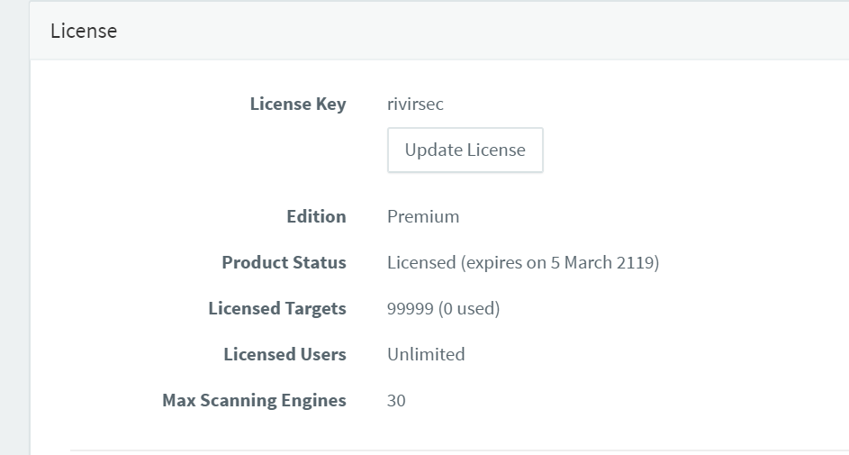

awvs13破解
```
bash acunetix_13.0.200217097_x64_.sh

windows版破解：
1.运行acunetix_13.0.200217097.exe安装。
2.复制wvsc.exe到“C:\Program Files (x86)\Acunetix\13.0.200217097\”下覆盖同名文件（安装到其他路径请自行修改）
3.复制license_info.json到“C:\ProgramData\Acunetix\shared\license”下覆盖同名文件


linux版破解：
1.运行acunetix_13.0.200217097_x64.sh安装。
2.复制wvsc到“/home/acunetix/.acunetix/v_200217097/scanner/”下覆盖同名文件
3.复制license_info.json到“/home/acunetix/.acunetix/data/license/”下覆盖同名文件
```
破解成功后再profile->license 这里可以可以看到破解的信息。
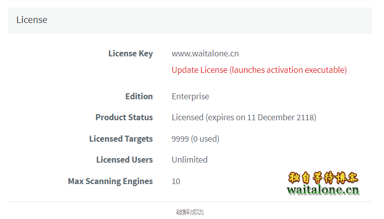


### 1.2 awvs 功能介绍
**1. web界面**: https://localhost:3443/ 

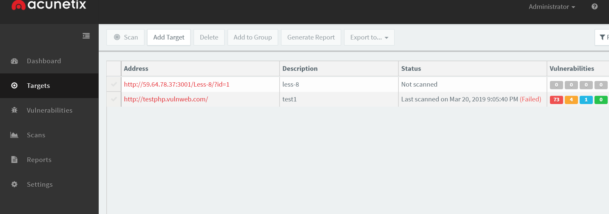

相较于awvs10的客户端界面，Web界面界面功能精简了很多， 主界面主要设置了dashboard,Targets,Vulnerailities, Scans, Reports, Settings.

- Targets 功能主要是对人物的增删改查操作。
- Vulnerabilities 主要是对漏洞进行展示
- Scans: 扫描细节展示，提供扫描信息展示界面，漏洞信息，网站结构，网站扫描结束时间和开始时间

**2. 扫描设置Profile**

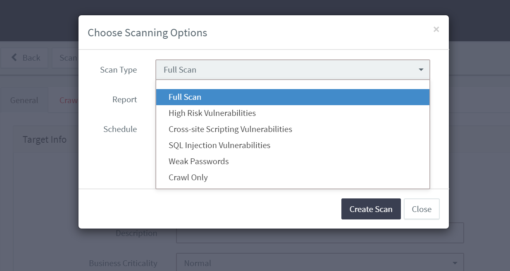
- Full Scan: 完全扫描
- High Risk Vul: 高危漏洞扫描: 扫描66种高危漏洞，包括常见Web安全漏洞，常见中间件的漏洞
- Cross Site Scripting: xss扫描
- SQL Injection: SQL注入扫描
- Weak passwords 弱口令扫描
- Crawl Only: 爬虫


**3. 扫描类型**
1. 带Cookie扫描

测试目标DVWA sqli 盲注， - 因为爬虫可能会爬取到logout.php因为去除该爬取目录:

- 加上自定义的Cookie
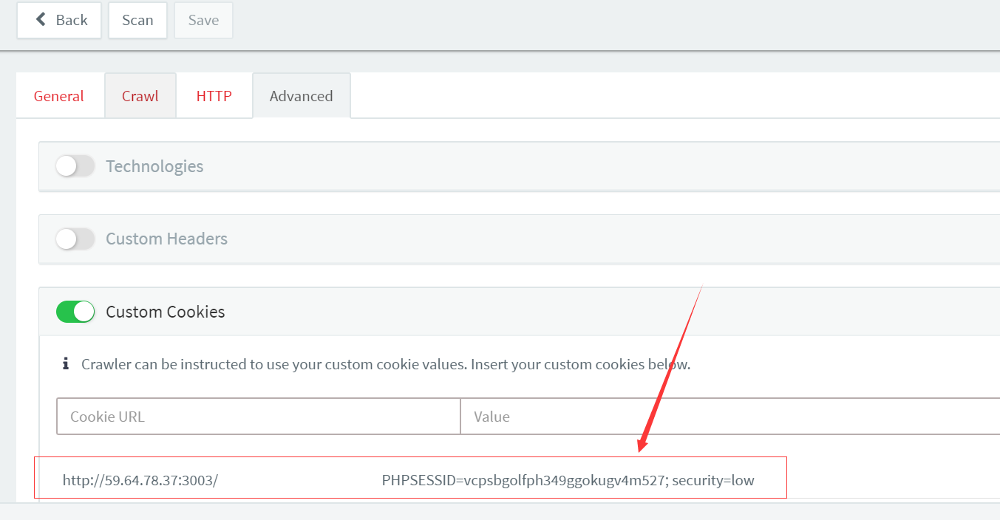

扫描结果:
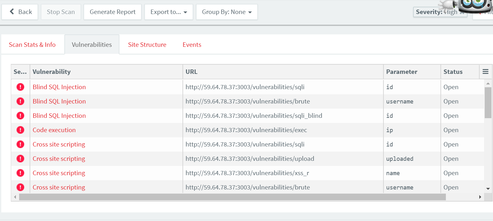
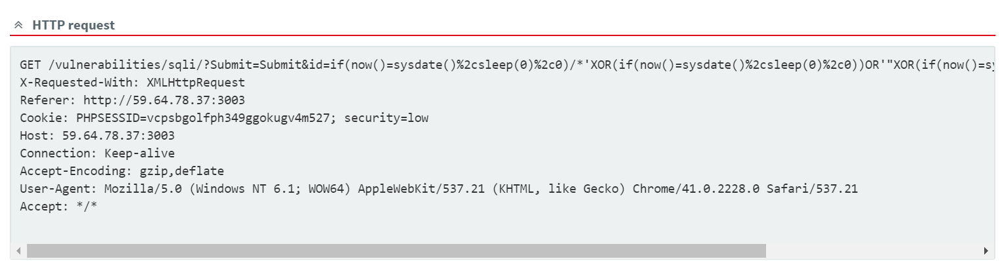
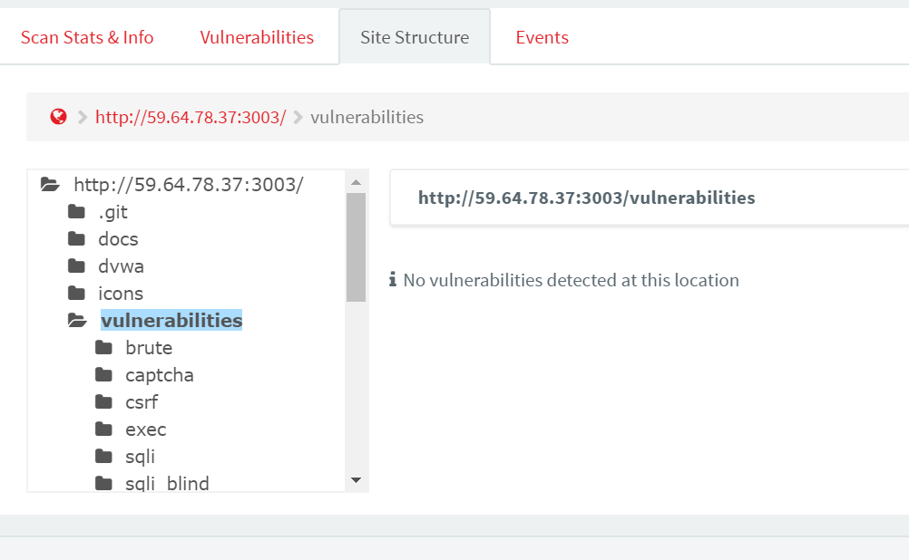

**4. debug调试模式**

Targets -> Advanced -> Debug scans for this target (打勾), 之后扫完便会产出三个文件(logfile.csv, results.wvs, settings.xml)，放在 C:\ProgramData\Acunetix 11\shared\scans\ 底下，并以zip储存。

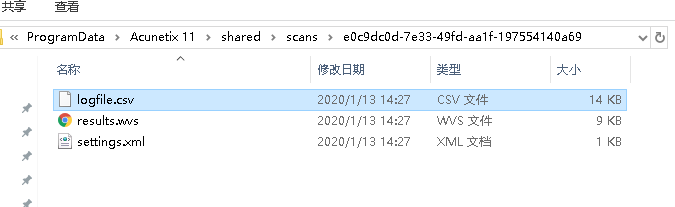


### 1.3 awvs 扫描漏洞
漏洞类型可以参考:
- Acunetix Web Vulnerabilities Index  https://www.acunetix.com/vulnerabilities/web/

awvs对漏洞类型分了45种:`Abuse Of Functionality,Arbitrary File Creation,Authentication Bypass,Bruteforce Possible,Buffer Overflow,CSRF,Code Execution,Configuration,Crlf Injection,Default Credentials,Denial Of Service,Dev Files,Directory Listing,Directory Traversal,Error Handling,File Inclusion,Http Parameter Pollution,Http Response Splitting,Information Disclosure,Insecure Admin Access,Internal Ip Disclosure,Known Vulnerabilities,Ldap Injection,Malware,Missing Update,Needless Service,Network Alert,Privilege Escalation,RCE,Remote Code Execution,SSRF,Sensitive Data Not Over Ssl,Session Fixation,Source Code Disclosure,Sql Injection,Test Files,Unauthenticated File Upload,Url Redirection,W3 Total Cache,Weak Credentials,Weak Crypto,XFS,XSS,XXE,Xpath Injection`


 
## 二、awvs 手动测试工具
- https://www.acunetix.com/vulnerability-scanner/free-manual-pen-testing-tools/

awvs11把一些常见的信息收集小工具独立出来了。这些工具虽然功能不是很强大，但很实用。这些工具包括:
- HTTP Editor
- Subdomain Scanner
- Target Finder
- Blind SQL Injector
- HTTP Fuzzer
- Authentication Tester
- Web Services Editor
- HTTP Sniffer

**HTTP Editor**
提供了http请求和相应包的查看编辑等功能。
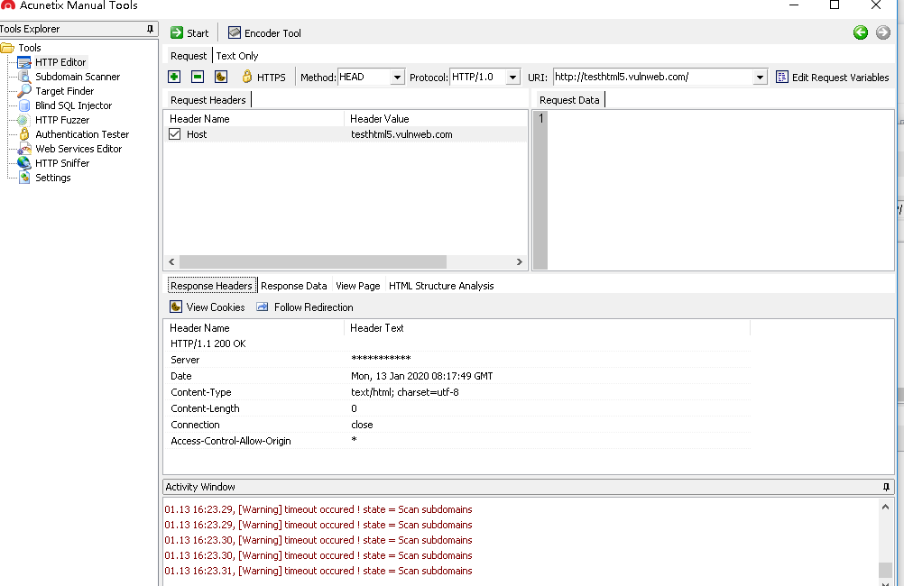

**subdomain scanner**
该功能提供了简单的子域名爆破的功能，可能是内置字典比较小，爆破出来的子域名不是很多。会探测http,https页面的banner, 耗时3min.
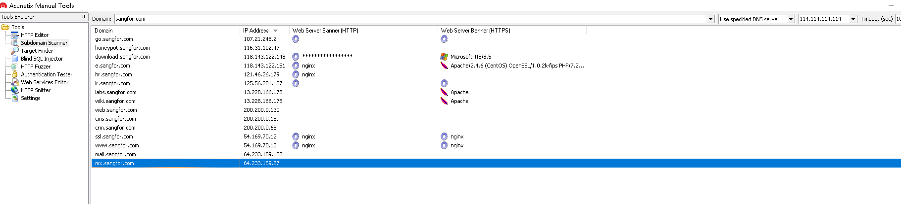

**Target Finder**
主机探测+常见开放端口， 好像是单线程，速度比较慢。
```
example.com	Scan a host by DNS hostname
192.168.0.1	Scan a host by IP address
192.168.0.1-30	Scan all hosts between two IP addresses
192.168.0.0/24	Scan all hosts in a subnet (CIDR format)
```
**Blind SQL Injector**
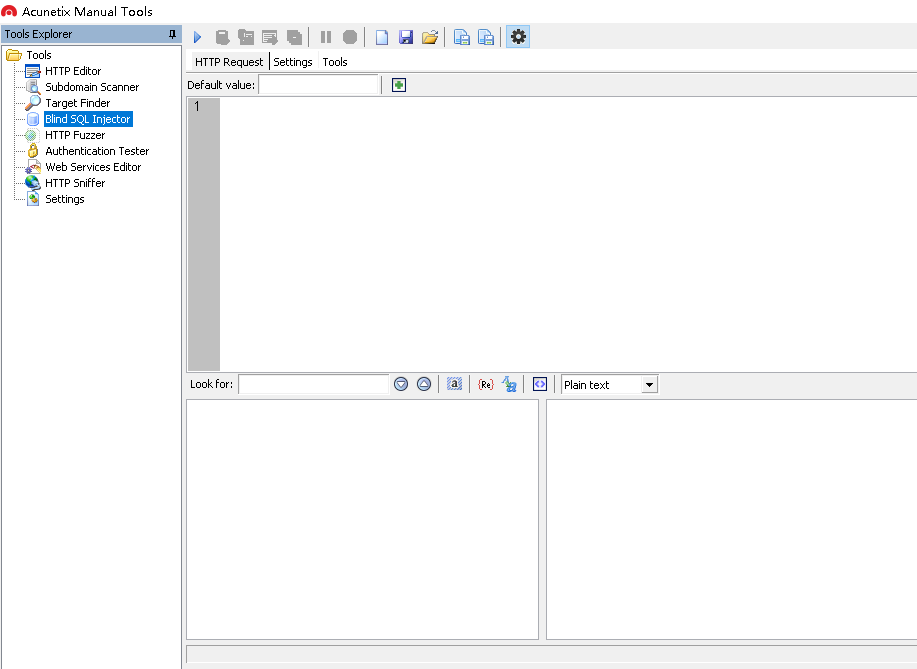

**HTTP Sniffer**
自动监听8080端口进行流量抓取, 是一个简单使用的小功能。
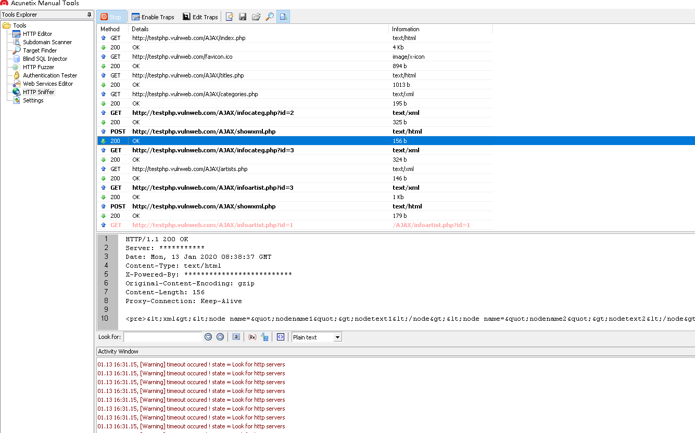

缺点: 只能监听http的站点，无法监听https的站。

**Authentication Tester**
字典爆破


## 三、awvs配置优化

1. awvs默认开启AcuSensor, 如果没有配置代理端，建议关闭,这样会在请求中添加一些易被waf识别的字段.

```
Acunetix-Aspect: enabled
Acunetix-Aspect-Password: 082119f75623eb7abd7bf357698ff66c
Acunetix-Aspect-Queries: filelist;aspectalerts

```

2. 扫描端口非常慢，建议关闭端口扫描的功能


## 四、功能翻译

**file**

new
- Web Site Scan 新建一个扫描向导，包括爬虫和漏洞审计
- Web Site Crawl 新建一个网站爬虫
- Web service Scan 新建一个网站服务扫描,如WDSL
- Report 生成一个报告

Load Scan Result: 加载一个扫描结果,必须是.wvs文件

Save Scan Result: 保存一个扫描结果位.wvs文件，和导出报告不一样

Exit : 退出


**Tools**

Web Scanner

Site Crawler: 网站爬虫，和file->new->Web Site Crawl一样

Target-Finder: 主机网段扫描

SubDomain Scanner:子域名扫描

Bind SQL Injector:盲注手工测试

HTTP Editor: HTTP信息查看,还有Encoder Tool编码工具，很贴心哦

HTTP Sniffer: HTTP 嗅探

HTTP Fuzzer: HTTP fuzz

Authentication Tester: HTTP 验证测试,表单爆破

Compare Results:比较测试结果

Web Services Scanner: WSDL漏洞扫描

WEb Services Editor: 网站服务手动分析


**Configuration**


Application Settings
- Application Updates 更新,可设置代理服务器
- Logging 日志记录: 目录在用户->Dockment>Acunetix WVS 10>Logs 该目录下还有AcuSensor,BlindSQL,Bugreports,Fuzzer,HttpEditor,Logs,Saves,Storage
- 保存扫描结果: 包括设置保存数据库，保存目录
- 可设置验证所用的证书
- Client Certificates 指定客户端访问所需证书
- Login Sequence Manger:登录会话管理
- False Positives:处理误报
- HTTP Sniffer: 设置监听网卡和端口
- Scheduler: 设置计划任务
- Miscellaneous: 其他设置,可设置扫描是的内存，默认1024M,使用临时文件夹
- Acunetix 传感器功能,提高漏洞审计能力


**Scan Setting**

- 扫描选项: 是否关闭爬虫错误，扫描模式，是否扫描端口
- 爬虫选项
- HTTP选项
- Scanning Profiles: 设定扫描重点,默认15个扫描方式，默认位default,及扫描全部


**help**


Check for update:检查更新

Application Dicectories: 程序目录，包括数据目录,用户目录和扫描计划保存目录

Schelduler Web Interface: localhost:8183  扫描计划web平台

Update License: 更新证书
