[TOC]
# burp - 模块介绍(一)

Referer: burpsuite: https://t0data.gitbooks.io/burpsuite/content/chapter8.html

下载: http://www.vuln.cn/8847
## 启动
命令行启动: 

    java -jar /your_burpsuite_path/burpSuite.jar
    java -jar  -Xbootclasspath/p:burp-loader-keygen.jar burpsuite_pro_v1.7.32.jar --config-file=project.json --user-config-file=user.json

### 如何设置JVM内存 大小
如果Java可运行环境配置正确的话，当你双击burpSuite.jar即可启动软件，这时，Burp Suite自己会自动分配最大的可用内存，具体实际分配了多少内存，默认一般为64M。

 一般来说，我们通常会分配2G的内存供Burp Suite使用，如果你的电脑内存足够，可以分配4G；如果你的电脑内存足够小，你也可以分配128M。当你给Burp Suite分配足够多的内存时，它能做的工作也会更多。指定Burp Suite占用内存大小的具体配置方法是在启动脚本里添加如下命令行参数： 假设启动脚本的名称为burp_suite_start.bat，则该bat脚本的内容为
 

    java -jar -Xmx2048M  /your_burpsuite_path/burpsuite.jar

其中参数-Xmx指定JVM可用的最大内存，单位可以是M，也可以是G，如果是G为单位的话，则脚本内容为：

    java -jar -Xmx2G  /your_burpsuite_path/burpsuite.jar
    
    
java 的一些命令行 
```
-classpath <目录和 zip/jar 文件的类搜索路径>
              用 ; 分隔的目录, JAR 档案
              和 ZIP 档案列表, 用于搜索类文件。
-D<名称>=<值>
              设置系统属性
-X            输出非标准选项的帮助
```

### 保存工作状态

有三种保存方式:
1. save state: 保存arget、Proxy、Repeater三个组件中的请求和应答消息的内容
2. project->save project options: 保存工程设置选项
3. user->save user options: 保存用户配置信息，插件等。

window 下的保存路径再
C:\Users\i-luojiang\AppData\Roaming\BurpSuite
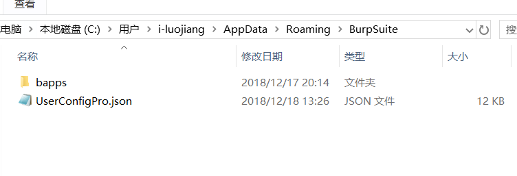

linux 下的插件保存路径:
```
/home/lj/.BurpSuite
```
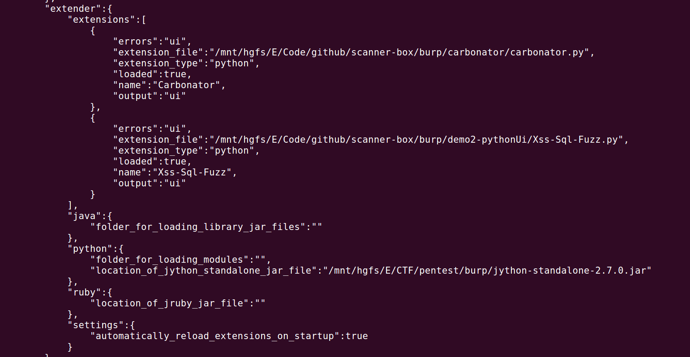

配置
```

```

配置文件: burp->project options->save project options

配置:
```
//proxy listeners 监听
        "request_listeners":[
            {
                "certificate_mode":"per_host",
                "listen_mode":"loopback_only",
                "listener_port":8080,
                "running":true
            }
        ],
      
//logging 日志记录
            "logging":{
                "requests":{
                    "all_tools":"",
                    "extender":"",
                    "intruder":"",
                    "proxy":"../log/burp.log",
                    "repeater":"",
                    "scanner":"",
                    "sequencer":"",
                    "spider":""
                },

//scanner 扫描配置部分
    "scanner":{
        "active_scanning_engine":{
            "concurrent_request_limit":10,
            "do_throttle":false,
            "follow_redirects":true,
            "number_of_retries_on_failure":3,
            "pause_before_retry_on_failure":2000,
            "throttle_interval":500,
            "throttle_random":false
        },
        "active_scanning_optimization":{
            "intelligent_attack_selection":true,
            "scan_accuracy":"normal",
            "scan_speed":"fast"
        },
        "attack_insertion_points":{
            "change_body_to_cookie":false,
            "change_body_to_url":false,
            "change_cookie_to_body":false,
            "change_cookie_to_url":false,
            "change_url_to_body":false,
            "change_url_to_cookie":false,
            "insert_amf_params":false,
            "insert_body_params":true,
            "insert_cookies":false,
            "insert_entire_body":false,
            "insert_http_headers":false,
            "insert_param_names":false,
            "insert_url_params":true,
            "insert_url_path_filename":false,
            "insert_url_path_folders":false,
            "max_insertion_points":30,
            "skip_all_tests_for_parameters":[],
            "skip_server_side_injection_for_parameters":[
                {
            ...
        },
        "live_active_scanning":{
            "advanced_mode":false,
            "exclude":[],
            "include":[],
            "scope_option":"nothing"
        },
        "live_passive_scanning":{
            "advanced_mode":false,
            "exclude":[],
            "include":[],
            "scope_option":"everything"
        },
        "scan_issues":{
            "scan_type_intrusive_active":true,
            "scan_type_light_active":true,
            "scan_type_medium_active":true,
            "scan_type_passive":true,
            "scan_type_static_code_analysis":true,
            "select_individual_issues":true,
            "selected_issues":[
                {
                    "detection_methods":[],
                    "enabled":false,
                    "type_index":"0x01000200"
                },
                {
                    "detection_methods":[],
                    "enabled":false,
                    "type_index":"0x00300100"
                },
                {
                    "detection_methods":[],
                    "enabled":false,
                    "type_index":"0x00500200"
                },
                {
                    "detection_methods":[],
                    "enabled":false,
                    "type_index":"0x00500800"
                }
            ]
        },
        "scan_queue":{
            "hide_finished_items":false
        },
        "static_code_analysis":{
            "max_time_per_item":120,
            "mode":"active_only"
        }
    },
```

listen mode:`loopback_only`,`all_interfaces`


### 常用快捷键

ctrl+shift+u : url decode解码(需要选中)

ctrl+shift+b: base64 decode
ctrl+b: base64 encode


## Target模块
- 目标域设置 Target Scope
- 站点地图 Site Map
- Target 工具的使用

### 目标域设置 Target Scope

Target Scope中作用域的定义比较宽泛，通常来说，当我们对某个产品进行渗透测试时，可以通过域名或者主机名去限制拦截内容，这里域名或主机名就是我们说的作用域；如果我们想限制得更为细粒度化，比如，你只想拦截login目录下的所有请求，这时我们也可以在此设置，此时，作用域就是目录。总体来说，Target Scope主要使用于下面几种场景中：
```
限制站点地图和Proxy 历史中的显示结果
告诉Burp Proxy 拦截哪些请求
Burp Spider抓取哪些内容
Burp Scanner自动扫描哪些作用域的安全漏洞
在Burp Intruder和Burp Repeater 中指定URL
```
通过Target Scope 我们能方便地控制Burp 的拦截范围、操作对象，减少无效的噪音。在Target Scope的设置中，主要包含两部分功能：允许规则和去除规则。 
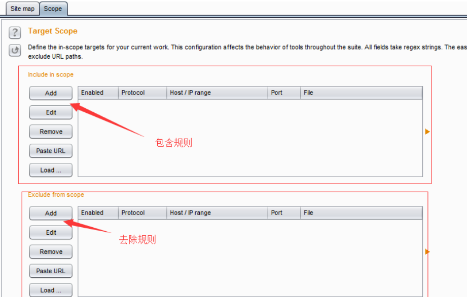
其中允许规则顾名思义，即包含在此规则列表中的，视为操作允许、有效。如果此规则用于拦截，则请求消息匹配包含规则列表中的将会被拦截；反之，请求消息匹配去除列表中的将不会被拦截。 

同时，我们也可以将某个域直接加入 Target Scope中. 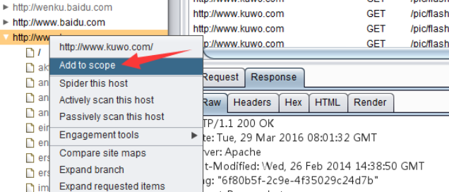


### SiteMap 使用
- 手工获取站点地图
- 站点比较
- 攻击面分析

站点比较是一个Burp提供给渗透测试人员对站点进行动态分析的利器，我们在比较帐号权限时经常使用到它。当我们登陆应用系统，使用不同的帐号，帐号本身在应用系统中被赋予了不同的权限，那么帐号所能访问的功能模块、内容、参数等都是不尽相同的，此时使用站点比较，能很好的帮助渗透测试人员区分出来。一般来说，主要有以下3种场景： 
```
1.同一个帐号，具有不同的权限，比较两次请求结果的差异。 
2.两个不同的帐号，具有不同的权限，比较两次请求结果的差异。
3.两个不同的帐号，具有相同的权限，比较两次请求结果的差异。
```

攻击面分析:Engagement tool->Analyze target

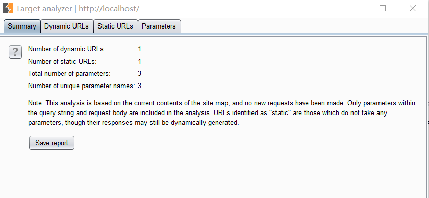

## Proxy

我们可以设置我们想要抓取的一些规则，比如抓取域， 抓取类型等。

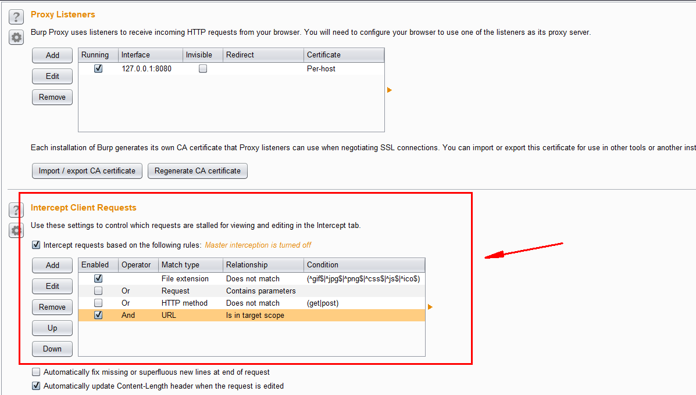

## Intruder 模块

### 标记爆破模式

1. Sniper 嗅探模式
对所有标记点每次fuzz一个变量。

2. pitchfork爆破模式

即同步变化,$1和$2 两个同时变化,数量级是较少的那个方

3. cluster bamb 爆破模式

$1 和 $2 映射变化模式，数量级是$1*$2

### payload 设置
1. burp有自定义一些payload 选项，比如Numer类型，String类型,NULL类型等。 
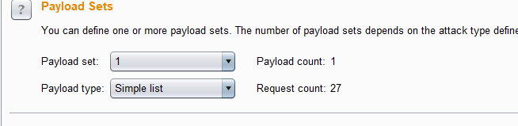

2. burpsuite提供对payload进行一些简单的编码加密处理。
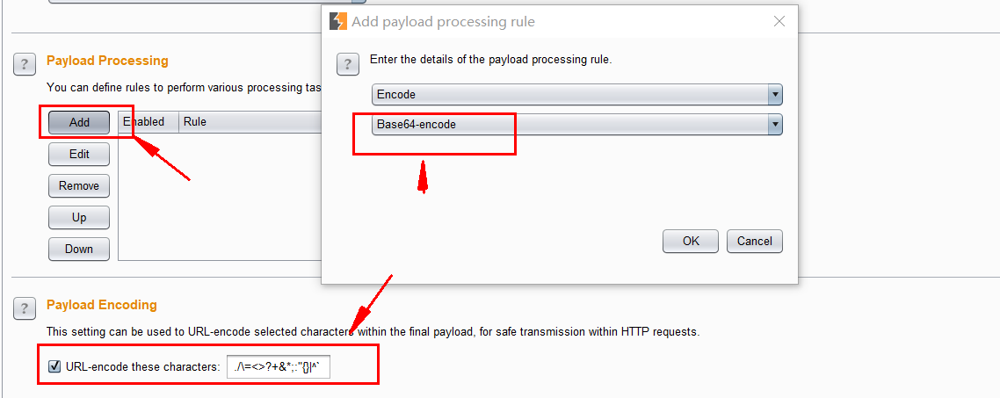

### Options设置捕获响应规则
1. grep 匹配Response特定的字符串
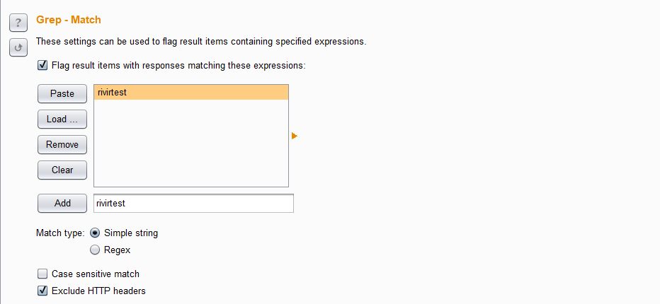

2. 搜索响应包里面是否包含payload
 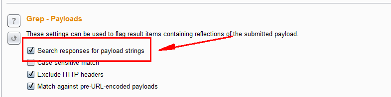

3. 是否跟随响应中的重定向
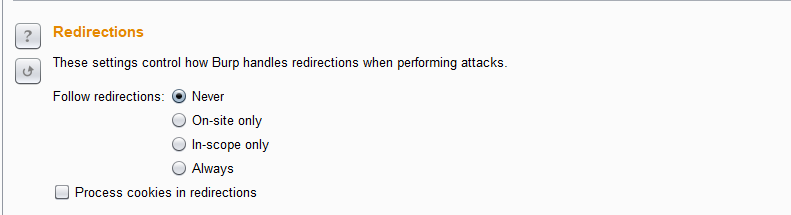

4. 设置显示的column字段
我们可以再column菜单中设置我们的
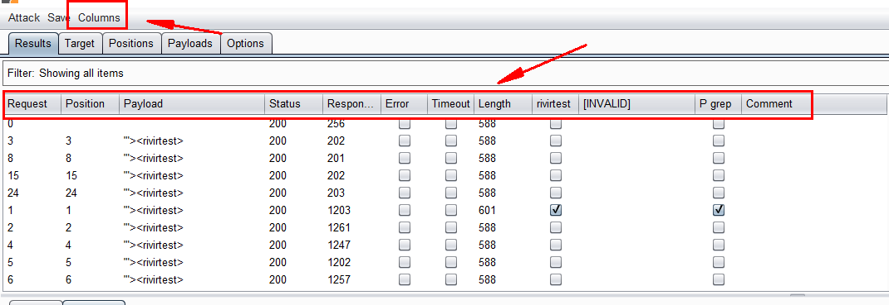

5. 保持结果：

Save->Result Table->保存即可。

## 爬虫模块
burpsuite的爬虫模块主要是proxy的http history和Scanner,Target

没什么好讲的，主要说一下filter的过滤规则吧

常用的一些filter规则:

左边有三大过滤规则:

- show only in-scope items
- Hide i

## scanner 扫描
### 扫描插入点设置
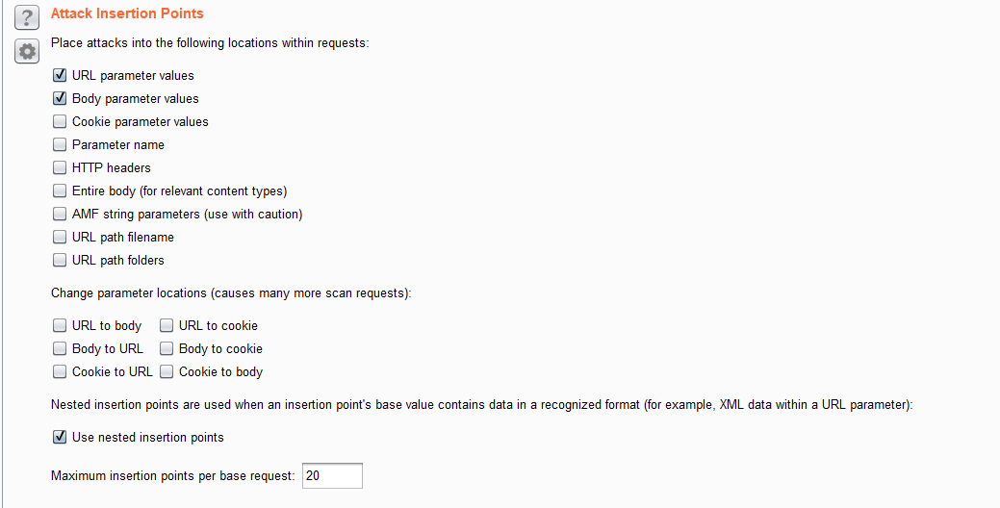

默认时全选，这里我们只扫描get,post的值。

### 扫描引擎
concurrent limit: 即并发的线程数量

Pause before retry: 每次重试的停止时间。

扫描速度设置。

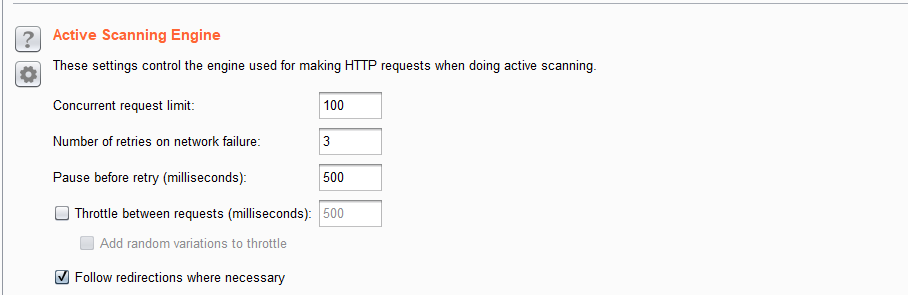
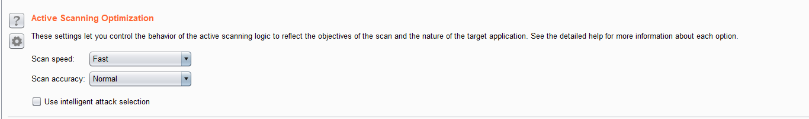


### issues
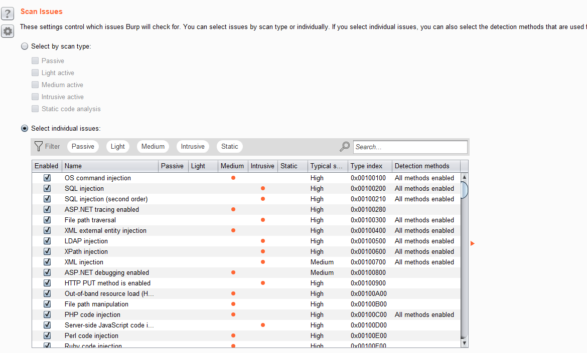

这里我去掉了几个常见的误报
```
Cleartext submission of password	4	3145984
Unencrypted communications	2	16777728
```
## BurpSuite全局参数设置和使用

在Burp Suite中，存在一些粗粒度的设置，这些设置选项，一旦设置了将会对Burp Suite的整体产生效果，这就是Burp Suite中Options面板。当我们打开Options面板即可看到，它是由Connections、HTTP、SSL、Sessions、Display、Misc六个选项卡组成。 
```
Burp 网络连接设置（Connections）
HTTP应答消息处理设置（HTTP）
SSL连接和加密设置（SSL）
会话设置（Sessions）
显示设置（Display）
其它工具设置（Misc）
```

### Connections
Connections选项卡主要用来控制Burp如何来处理平台认证、上游代理服务器、Socks代理、超时设置、主机名或域名解析以及Scope之外的请求六个方面的相关配置。当我们打开Connections选项卡，从上往下拖动，首先看到的设置将是平台身份认证（Platform Authentication）。

这些设置允许你配置Burp自动执行到目标Web服务器的平台身份验证，不同的主机可以配置不同的认证方式和证书。目前支持的身份验证类型有：BASIC，NTLMv1，NTLMv2和“摘要”式认证( Digest authentication)

#### 上游代理服务器（Upstream Proxy Servers） 

这些设置主要是控制Burp是否会发送请求到上游代理服务器，或直转向目标Web服务器。从代理服务器配置的图中我们可以看出，这是一个列表，那就表明我们可以配置多个匹配规则。当我们配置了多个规则时，可以针对不同的目标主机或主机组指定不同的代理服务器设置。这些规则将按照顺序，并将与目标Web服务器相匹配的第一个规则作为生效规则。如果列表没有规则匹配，Burp默认采取直连、非代理的方式进行连接。 

#### Socks代理 
这些设置允许我们配置Burp使用SOCKS代理的方式进行所有传出的通信，但此设置只在TCP层生效，所有出站请求将通过这个代理发送。如果我们同时设置了已游HTTP代理服务器配置的规则，则请求上游代理将通过这里配置的SOCKS代理发送。其请求的匹配路径依次是：本地-->上游代理-->SOCKS代理。 在使用SOCKS代理时，我们需要勾选【Use SOCKS proxy】，并提供代理的ip或者主机名、端口、认证的用户名和口令（如上图所示）。 如果我们勾选了【Do DNS lookups over SOCKS proxy】，则进行域名解析时，将通过SOCKS代理去查询，而不会使用本地缓存。


#### 快捷键设置（Hotkeys） 

Burp的快捷键设置遵循了系统软件的设置习惯，比如Ctrl+V、Ctrl+C、Ctrl+Z都是和操作系统一样，同时，在各个工具组件之间的切换和消息传递时，Burp的快捷键基本遵循了Ctrl+组件的首字母，例如： send to Repeater是Ctrl+R send to Intruder是Ctrl+I 详细的快捷键读者自己在使用过程中，会慢慢熟悉，而且，Burp也提供了自定义快捷键的功能，只有点击下方的【Edit hotkeys】按钮，进行修改即可。

## burpsuite和sqlmap 比较

### dvwa Low级别
漏洞|burpsuite|sqlmap
-|-|-
sql注入|存在:`id=1'`|存在
sql盲注|存在:`id=87918744' or '6116'='6116`, `id=84661530' or '2090'='2083 `|存在:`id=1' AND 8334=8334 AND 'aPRl'='aPRl`
反射型xss|存在: `iy31z<script>alert(1)</script>oyl3p`|x
存储型xss|存在|x
文件包含|存在: `../../../../../../../../../../../../../../../../etc/passwd`,<br>`http://qsm0v4hdixt4pabvjjm7zdhda4g44uslfb30.burpcollaborator.net/?file1.php`|x
文件上传|x|x
CSRF|存在|x
命令执行|存在:`ip=srnc68v18jt4wdbm8qai0x14mvsmge46rwfl.burpcollaborator.net`|x


### DVWA Medium级别

漏洞|burpsuite|sqlmap
-|-|-
sql注入|存在:`id=1'`|存在
sql盲注|存在 :`(select*from(select(sleep(20)))a)`|存在:`id=1 AND SLEEP(5)`, `id=1 AND 4781=4781`
反射型xss|存在: `krwcn<ScRiPt>alert(1)</ScRiPt>gd1sb`|x
存储型xss|存在|x
文件包含|存在|x
文件上传|x|x
CSRF|存在|x

### DVWA High级别
漏洞|burpsuite|sqlmap
-|-|-
sql注入|不存在|不存在
sql盲注|不存在|不存在
反射型xss|存在:`okvrwtxm0m `|x
存储型xss|存在|x
文件包含|存在:`file:///etc/passwd`|x
文件上传|x|x
CSRF|x|x

### 简要综合比较
DVWA Low模式
扫描器|sql注入|sql盲注|反射型xss|存储型xss|文件上传|文件包含|命令执行|CSRF
-|-|-|-|-|-|-|-|-|-
burpsuite|存在|存在|存在|存在|x|存在|存在|存在
sqlmap|存在|存在|x|x|x|x|x|x

DVWA Medium模式
扫描器|sql注入|sql盲注|反射型xss|存储型xss|文件上传|文件包含|命令执行|CSRF
-|-|-|-|-|-|-|-|-|-
burpsuite|存在|存在|存在|存在|x|存在|存在|存在
sqlmap|存在|存在|x|x|x|x|x|x

DVWA High模式
扫描器|sql注入|sql盲注|反射型xss|存储型xss|文件上传|文件包含|命令执行|CSRF
-|-|-|-|-|-|-|-|-|-
burpsuite|不存在|不存在|存在|存在|x|存在|存在|存在
sqlmap|不存在|不存在|x|x|x|x|x|x