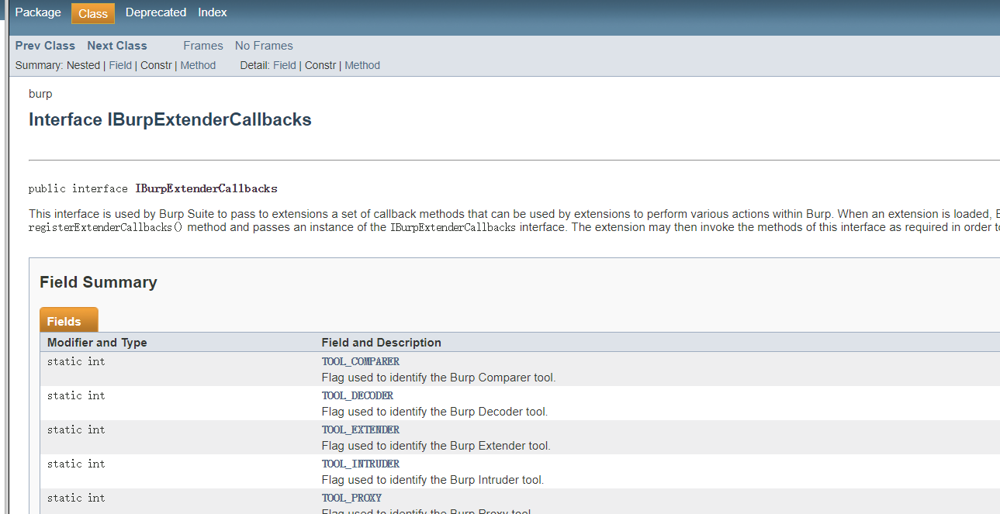
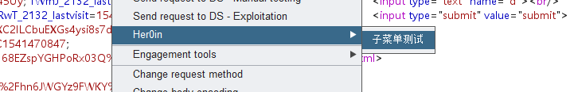
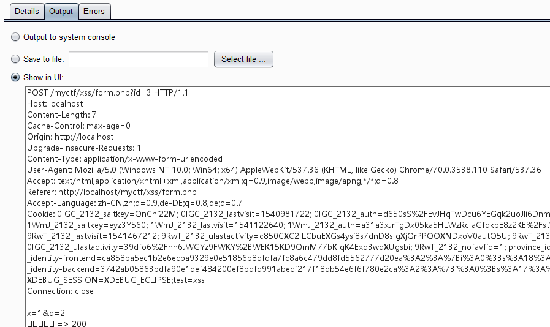
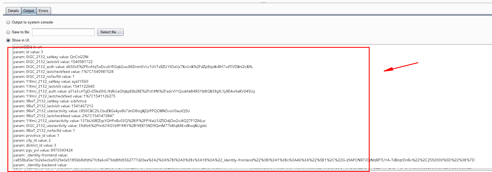
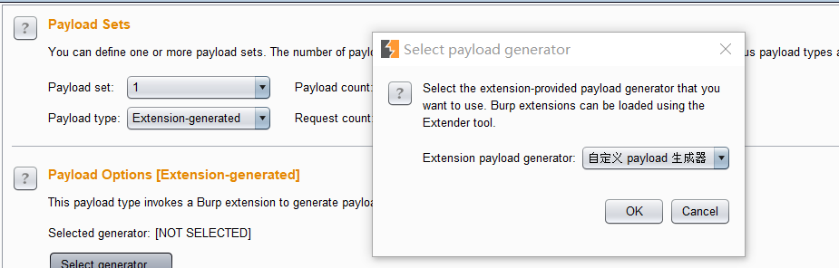
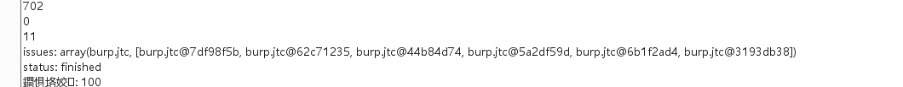
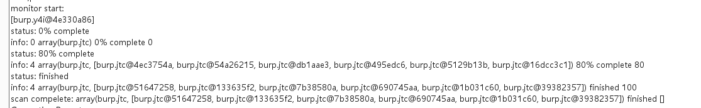
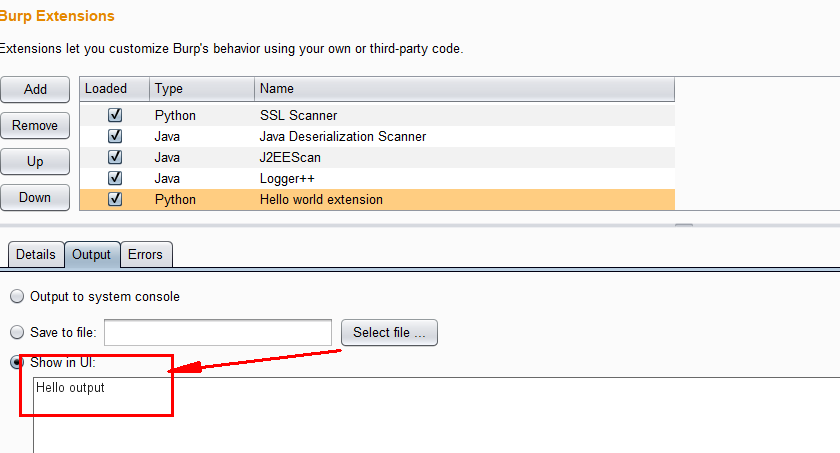
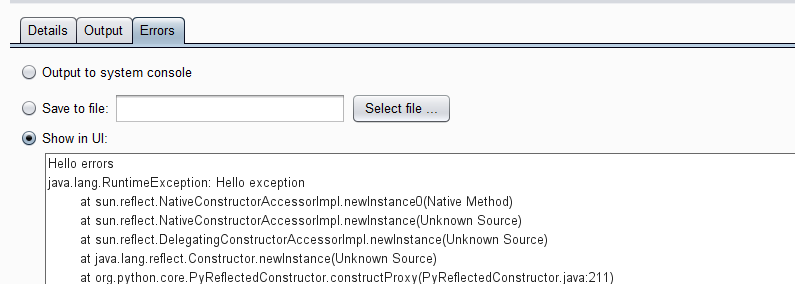
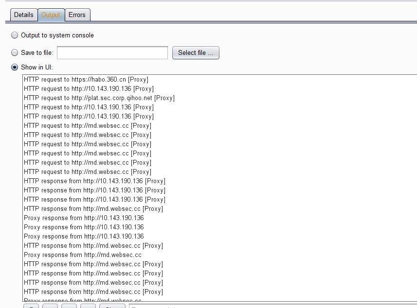

[TOC]

# burp 插件开发 - API接口(二)

Referer: 
- BurpSuite插件开发指南之 API 上篇 Her0in:http://www.vuln.cn/6098
- BurpSuite插件开发指南之 API 下篇 Her0in  http://www.vuln.cn/6099

## 插件开发“方法论”：
插件型的应用程序在设计时就一定会考虑插件的开发，因此，主程序与插件之间必然有一种“约定”，在开发插件的过程中，只需按照程序开发者设计的这种“约定”开发就好了，读者在阅读参考官方开发文档时只需注意以下三点：

```
接口方法功能
接口方法入参（参数类型和参数个数）
接口方法的返回值（返回值类型）
```
在关注上述三点以后，就可以把多个接口方法联系在一起，组织起一定的逻辑，这样，开发的思路就顺理成章了。


## burp的一些常量
toolFlag是burpsuite中对工具进行识别的方式

### burp.IBurpExtenderCallbacks
```
Modifier and Type	Constant Field	Value
public static final int	TOOL_COMPARER	512 //comparer
public static final int	TOOL_DECODER	256 //deocde
public static final int	TOOL_EXTENDER	1024
public static final int	TOOL_INTRUDER	32 //intruder
public static final int	TOOL_PROXY	4 //proxy
public static final int	TOOL_REPEATER	64 //repeater
public static final int	TOOL_SCANNER	16 //scanner
public static final int	TOOL_SEQUENCER	128 //sequencer
public static final int	TOOL_SPIDER	8 //spider
public static final int	TOOL_SUITE	1 //suite
public static final int	TOOL_TARGET	2 //target
```
可以看到都是burp面板上面的几个功能。

其他接口也有一些常量，具体参考api


## API 分类
1. 插件入口和帮助接口类：IBurpExtender、IBurpExtenderCallbacks、IExtensionHelpers、IExtensionStateListener
2. UI相关接口类：IContextMenuFactory、IContextMenuInvocation、ITab、ITextEditor、IMessageEditor、IMenuItemHandler
3. Burp工具组件接口类：IInterceptedProxyMessage、IIntruderAttack、IIntruderPayloadGenerator、IIntruderPayloadGeneratorFactory、IIntruderPayloadProcessor、IProxyListener、IScanIssue、IScannerCheck、IScannerInsertionPoint、IScannerInsertionPointProvider、IScannerListener、IScanQueueItem、IScopeChangeListener
4. HTTP消息处理接口类：ICookie、IHttpListener、IHttpRequestResponse、IHttpRequestResponsePersisted、IHttpRequestResponseWithMarkers、IHttpService、IRequestInfo、IParameter、IResponseInfo


## 插件入口和帮助接口类
### IBurpExtender 接口
- public interface IBurpExtender
所有的扩展必须实现此接口，实现的类名必须为“BurpExtender”。在 burp 包中，必须申明为 public ,并且必须提供一个默认的构造器。
此接口实现了以下方法：
```
    #!java
    void registerExtenderCallbacks(IBurpExtenderCallbacks callbacks)
```
此方法将在扩展加载后被调用，它注册了一个 IBurpExtenderCallbacks 接口的实例，IBurpExtenderCallbacks 接口提供了许多在开发插件过程中常用的一些操作。

- 参数说明: callbacks 是一个 IBurpExtenderCallbacks 对象。

### IBurpExtenderCallbacks
- public interface IBurpExtenderCallbacks
此接口中实现的方法和字段在插件开发过程中会经常使用到。 Burp Suite 利用此接口向扩展中传递了许多回调方法，这些回调方法可被用于在 Burp 中执行多个操作。当扩展被加载后，Burp 会调用 registerExtenderCallbacks() 方法，并传递一个 IBurpExtenderCallbacks 的实例。扩展插件可以通过这个实例调用很多扩展 Burp 功能必需的方法。如：设置扩展插件的属性，操作 HTTP 请求和响应以及启动其他扫描功能等等。

此接口提供了很多的方法和字段

具体方法属性参考api文档: 

说几个常见的:
```
//设置插件名称
void setExtensionName(java.lang.String name) 
//获取output输出对象
java.io.OutputStream getStdout()
//获取错误输出对象
java.io.OutputStream getStderr()

//注册一个扩展状态监听器，监听扩展的状态
void registerExtensionStateListener(IExtensionStateListener listener)
//This method is used to retrieve the extension state listeners that are registered by the extension.
java.util.List<IExtensionStateListener> getExtensionStateListeners()

removeExtensionStateListener
registerHttpListener
getHttpListeners
removeHttpListener

registerProxyListener
getProxyListeners
removeProxyListener

registerScannerListener
getScannerListeners
removeScannerListener

registerScopeChangeListener
getScopeChangeListeners
removeScopeChangeListener

...
ContextMenuFactories
MessageEditorTabFactories
ScannerCheck
IntruderPayloadGeneratorFactories
SessionHandlingAction
```


### IExtensionHelpers
- public interface IExtensionHelpers

此接口提供了很多常用的辅助方法，扩展可以通过调用 IBurpExtenderCallbacks.getHelpers 获得此接口的实例。

方法:

#### 解析http 的方法

```
#!java
// 此方法会添加一个新的参数到 HTTP 请求中，并且会适当更新 Content-Length
byte[]  addParameter(byte[] request, IParameter parameter)

// 此方法用于分析 HTTP 请求信息以便获取到多个键的值
IRequestInfo    analyzeRequest(byte[] request)

// 此方法用于分析 HTTP 响应信息以便获取到多个键的值
IResponseInfo   analyzeResponse(byte[] response)

// 构建包含给定的 HTTP 头部，消息体的 HTTP 消息
byte[]  buildHttpMessage(java.util.List<java.lang.String> headers, byte[] body)

// 对给定的 URL 发起 GET 请求
byte[]  buildHttpRequest(java.net.URL url)
```


加解密函数: 
```
//提供了一组base64加解密函数(鸡肋)
base64Decode() / base64Decode() 鸡肋

//byte[] stringToBytes(java.lang.String data)
转换string到byte[]类型数据

java.lang.String bytesToString(byte[] data)
转换byte[] 到String数据

indexOf(byte[] data, byte[] pattern, boolean caseSensitive, int from, int to) : 索引

urlencode/urldecode (鸡肋)
```

demo code:
```
def processHttpMessage(self, tool_flag, isRequest, current):
	self.last_packet_seen = int(time.time())
	if tool_flag == self._callbacks.TOOL_SPIDER and isRequest: #if is a spider request then send to scanner
		print 'processHttpmessage:',self._helpers.bytesToString(current.getRequest())
```


### IExtensionStateListener
- public interface IExtensionStateListener

扩展可以实现此接口，然后调用 IBurpExtenderCallbacks.registerExtensionStateListener() 注册一个扩展的状态监听器。在扩展的状态发生改变时，监听器将会收到通知。注意：任何启动后台线程或打开系统资源（如文件或数据库连接）的扩展插件都应该注册一个监听器，并在被卸载后终止线程/关闭资源。


## UI相关接口类
### IContextMenuFactory
- public interface IContextMenuFactory
Burp 的作者在设计上下文菜单功能中采用了工厂模式的设计模式，扩展可以实现此接口，然后调用 IBurpExtenderCallbacks.registerContextMenuFactory() 注册自定义上下文菜单项的工厂

此接口提供了如下方法：
```
#!java
java.util.List<javax.swing.JMenuItem>   createMenuItems(IContextMenuInvocation invocation)
```

- 参数说明：

invocation – 一个实现 IContextMenuInvocation 接口的对象, 通过此对象可以获取上下文菜单调用的细节。

- 返回值：
此工厂方法将会返回需要被显示的自定义菜单项的一个列表（包含子菜单，checkbox 菜单项等等）， 若无菜单项显示，此工厂方法会返回 null。
demo:
```
#!java
package burp;

import java.util.ArrayList;
import java.util.List;

import javax.swing.JMenu;
import javax.swing.JMenuItem;

public class BurpExtender implements IBurpExtender, IContextMenuFactory{

    @Override
    public void registerExtenderCallbacks(final IBurpExtenderCallbacks callbacks){

        callbacks.setExtensionName("Her0in");
        callbacks.registerContextMenuFactory(this);
    }


    @Override
    public List<JMenuItem> createMenuItems(final IContextMenuInvocation invocation) {

        List<JMenuItem> listMenuItems = new ArrayList<JMenuItem>();
        //子菜单
        JMenuItem menuItem;
        menuItem = new JMenuItem("子菜单测试");  

        //父级菜单
        JMenu jMenu = new JMenu("Her0in");
        jMenu.add(menuItem);        
        listMenuItems.add(jMenu);
        return listMenuItems;
    }
}
```


### IContextMenuInvocation

public interface IContextMenuInvocation

此接口被用于获取当 Burp 调用扩展提供的 IContextMenuFactory 工厂里的上下文菜单时的一些细节，如能获取到调用了扩展提供的自定义上下文菜单的 Burp 工具名称（在 IBurpExtenderCallbacks 中定义）或功能组件的名称（在 IContextMenuInvocation 中定义）。

常量:
```
Modifier and Type	Field and Description
static byte	CONTEXT_INTRUDER_ATTACK_RESULTS
Used to indicate that the context menu is being invoked in an Intruder attack results.
static byte	CONTEXT_INTRUDER_PAYLOAD_POSITIONS
Used to indicate that the context menu is being invoked in the Intruder payload positions editor.
static byte	CONTEXT_MESSAGE_EDITOR_REQUEST
Used to indicate that the context menu is being invoked in a request editor.
static byte	CONTEXT_MESSAGE_EDITOR_RESPONSE
Used to indicate that the context menu is being invoked in a response editor.
static byte	CONTEXT_MESSAGE_VIEWER_REQUEST
Used to indicate that the context menu is being invoked in a non-editable request viewer.
static byte	CONTEXT_MESSAGE_VIEWER_RESPONSE
Used to indicate that the context menu is being invoked in a non-editable response viewer.
static byte	CONTEXT_PROXY_HISTORY
Used to indicate that the context menu is being invoked in the Proxy history.
static byte	CONTEXT_SCANNER_RESULTS
Used to indicate that the context menu is being invoked in the Scanner results.
static byte	CONTEXT_SEARCH_RESULTS
Used to indicate that the context menu is being invoked in a search results window.
static byte	CONTEXT_TARGET_SITE_MAP_TABLE
Used to indicate that the context menu is being invoked in the Target site map table.
static byte	CONTEXT_TARGET_SITE_MAP_TREE
Used to indicate that the context menu is being invoked in the Target site map tree.
```

方法:
```
Modifier and Type	Method and Description
java.awt.event.InputEvent	getInputEvent()
This method can be used to retrieve the native Java input event that was the trigger for the context menu invocation.
byte	getInvocationContext()
This method can be used to retrieve the context within which the menu was invoked.
IScanIssue[]	getSelectedIssues()
This method can be used to retrieve details of the Scanner issues that were selected by the user when the context menu was invoked.
IHttpRequestResponse[]	getSelectedMessages()
This method can be used to retrieve details of the HTTP requests / responses that were shown or selected by the user when the context menu was invoked.
int[]	getSelectionBounds()
This method can be used to retrieve the bounds of the user's selection into the current message, if applicable.
int	getToolFlag()
This method can be used to retrieve the Burp tool within which the context menu was invoked.
```

比较常用的方法就是getSelectedMessages()函数，不过要注意该方法会返回一个数组，第一个元素才是IHttpRequestResponse对象。

### ITab
- public interface ITab

此接口用于自定义的标签页，调用IBurpExtenderCallbacks.addSuiteTab()方法可以在 Burp 的 UI 中显示自定义的标签页。
```
java.lang.String    getTabCaption()

// Burp 调用此方法获取自定义标签页显示的组件
java.awt.Component  getUiComponent()
```

demo code:
```
package burp;

import java.awt.Component;
import java.io.PrintWriter;

import javax.swing.JButton;
import javax.swing.JPanel;
import javax.swing.SwingUtilities;

public class BurpExtender implements IBurpExtender, ITab{

    public PrintWriter stdout;
    public IExtensionHelpers helpers;

    private JPanel jPanel1;
    private JButton jButton1;

    @Override
    public void registerExtenderCallbacks(final IBurpExtenderCallbacks callbacks){

        this.stdout = new PrintWriter(callbacks.getStdout(), true);
        this.helpers = callbacks.getHelpers();
        callbacks.setExtensionName("Her0in");
        SwingUtilities.invokeLater(new Runnable() {
            @Override
            public void run() {
                 //创建一个 JPanel
                 jPanel1 = new JPanel();
                 jButton1 = new JButton("点我");

                 // 将按钮添加到面板中
                 jPanel1.add(jButton1);

                 //自定义的 UI 组件
                 callbacks.customizeUiComponent(jPanel1);
                 //将自定义的标签页添加到Burp UI 中
                 callbacks.addSuiteTab(BurpExtender.this);
            }
       });
    }

    @Override
    public String getTabCaption() {
        // 返回自定义标签页的标题
        return "Her0in";
    }

    @Override
    public Component getUiComponent() {
        // 返回自定义标签页中的面板的组件对象
        return jPanel1;
    }
}
```


### ITempFile
- public interface ITempFile

此接口用于操作调用IBurpExtenderCallbacks.saveToTempFile()创建的临时文件。
```
// 删除临时文件，此方法已过时
void    delete()

// 此方法用于获取临时文件内容的缓冲区
byte[]  getBuffer()
```

### ITextEditor
- public interface ITextEditor
此接口用于扩展 Burp 的 原始文本编辑器，扩展通过调用IBurpExtenderCallbacks.createTextEditor() 获得一个此接口的实例。

```
// 此方法返回用于扩展添加自定义的编辑器的 UI 组件
java.awt.Component  getComponent()

// 此方法用于获取当前的已选择的文本
byte[]  getSelectedText()

// 此方法用于获取用户在已显示的文本中选择的边界
int[]   getSelectionBounds()

// 此方法用于获取当前已显示的文本
byte[]  getText()

// 此方法用于指示用户是否对编辑器的内容做了修改
boolean isTextModified()

// 此方法用于决定当前的编辑器是否可编辑
void    setEditable(boolean editable)

// 此方法用于更新编辑器下边的搜索框的搜索表达式
void    setSearchExpression(java.lang.String expression)

// 此方法用于更新编辑器中当前已显示的文本
void    setText(byte[] text)
```


## HTTP消息处理接口类


### IHttpListener
public interface IHttpListener

扩展可以实现此接口。通过调用 IBurpExtenderCallbacks.registerHttpListener() 注册一个 HTTP 监听器。Burp 里的任何一个工具发起 HTTP 请求或收到 HTTP 响应都会通知此监听器。扩展可以得到这些交互的数据，进行分析和修改。

```
#!java
void    processHttpMessage(int toolFlag, boolean messageIsRequest, IHttpRequestResponse messageInfo)
```

如果在开发插件的时候需要获取到所有的 HTTP 数据包，包括通过 Repeater 工具自定义修改的请求，则必须实现此接口，重写该方法。

- 参数说明：
```
#!java  
// 指示了发起请求或收到响应的 Burp 工具的 ID，所有的 toolFlag 定义在 IBurpExtenderCallbacks 接口中。
int toolFlag

// 指示该消息是请求消息（值为True）还是响应消息（值为False）
messageIsRequest

// 被处理的消息的详细信息，是一个 IHttpRequestResponse 对象
messageInfo
```

demo code:
```
#!java
package burp;

public class BurpExtender implements IBurpExtender, IHttpListener{

    @Override
    public void registerExtenderCallbacks(final IBurpExtenderCallbacks callbacks){

        callbacks.setExtensionName("Her0in");
        callbacks.registerHttpListener(this);
    }

    @Override
    public void processHttpMessage(int toolFlag, boolean messageIsRequest,
            IHttpRequestResponse messageInfo) {

        // TODO here
    }
}
```

### IHttpRequestResponse
public interface IHttpRequestResponse

此接口用于检索和更新有关 HTTP 消息的详细信息。

> 注意：setter 方法通常只能在消息被被处理之前使用，因为它是一个写操作，因此在只读的上下文中也是不可用的。与响应细节相关的 getter 方法只能用在请求发出后使用。

```
#!java
// 获取用户标注的注释信息
java.lang.String    getComment()
// 获取用户标注的高亮信息
java.lang.String    getHighlight()
// 获取请求/响应的 HTTP 服务信息
IHttpService    getHttpService()
// 获取 HTTP 请求信息
byte[]  getRequest()
// 获取 HTTP 响应信息
byte[]  getResponse()
// 更新用户标注的注释信息
void    setComment(java.lang.String comment)
// 更新用户标注的高亮信息
void    setHighlight(java.lang.String color)
// 更新 请求/响应的 HTTP 服务信息 
void    setHttpService(IHttpService httpService)
// 更新 HTTP 请求信息
void    setRequest(byte[] message)
// 更新 HTTP 响应信息
void    setResponse(byte[] message)
```

### IRequestInfo
public interface IRequestInfo

此接口被用于获取一个 HTTP 请求的详细信息。扩展插件可以通过调用 `IExtensionHelpers.analyzeRequest()` 获得一个 IRequestInfo 对象。

此接口提供了以下方法：

```
// 此方法用于获取 HTTP body 在请求消息中的起始偏移量
int getBodyOffset()

// 此方法用于获取请求消息的 HTTP 类型
byte    getContentType()

// 此方法用于获取请求中包含的 HTTP 头
java.util.List<java.lang.String>    getHeaders()

// 此方法用于获取请求的 HTTP 方法
java.lang.String    getMethod()

// 此方法用于获取请求中包含的参数
java.util.List<IParameter>  getParameters()

// 此方法用于获取请求中的 URL
java.net.URL    getUrl()
```
demo code:
```
package burp;

import java.io.PrintWriter;

public class BurpExtender implements IBurpExtender, IHttpListener{

    public PrintWriter stdout;
    public IExtensionHelpers helpers;

    @Override
    public void registerExtenderCallbacks(final IBurpExtenderCallbacks callbacks){

        this.stdout = new PrintWriter(callbacks.getStdout(), true);
        this.helpers = callbacks.getHelpers();
        callbacks.setExtensionName("Her0in");
        callbacks.registerHttpListener(this);
    }

    @Override
    public void processHttpMessage(int toolFlag, boolean messageIsRequest,
            IHttpRequestResponse messageInfo) {
        // 打印出请求的 Url 和 响应码
        if(messageIsRequest){
            stdout.println(helpers.bytesToString(messageInfo.getRequest()));
        }
        else{
            IResponseInfo responseInfo = helpers.analyzeResponse(messageInfo.getResponse());
            short statusCode = responseInfo.getStatusCode();
            stdout.printf("响应码 => %d\r\n", statusCode);
        }
    }
}
```

### IResponseInfo
- public interface IResponseInfo

此接口被用于获取一个 HTTP 请求的详细信息。扩展插件可以通过调用 IExtensionHelpers. analyzeResponse() 获得一个 IResponseInfo 对象。
```
// 此方法用于获取 HTTP body 在响应消息中的起始偏移量
int getBodyOffset()

// 此方法用于获取响应消息中设置的 HTTP Cookie
java.util.List<ICookie> getCookies()

// 此方法用于获取包含在响应消息中的 HTTP 头
java.util.List<java.lang.String>    getHeaders()

// 此方法用于获取根据 HTTP 响应判断出的 MIME 类型
java.lang.String    getInferredMimeType()

// 此方法用于获取 HTTP 响应头中指示的 MIME 类型
java.lang.String    getStatedMimeType()

// 此方法用于获取 HTTP 状态码
short   getStatusCode()
```


### IHttpRequestResponseWithMarkers
- public interface IHttpRequestResponseWithMarkers extends IHttpRequestResponse

此接口是 IHttpRequestResponse 接口的一个子接口，此接口用于那些已被标记的 IHttpRequestResponse 对象，扩展可以使用 IBurpExtenderCallbacks.applyMarkers() 创建一个此接口的实例，或提供自己的实现。标记可用于各种情况，如指定Intruder 工具的 payload 位置，Scanner 工具的插入点或将 Scanner 工具的一些问题置为高亮。

```
此接口提供了两个分别操作请求和响应的方法：

#!java
// 获取带有标记的请求信息的详细信息
java.util.List<int[]>   getRequestMarkers()

// 获取带有标记的请求信息的详细信息
java.util.List<int[]>   getResponseMarkers()
```

### IHttpService
- public interface IHttpService

此接口用于提供关于 HTTP 服务信息的细节。

此接口提供了如下方法：

```
// 返回 HTTP 服务信息的主机名或 IP 地址
java.lang.String    getHost()

// 返回 HTTP 服务信息的端口
int getPort()

// 返回 HTTP 服务信息的协议
java.lang.String    getProtocol()
```
demo code:
```
#!java
package burp;

import java.io.PrintWriter;

public class BurpExtender implements IBurpExtender, IHttpListener{

    private PrintWriter stdout;
    public IBurpExtenderCallbacks iCallbacks;

    @Override
    public void registerExtenderCallbacks(final IBurpExtenderCallbacks callbacks){

        this.stdout = new PrintWriter(callbacks.getStdout(), true); 
        callbacks.setExtensionName("Her0in");
        callbacks.registerHttpListener(this);
    }

    @Override
    public void processHttpMessage(int toolFlag, boolean messageIsRequest,
            IHttpRequestResponse messageInfo) {

        IHttpService iHttpService = messageInfo.getHttpService();

        this.stdout.println(iHttpService.getHost());
        this.stdout.println(iHttpService.getPort());
        this.stdout.println(iHttpService.getProtocol());
    }
}
```


### IParameter
- public interface IParameter

此接口用于操控 HTTP 请求参数，开发者通过此接口可以灵活的获取请求或响应里的参数。

```
// 此方法用于获取参数名称
java.lang.String    getName()

// 此方法用于获取在 HTTP 请求里面的最后一个参数的名称
int getNameEnd()

// 此方法用于获取在 HTTP 请求里面的第一个参数的名称
int getNameStart()

// 此方法用于获取参数类型，参数的类型在 IParameter 接口中有定义
byte    getType()

// 此方法用于获取参数的值
java.lang.String    getValue()

// 此方法用于获取最后一个参数的值
int getValueEnd()

// 此方法用于获取第一个参数的值
int getValueStart()
```
demo code:
```
package burp;

import java.io.PrintWriter;
import java.util.List;

public class BurpExtender implements IBurpExtender, IHttpListener{

    public PrintWriter stdout;
    public IExtensionHelpers helpers;
    private IBurpExtenderCallbacks callbacks;

    @Override
    public void registerExtenderCallbacks(final IBurpExtenderCallbacks callbacks){

        this.stdout = new PrintWriter(callbacks.getStdout(), true);
        this.callbacks = callbacks;
        this.helpers = callbacks.getHelpers();
        callbacks.setExtensionName("Her0in");
        callbacks.registerHttpListener(this);
    }

    @Override
    public void processHttpMessage(int toolFlag, boolean messageIsRequest,
            IHttpRequestResponse messageInfo) {
        // 获取请求中的参数
        if(messageIsRequest){
            IRequestInfo iRequestInfo = helpers.analyzeRequest(messageInfo);
            // 获取请求中的所有参数
            List<IParameter> iParameters = iRequestInfo.getParameters();
            for (IParameter iParameter : iParameters) {
                if(iParameter.getType() == IParameter.PARAM_URL)
                    stdout.println("param：" + iParameter.getName() + " in url");
                    stdout.println("param: " + iParameter.getName() + " value: " + iParameter.getValue());
            }
        }

    }
}
```

包括get,cookie,post参数我们都可以获取到。

### ICookie
public interface ICookie

此接口用于获取 HTTP cookie 的一些信息。
```
#!java
// 此方法用于获取 Cookie 的域
java.lang.String    getDomain()

// 此方法用于获取 Cookie 的过期时间
java.util.Date  getExpiration()

// 此方法用于获取 Cookie 的名称
java.lang.String    getName()

// 此方法用于获取 Cookie 的路径
java.lang.String    getPath()

// 此方法用于获取 Cookie 的值
java.lang.String    getValue()
```


## Burp工具组件接口类
### IInterceptedProxyMessage
- public interface IInterceptedProxyMessage
此接口不能被扩展实现，它表示了已被 Burp 代理拦截的 HTTP 消息。扩展可以利用此接口注册一个 IProxyListener 以便接收代理消息的细节。

此接口提供了以下方法：
```
#!java
// 获取被拦截的请求消息的客户端 IP 地址
java.net.InetAddress    getClientIpAddress()

// 获取当前定义的拦截操作类型，具体的类型可以在本接口中看到
int getInterceptAction()

// 获取 Burp Proxy 处理拦截消息监听器的名称
java.lang.String    getListenerInterface()

// 获取被拦截的消息的详细信息
IHttpRequestResponse    getMessageInfo()

// 获取请求/响应消息的唯一引用号
int getMessageReference()

// 设置更新拦截操作
void    setInterceptAction(int interceptAction)
```

demo:
```
package burp;

import java.io.PrintWriter;

public class BurpExtender implements IBurpExtender, IProxyListener{

    private PrintWriter stdout;

    @Override
    public void registerExtenderCallbacks(final IBurpExtenderCallbacks callbacks){
        callbacks.setExtensionName("Her0in");
        this.stdout = new PrintWriter(callbacks.getStdout(), true);
        callbacks.registerProxyListener(this);
    }

    @Override
    public void processProxyMessage(boolean messageIsRequest,
            IInterceptedProxyMessage message) {
        // 只操作请求消息
        if(messageIsRequest){
            // 获取并打印出客户端 IP
            this.stdout.println(message.getClientIpAddress());
            // Drop 掉所有请求
            message.setInterceptAction(IInterceptedProxyMessage.ACTION_DROP);
            // TODO here
        }       
    }
}
```

### IIntruderAttack
- public interface IIntruderAttack

此接口用于操控 Intruder 工具的攻击详情。此接口提供了以下方法
```
// 获取攻击中的 HTTP 服务信息
IHttpService    getHttpService()

// 获取攻击中的请求模版
byte[]  getRequestTemplate()
```

### IIntruderPayloadGenerator
- public interface IIntruderPayloadGenerator
此接口被用于自定义 Intruder 工具的 payload 生成器。当需要发起一次新的 Intruder 攻击时，扩展需要注册一个 IIntruderPayloadGeneratorFactory 工厂并且必须返回此接口的一个新的实例。此接口会将当前插件注册为一个 Intruder 工具的 payload 生成器。

```
此接口提供了如下方法：  
// 此方法由 Burp 调用，用于获取下一个 payload 的值
byte[]  getNextPayload(byte[] baseValue)

// 此方法由 Burp 调用，用于决定 payload 生成器是否能够提供更多 payload
boolean hasMorePayloads()

// 此方法由 Burp 调用，用于重置 payload 生成器的状态，这将导致下一次调用 getNextPayload() 方法时会返回第一条 payload
void    reset()
```

Demo code:
```
package burp;

public class BurpExtender implements IBurpExtender, IIntruderPayloadGeneratorFactory{

    @Override
    public void registerExtenderCallbacks(final IBurpExtenderCallbacks callbacks){
        callbacks.setExtensionName("Her0in");
        // 将当前插件注册为一个 Intruder 工具的 payload 生成器
        callbacks.registerIntruderPayloadGeneratorFactory(this);
    }

    @Override
    public String getGeneratorName() {
        // 设置 payload 生成器名称
        return "自定义 payload 生成器";
    }

    @Override
    public IIntruderPayloadGenerator createNewInstance(IIntruderAttack attack) {
        // 返回一个新的 payload 生成器的实例
        return new IntruderPayloadGenerator();
    }

     // 实现 IIntruderPayloadGenerator 接口，此接口提供的方法是由 Burp 来调用的
    class IntruderPayloadGenerator implements IIntruderPayloadGenerator{

        @Override
        public boolean hasMorePayloads() {
            // TODO here
            return false;
        }

        @Override
        public byte[] getNextPayload(byte[] baseValue) {
            // TODO here
            return null;
        }

        @Override
        public void reset() {
            // TODO here

        }
    }
}
```
在 Burp 加载了上述插件后，可以按照下图标红的步骤操作，即可看到自定义的 payload 生成器：


### IIntruderPayloadGeneratorFactory
- public interface IIntruderPayloadGeneratorFactory

扩展可以实现此接口，并且可以调用 IBurpExtenderCallbacks.registerIntruderPayloadGeneratorFactory() 注册一个自定义的 Intruder 工具的 payload 生成器。

### IIntruderPayloadProcessor
- public interface IIntruderPayloadProcessor

扩展可以实现此接口，并且可以调用 IBurpExtenderCallbacks.registerIntruderPayloadProcessor() 注册一个自定义 Intruder 工具的 payload 的处理器。此接口会将当前插件注册为一个 Intruder 工具的 payload 处理器。


### IScopeChangeListener
public interface IScopeChangeListener

扩展可以实现此接口并且可以通过调用IBurpExtenderCallbacks.registerScopeChangeListener()注册一个 Target 工具下的 scope 变化监听器。当 Burp 的 Target 工具下的 scope 发生变化时，将会通知此接口。

此接口提供了以下方法：

```
// 当 Burp 的 Target 工具下的 scope 发生变化时，将会调用此方法。
void    scopeChanged()
```

### IProxyListener
public interface IProxyListener

扩展可以实现此接口，并且可以通过调用 IBurpExtenderCallbacks.registerProxyListener() 注册一个代理监听器。在代理工具处理了请求或响应后会通知此监听器。扩展插件通过注册这样一个监听器，对这些消息执行自定义的分析或修改操作。

此接口提供了一个很常用的方法：

```
// 当代理工具处理 HTTP 消息时则会调用此方法
void    processProxyMessage(boolean messageIsRequest, IInterceptedProxyMessage message)
```

### Interface IInterceptedProxyMessage
processProxyMessage 的message是该对象，我们需要学习一下这个接口的相关函数
```
Modifier and Type	Method and Description
java.net.InetAddress	getClientIpAddress()
This method retrieves the client IP address from which the request for the intercepted message was received.
int	getInterceptAction()
This method retrieves the currently defined interception action.
java.lang.String	getListenerInterface()
This method retrieves the name of the Burp Proxy listener that is processing the intercepted message.
IHttpRequestResponse	getMessageInfo()
This method retrieves details of the intercepted message.
int	getMessageReference()
This method retrieves a unique reference number for this request/response.
void	setInterceptAction(int interceptAction)
This method is used to update the interception action.
```

- getMessageInfo() 是一个IHttpRequestResponse对象，我们可以像处理HTTP请求响应一样来获取HTTP内容。
- setInterceptAction() 函数是设置下一步操作，参数是一个整数类型。对应的值有:
```
static int	ACTION_DO_INTERCEPT //intercept
This action causes Burp Proxy to present the message to the user for manual review or modification.
static int	ACTION_DO_INTERCEPT_AND_REHOOK //do intercept and rehook
This action causes Burp Proxy to present the message to the user for manual review or modification, and then make a second call to processProxyMessage.
static int	ACTION_DONT_INTERCEPT //dont intercept
This action causes Burp Proxy to forward the message to the remote server or client, without presenting it to the user.
static int	ACTION_DONT_INTERCEPT_AND_REHOOK
This action causes Burp Proxy to skip user interception, and then make a second call to processProxyMessage.
static int	ACTION_DROP //drop 掉该包
This action causes Burp Proxy to drop the message.
static int	ACTION_FOLLOW_RULES 
This action causes Burp Proxy to follow the current interception rules to determine the appropriate action to take for the message.
static int	ACTION_FOLLOW_RULES_AND_REHOOK
This action causes Burp Proxy to follow the current interception rules to determine the appropriate action to take for the message, and then make a second call to processProxyMessage.
```

### IScannerListener
- public interface IScannerListener

扩展可以实现此接口，并且可以通过调用IBurpExtenderCallbacks.registerScannerListener() 注册一个 Scanner 工具的监听器。当 Scanner 工具扫描到新的问题时，会通知此监听器。扩展通过注册这样的监听器用于针对扫描问题自定义的分析和记录。

接口方法:
```
#!java
// 当一个新的扫描问题被添加到 Burp 的Scanner工具的扫描结果中时，此方法将被 Burp 调用
void    newScanIssue(IScanIssue issue)
```

demo:
```
#!java  
package burp;

import java.io.PrintWriter;

public class BurpExtender implements IBurpExtender, IScannerListener{

    public PrintWriter stdout;
    public IExtensionHelpers helpers;

    @Override
    public void registerExtenderCallbacks(final IBurpExtenderCallbacks callbacks){

        this.stdout = new PrintWriter(callbacks.getStdout(), true);
        this.helpers = callbacks.getHelpers();
        callbacks.setExtensionName("Her0in");
        callbacks.registerScannerListener(this);
    }

    @Override
    public void newScanIssue(IScanIssue issue) {
        // TODO Auto-generated method stub
        stdout.println("扫描到新的问题 :");
        stdout.println("url => " + issue.getUrl());     
        stdout.println("详情 => " + issue.getIssueDetail());  
    }
}
```

### IScanIssue 
- public interface IScanIssue
此接口用于获取 Scanner 工具扫描到的问题的细节。扩展可以通过注册一个 IScannerListener 或者是 通过调用 IBurpExtenderCallbacks.getScanIssues() 获取扫描问题的细节。扩展同样可以通过注册IScannerCheck接口或者是调用IBurpExtenderCallbacks.addScanIssue()方法来自定义扫描问题，此时扩展需要提供它对此接口的实现。

接口访问:
```
#!java  
// 此方法返回扫描问题的信任等级
java.lang.String    getConfidence()

// 此方法返回生成扫描问题所对应的 HTTP 消息
IHttpRequestResponse[]  getHttpMessages()

// 此方法返回生成扫描问题所对应的 HTTP 服务信息
IHttpService    getHttpService()

// 此方法返回指定扫描问题类型的背景描述信息
java.lang.String    getIssueBackground()

// 此方法返回指定的扫描问题的详细信息
java.lang.String    getIssueDetail()

// 此方法返回扫描问题类型的名称
java.lang.String    getIssueName()

// 此方法返回扫描问题类型的数字标志符
int getIssueType()

// 此方法返回指定扫描问题的解决方式的背景描述信息
java.lang.String    getRemediationBackground()

// 此方法返回指定扫描问题的解决方式的背景详情
java.lang.String    getRemediationDetail()

// 此方法返回扫描问题的错误等级
java.lang.String    getSeverity()

// 此方法返回生成扫描问题对应的 URL 信息
java.net.URL    getUrl()
```

demo:

```
print 'issue http', issue.getHttpMessages()
print 'issue url', issue.getUrl()
print 'issue service', issue.getHttpService()
```


### IScannerCheck
- public interface IScannerCheck 扩展可以实现此接口，之后可以通过调用IBurpExtenderCallbacks.registerScannerCheck() 注册一个自定义的 Scanner 工具的检查器。Burp 将会告知检查器执行“主动扫描”或“被动扫描”，并且在确认扫描到问题时给出报告。

接口访问
```
// 当自定义的Scanner工具的检查器针对同一个 URL 路径报告了多个扫描问题时，Scanner 工具会调用此方法
int consolidateDuplicateIssues(IScanIssue existingIssue, IScanIssue newIssue)

// Scanner 工具会对每一个可插入的点执行“主动扫描”
java.util.List<IScanIssue>  doActiveScan(IHttpRequestResponse baseRequestResponse, IScannerInsertionPoint insertionPoint)

// Scanner 工具会对每一个可插入的点执行“被动扫描”
java.util.List<IScanIssue>  doPassiveScan(IHttpRequestResponse baseRequestResponse)
```

demo code:
```
package burp;

import java.io.PrintWriter;
import java.util.List;

public class BurpExtender implements IBurpExtender, IScannerCheck{

    public PrintWriter stdout;
    public IExtensionHelpers helpers;

    @Override
    public void registerExtenderCallbacks(final IBurpExtenderCallbacks callbacks){

        this.stdout = new PrintWriter(callbacks.getStdout(), true);
        this.helpers = callbacks.getHelpers();
        callbacks.setExtensionName("Her0in");
        callbacks.registerScannerCheck(this);
    }

    @Override
    public List<IScanIssue> doPassiveScan(
            IHttpRequestResponse baseRequestResponse) {
        // TODO here
        return null;
    }

    @Override
    public List<IScanIssue> doActiveScan(
            IHttpRequestResponse baseRequestResponse,
            IScannerInsertionPoint insertionPoint) {
        // TODO here
        return null;
    }

    @Override
    public int consolidateDuplicateIssues(IScanIssue existingIssue,
            IScanIssue newIssue) {
        // TODO here
        return 0;
    }
}
```
### IScannerInsertionPoint
- public interface IScannerInsertionPoint
此接口被用于定义一个用于Scanner工具检查器扫描的插入点。扩展可以通过注册IScannerCheck 获得此接口实例，或者通过注册IScannerInsertionPointProvider 创建一个 Burp 所使用的扫描检查器实例。

接口方法
```
// 此方法用于使用指定的 payload 在插入点构建一个请求
byte[]  buildRequest(byte[] payload)

// 此方法返回插入点的基本值
java.lang.String    getBaseValue()

// 此方法返回插入点的名称
java.lang.String    getInsertionPointName()

// 此方法返回插入点的类型，插入点类型在IScannerInsertionPoint接口中定义
byte    getInsertionPointType()

// 当使用指定的 payload 替换到插入点时，此方法可以决定 payload 在请求中的偏移量
int[]   getPayloadOffsets(byte[] payload)
```

### IScannerInsertionPointProvider
扩展可以实现此接口并且可以通过调用IBurpExtenderCallbacks.registerScannerInsertionPointProvider()注册自定义扫描插入点的工厂。

### IScanQueueItem
- public interface IScanQueueItem
此接口被用于获取在 Burp 的 Scanner 工具中激活的扫描队列里的项目详情。扩展可以通过调用IBurpExtenderCallbacks.doActiveScan() 获得扫描队列项目的引用。

接口方法:
```
void    cancel()

// 获取扫描队列项目生成的问题的细节
IScanIssue[]    getIssues()

// 此方法返回扫描队列项目发生错误时的网络错误号
int getNumErrors()

// 此方法返回扫描队列项目的攻击插入点的数量
int getNumInsertionPoints()

// 此方法返回扫描队列项目已经发出的请求的数量
int getNumRequests()

// 此方法返回扫描队列项目中已经完成扫描的百分比
byte    getPercentageComplete()

// 此方法返回扫描队列项目的状态描述
java.lang.String    getStatus()
```


demo:
```
def monitorQueue(self):
	self._callbacks.issueAlert('monitor queue')
	try:
		while 10 :
			for queueItem in self.queueItems:
				print queueItem.getNumRequests()
				print queueItem.getNumErrors()
				print queueItem.getNumInsertionPoints()
				print 'issues:', queueItem.getIssues()
				print 'status:',queueItem.getStatus()
				print '百分比:',queueItem.getPercentageComplete()
			time.sleep(3)
	except Exception,e:
		print e
```




要注意，getIssues() 返回看起来虽然像是一个二位数组，但其实就是一个issues列表。


### 


## 官方Demo
https://portswigger.net/burp/extender#SampleExtensions

You can:
```
执行和修改 HTTP 请求和响应

访问运行时的数据，比如：代理日志、目标站map和扫描问题

启动自己的action，如扫描和网站爬行

自定义扫描检测和注册扫描问题

提供自定义Intruder payloads和payload处理

查询和更新Suite-wide的目标作用域

查询和更新session处理cookie jar

实现自定义session处理action

添加自定义的标签(tabs)和上下文菜单项到Burp 用户界面

可使用自己的界面添加Burp的HTTP消息编辑器

自定义Burp的HTTP消息编辑器处理Burp不支持的数据格式

获取headers, parameters, cookies分析HTTP请求和响应

读取或修改Burp配置设置

保存或恢复Burp状态
```


### 1. hello world demo
```
from burp import IBurpExtender
from java.io import PrintWriter
from java.lang import RuntimeException

class BurpExtender(IBurpExtender):
    
    #
    # implement IBurpExtender
    #
    
    def	registerExtenderCallbacks(self, callbacks):
        # set our extension name
        callbacks.setExtensionName("Hello world extension")
        
        # obtain our output and error streams
        stdout = PrintWriter(callbacks.getStdout(), True)
        stderr = PrintWriter(callbacks.getStderr(), True)
        
        # write a message to our output stream
        stdout.println("Hello output")
        
        # write a message to our error stream
        stderr.println("Hello errors")
        
        # write a message to the Burp alerts tab
        callbacks.issueAlert("Hello alerts")
        
        # throw an exception that will appear in our error stream
        raise RuntimeException("Hello exception")
```




BurpExtender.java实现了IBurpExtender接口，而IBurpExtender仅定义了一个方法：registerExtenderCallbacks(注册扩展回调方法)：


### 2. Event listeners
所谓事件监听即你可以通过Burp的IBurpExtenderCallbacks去注册自己的监听方法。Demo只提供了四种事件(包含HTTP监听、代理、Scanner、状态监听)，所有的未列举的事件直接用Eclipse的快捷键提示就出来了：

```
from burp import IBurpExtender
from burp import IHttpListener
from burp import IProxyListener
from burp import IScannerListener
from burp import IExtensionStateListener
from java.io import PrintWriter

class BurpExtender(IBurpExtender, IHttpListener, IProxyListener, IScannerListener, IExtensionStateListener):
    def	registerExtenderCallbacks(self, callbacks):
        ...
        
    def processHttpMessage(self, toolFlag, messageIsRequest, messageInfo):
        ...
        
    def processProxyMessage(self, messageIsRequest, message):
        ...

    def newScanIssue(self, issue):
        self._stdout.println("New scan issue: " + issue.getIssueName())
    def extensionUnloaded(self):
        self._stdout.println("Extension was unloaded")
```
我们对这四种事件分别实现其对应的接口即可。



