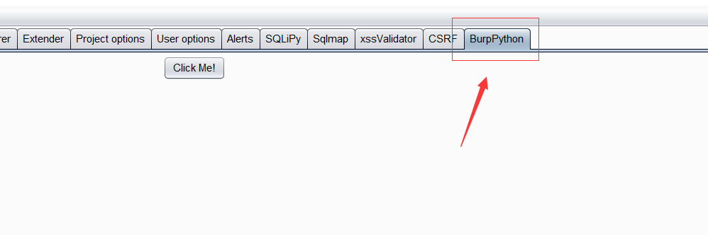
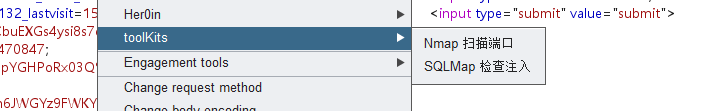
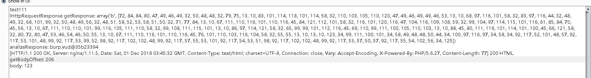
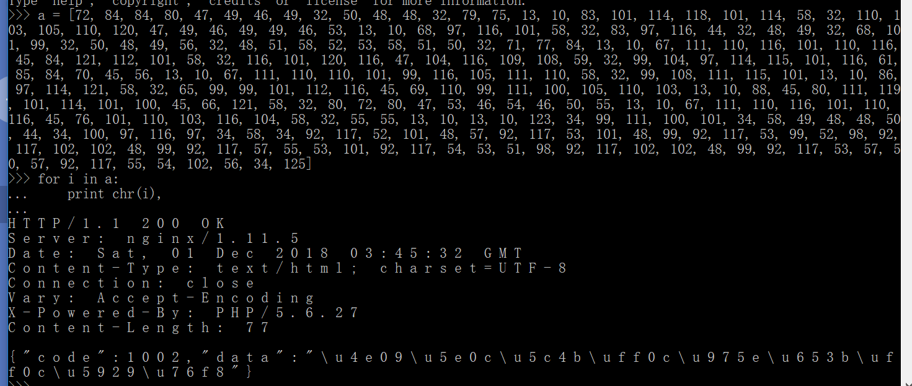
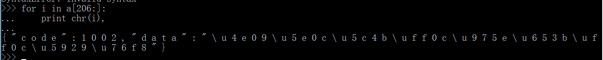

[TOC]
# burp 插件开发 - python(三)

Refer:
https://portswigger.net/burp/extender#SampleExtensions

## Python 编写 Burp 面板
demo code：
```
#!/usr/bin/env python        
#coding:utf-8
import sys
reload(sys)
sys.setdefaultencoding('utf-8') 

# 导入 burp 接口
from burp import IBurpExtender, ITab

from javax.swing import JPanel
from javax.swing import JButton

class BurpExtender(IBurpExtender, ITab):

    def registerExtenderCallbacks(self, callbacks):

        self._cb = callbacks
        self._hp = callbacks.getHelpers()

        self._cb.setExtensionName('BurpPython')
        print 'hello burp!'

        self.mainPanel = JPanel()

        # 初始化一个 JButton 并绑定单击事件
        self.testBtn = JButton('Click Me!', actionPerformed=self.testBtn_onClick)

        self.mainPanel.add(self.testBtn)

        self._cb.customizeUiComponent(self.mainPanel)
        self._cb.addSuiteTab(self)

    def testBtn_onClick(self, event):
        print 'testBtn clicked!'

    # 实现 ITab 接口的 getTabCaption() 方法
    def getTabCaption(self):
        return 'BurpPython'

    def getUiComponent(self):
        return self.mainPanel
```

使用 Python 调用 Java 的 swing 图形控件库并绑定相关事件。最终结果如下图：



## Python 编写 Burp 插件实例之右键工具集成菜单

demo code:
```
#!/usr/bin/env python        
#coding:utf-8
import sys
reload(sys)
sys.setdefaultencoding('utf-8') 

import os
import sys
import json
import thread
import traceback

# 导入 burp 相关接口
from burp import IBurpExtender
from burp import IContextMenuFactory

# 导入 Java 相关库
from javax.swing import JMenu
from javax.swing import JMenuItem

reload(sys)
sys.setdefaultencoding('utf-8')


class BurpExtender(IBurpExtender, IContextMenuFactory):

    def registerExtenderCallbacks(self, callbacks):

        self.messages = []
        self.menusConf = {}

        self.callbacks = callbacks
        self.helpers = callbacks.getHelpers()

        self.callbacks.issueAlert('toolKits is ready ...')
        self.callbacks.setExtensionName('toolKits')
        self.callbacks.registerContextMenuFactory(self)

    def loadMenus(self):
        self.menus = []
        self.mainMenu = JMenu("toolKits")
        self.menus.append(self.mainMenu)

        try:
            with open('toolKits/toolKits.conf') as fp:
                self.menusConf = json.loads(fp.read())
        except:
            self.mainMenu.add(JMenuItem(u'加载配置出错!'))
        else:
            for tool in self.menusConf:
                # 遍历配置，创建子菜单项，并添加事件绑定
                menu = JMenuItem(tool['name'],
                                 None,
                                 actionPerformed=lambda x: self.eventHandler(x))
                self.mainMenu.add(menu)

    def createMenuItems(self, invocation):

        # 将加载的过程放在 createMenuItems 接口方法中
        # 可以在不重新加载该插件的情况下，动态加载配置
        self.loadMenus()

        self.messages = invocation.getSelectedMessages()

        # 只在指定的 Burp 标签的右键菜单显示
        # ctx = invocation.getInvocationContext()
        # if not ctx in [0, 1, 2, 3, 4, 5, 6]:
        #     return None

        return self.menus if self.menus else None

    def eventHandler(self, x):
        '''
            通过获取当前点击的子菜单的 text 属性，确定当前需要执行的 command
            启动线程执行命令
        '''

        try:
            menuName = x.getSource().text
            for tool in self.menusConf:
                if tool['name'] == menuName:
                    commands = [tool['command'].replace(
                        '{#}', val) for val in self.getValue(tool['param'])]
                    [thread.start_new_thread(self.execCommand, (command,))
                     for command in commands]
        except:
            print traceback.print_exc()

    def getHost(self, message):
        return message.getHttpService().getHost()

    # 获取 Url 注意此处若通过 meesage.getRequest() 是获取不到的
    def getUrl(self, meesage):
        return str(self.helpers.analyzeRequest(meesage).getUrl())

    # 通过配置中的 参数值 分别获取不同值
    def getValue(self, paramType):
        if paramType == 'host':
            return set([self.getHost(message) for message in self.messages])
        elif paramType == 'url':
            return set([self.getUrl(message) for message in self.messages])

    # 执行命令处理方法
    def execCommand(self, command):
        try:
            print '[I] 正在执行命令: {command}, 请稍后...'.format(command=command)
            res = '---------- 命令 {command} 执行结果: ---------- {res}'.format(
                command=command, res=os.popen(command).read())
            print res
        except:
            print traceback.print_exc()
```

配置文件:
```
[{
  "name": "Nmap 扫描端口",
  "param": "host",
  "command": "nmap -T4 {#}"
},
{
  "name": "SQLMap 检查注入",
  "param": "url",
  "command": "python E:/CTF/pentest/vulscan/sqlmap/sqlmap.py -u {#} --dbs"
}]
```




## python 开发unicode 解码操作(http响应包处理)
Referer: http://www.vuln.cn/6097
```
#!/usr/bin/env python
#coding=utf8
from burp import IBurpExtender
from burp import IHttpListener
from burp import IHttpRequestResponse
from burp import IResponseInfo

import re
# Class BurpExtender (Required) contaning all functions used to interact with Burp Suite API

print 'stayliv3.github.io'

class BurpExtender(IBurpExtender, IHttpListener):

    # define registerExtenderCallbacks: From IBurpExtender Interface 
    def registerExtenderCallbacks(self, callbacks):
    
        # keep a reference to our callbacks object (Burp Extensibility Feature)
        self._callbacks = callbacks
        # obtain an extension helpers object (Burp Extensibility Feature)
        # http://portswigger.net/burp/extender/api/burp/IExtensionHelpers.html
        self._helpers = callbacks.getHelpers()
        # set our extension name that will display in Extender Tab
        self._callbacks.setExtensionName("unicode decode")
        # register ourselves as an HTTP listener
        callbacks.registerHttpListener(self)
        
    # define processHttpMessage: From IHttpListener Interface 
    def processHttpMessage(self, toolFlag, messageIsRequest, messageInfo):
        
        # determine what tool we would like to pass though our extension:
        if toolFlag == 64 or toolFlag == 16 or toolFlag == 32: #if tool is Proxy Tab or repeater
            # determine if request or response:
            if not messageIsRequest:#only handle responses
                response = messageInfo.getResponse()
                 #get Response from IHttpRequestResponse instance
                analyzedResponse = self._helpers.analyzeResponse(response) # returns IResponseInfo
                headers = analyzedResponse.getHeaders()
                #替换iso8859-1
                # iterate though list of headers
                new_headers = []
                for header in headers:
                    # Look for Content-Type Header)
                    if header.startswith("Content-Type:"):
                        # Look for HTML response
                        # header.replace('iso-8859-1', 'utf-8')
                        # print header
                        new_headers.append(header.replace('iso-8859-1', 'utf-8'))
                    else:
                        new_headers.append(header)

                print new_headers

                body = response[analyzedResponse.getBodyOffset():]
                body_string = body.tostring()
                print body_string
                u_char_escape = re.search( r'(?:\\u[\d\w]{4})+', body_string)
                if u_char_escape:
                    # print u_char_escape.group()
                    u_char = u_char_escape.group().decode('unicode_escape').encode('utf8')
                    new_body_string = body_string.replace(u_char_escape.group(),'--u--'+u_char+'--u--')
                    new_body = self._helpers.bytesToString(new_body_string)
                    # print new_body_string
                    messageInfo.setResponse(self._helpers.buildHttpMessage(new_headers, new_body))

```


程序中对IHttpRequestResponse 调用了self._helpers来解析，为什么需要解析呢？ 我们可以看一下输出

IHttpRequestResponse.getResponse()函数获取到的是ascii码，我们可以看看内容:

可以看到，就是响应的ascii。

self._helpers()函数可以将字节码解析成IResponseInfo对象来调用。

而IResponse对象的方法有:
```
int	getBodyOffset() //This method is used to obtain the offset within the response where the message body begins.
java.util.List<ICookie>	getCookies() //This method is used to obtain details of the HTTP cookies set in the response.
java.util.List<java.lang.String>	getHeaders() //This method is used to obtain the HTTP headers contained in the response.
java.lang.String	getInferredMimeType() //This method is used to obtain the MIME type of the response, as inferred from the contents of the HTTP message body.
java.lang.String	getStatedMimeType() //This method is used to obtain the MIME type of the response, as stated in the HTTP headers.
short	getStatusCode() //This method is used to obtain the HTTP status code contained in the response.
```
我们看到IResponseInfo对象并没有直接获取getBody()的函数，而是一个getBodyOffset()来获取body偏移的函数。


那么如果获取response body的内容呢？
```
body = response[analyzedResponse.getBodyOffset():]
print 'body:',body.tostring()
```

可以通过这两行程序来获取


获取到了body的值后对body的内容进行解码处理，然后需要重新构建新的body. 

```
//Interface IHttpRequestResponse
void setResponse(byte[] message)
//Interface IExtensionHelpers
byte[]	buildHttpMessage(java.util.List<java.lang.String> headers, byte[] body)
This method builds an HTTP message containing the specified headers and message body.
```

我们看到重新构建新得body的时候，用了两个函数，一个是setResponse(), 这个函数接受的是一个byte[] 类型的数据，因此我们需要先用buildHttpMessage()函数将headers和body转换成byte[]类型的数据。

## python: 签名插件(http请求包修改)
```
from burp import IBurpExtender
from burp import IHttpListener
from java.io import PrintWriter
import hashlib
import urllib

print "Hack Jeecms Sign By Nerd."

class BurpExtender(IBurpExtender, IHttpListener):
    def registerExtenderCallbacks(self, callbacks):

        self._callbacks = callbacks
        self._helpers = callbacks.getHelpers()
        callbacks.setExtensionName("Hack JeeCMS Sign")
        callbacks.registerHttpListener(self)
        self.stdout = PrintWriter(callbacks.getStdout(), True)
        self.stderr = PrintWriter(callbacks.getStderr(), True)
        callbacks.issueAlert("Loaded Successfull.")

    def processHttpMessage(self, toolFlag, messageIsRequest, currentRequest):
        if messageIsRequest:

            requestInfo = self._helpers.analyzeRequest(currentRequest)

            self.headers = list(requestInfo.getHeaders())
            hook_host = requestInfo.getUrl().getHost()

            bodyBytes = currentRequest.getRequest()[requestInfo.getBodyOffset():]
            self.body = self._helpers.bytesToString(bodyBytes)

            o,n = self.update_sign(urllib.unquote(self.body))
            self.body = self.body.replace(o,n)
            newMessage = self._helpers.buildHttpMessage(self.headers, self.body)
            currentRequest.setRequest(newMessage)

        # Process responses
        else:
            pass

    def update_sign(slef, body=""):
        try:
            old_sign = ""
            # defalut appKey
            appKey = "uicxsXYso7DJxlrFdgQnVVXW5OCzU74h"

            hash_param = ""
            param_list = body.split("&")

            temp_dict = {}
            for pa in param_list:
                t = pa.split("=")
                temp_dict[t[0]] = t[1]

            tmmmm = temp_dict.items()

            tmmmm.sort()
            for (k, v) in tmmmm:
                if k == "sign":
                    old_sign = v
                    print "old sign = ",v
                    continue
                hash_param += "%s=%s&" % (k, v)

            hash_param += "key=" + appKey
            sign = hashlib.md5(hash_param).hexdigest()
            return old_sign,sign.upper()
        except Exception, e:
            return "",""
```

http 请求参数修改有两种方式，一种是和处理http响应一样，直接replace 掉body的内容，第二种是使用getParamter()函数来获取参数替换。
demo :
```
    def processHttpMessage(self, toolFlag, messageIsRequest, currentRequest):
        if toolFlag == 64 or toolFlag == 16 or toolFlag == 32: #if tool is Proxy Tab or repeater
            if messageIsRequest:
                requestInfo = self._helpers.analyzeRequest(currentRequest)
                self.headers = list(requestInfo.getHeaders())
                #print 'headers:',self.headers
                
            
                bodyBytes = currentRequest.getRequest()[requestInfo.getBodyOffset():]
                self.body = self._helpers.bytesToString(bodyBytes)
                #print 'self.body:',self.body
                o,n = self.update_sign(urllib.unquote(self.body))
                self.body = self.body.replace(o,n)
                #print 'replace self.body',self.body
                paraList = self._helpers.analyzeRequest(currentRequest).getParameters()
                #print 'para list',paraList
                newPara = self._helpers.buildParameter('id','xxx', 1);  # 使用parameter 来修改参数
                newMessage = self._helpers.buildHttpMessage(self.headers, self.body) #直接替换body的参数内容。
                newMessage = self._helpers.updateParameter(newMessage, newPara)
                #print 'newMessage:',newMessage
                currentRequest.setRequest(newMessage)
            # Process responses
            else:
                pass

    def update_sign(self, body=""):
        try:
            o = self.body
            n = 'id=1&x=1&d=1'
            return o,n
        except Exception, e:
            return "",""
```

一下两行便是对param进行处理的代码
```
newPara = self._helpers.buildParameter('id','xxx', 1); 
newMessage = self._helpers.updateParameter(newMessage, newPara)
```

buildParamter的用法是:`	buildParameter(java.lang.String name, java.lang.String value, byte type)`

type指参数类型，参数共有7种格式，0是URL参数，1是body参数，2是cookie参数，6是json格式参数。

## python: 在createMenuItems() 中动态修改请求包
```
#!/usr/bin/env python        
#coding:utf-8
import sys
reload(sys)
sys.setdefaultencoding('utf-8') 

import os


from burp import IBurpExtender
from burp import IHttpListener
from java.io import PrintWriter
from burp import IContextMenuFactory
from javax.swing import JMenu
from javax.swing import JMenuItem
import hashlib
import urllib


class BurpExtender(IBurpExtender, IHttpListener,IContextMenuFactory):
    def registerExtenderCallbacks(self, callbacks):

        self._callbacks = callbacks
        self._helpers = callbacks.getHelpers()
        callbacks.setExtensionName("test modify request paramter")
        # callbacks.registerHttpListener(self)
        callbacks.registerContextMenuFactory(self)
        self.stdout = PrintWriter(callbacks.getStdout(), True)
        self.stderr = PrintWriter(callbacks.getStderr(), True)
        callbacks.issueAlert("Loaded Successfull.")

    def createMenuItems(self, invocation):
        self.menus = []
        self.mainMenu = JMenu("Xss-Sql-Fuzz")
        self.menus.append(self.mainMenu)
        self.invocation = invocation
        #print invocation.getSelectedMessages()[0].getRequest()
        menuItem = ['Get','Cookie','Post','modify header','modify body']
        for tool in menuItem:
            #self.mainMenu.add(JMenuItem(tool))
            if tool == 'modify header':
                menu = JMenuItem(tool,None,actionPerformed=lambda x:self.modifyHeader(x))
                self.mainMenu.add(menu)
            elif tool == 'modify body':
                menu = JMenuItem(tool,None,actionPerformed=lambda x:self.modifyBody(x)) # 不能传入invocation,x传入的是当前munuItem的上下文
                self.mainMenu.add(menu)
    
        

        return self.menus if self.menus else None
        
    def modifyHeader(self,x):
        if x.getSource().text == 'modify header': #通过获取当前点击的子菜单的 text 属性，确定当前需要执行的 command
            currentRequest = self.invocation.getSelectedMessages()[0]  #getSelectedMessages()返回数组，但有时为1个，有时2个
            requestInfo = self._helpers.analyzeRequest(currentRequest) # 该部分实际获取到的是全部的Http请求包
            self.headers = list(requestInfo.getHeaders())
            self.headers.append(u'flag:flag{This_is_flag}')
            #print 'self.headers',self.headers
            bodyBytes = currentRequest.getRequest()[requestInfo.getBodyOffset():] # bytes[]类型
            self.body = self._helpers.bytesToString(bodyBytes) #bytes to string转换一下
            #print 'self.body:',self.body
            newMessage = self._helpers.buildHttpMessage(self.headers, self.body)
            currentRequest.setRequest(newMessage) #setRequest() 会动态更新setRequest

    def modifyBody(self,x):
        if x.getSource().text == 'modify body':
            print 'invocaton:',self.invocation.getSelectedMessages
            # print '1:',self.invocation.getSelectedMessages[1]
            # currentRequest1 = self.invocation.getSelectedMessages()[1]
            # print 'currentRequst1:',self._helpers.analyzeRequest(currentRequest1)

            currentRequest = self.invocation.getSelectedMessages()[0]
            requestInfo = self._helpers.analyzeRequest(currentRequest)
            self.headers = list(requestInfo.getHeaders())
            #print 'self.headers',self.headers
            bodyBytes = currentRequest.getRequest()[requestInfo.getBodyOffset():]
            self.body = self._helpers.bytesToString(bodyBytes)
            print 'self.body:',self.body
            o,n = self.update_sign(urllib.unquote(self.body))
            self.body = self.body.replace(o,n)
            newMessage = self._helpers.buildHttpMessage(self.headers, self.body)
            currentRequest.setRequest(newMessage)

    def update_sign(self, body=""):
        try:
            o = self.body
            n = 'id=1&x=1&d=1'
            return o,n
        except Exception, e:
            return "",""
```

self.headers 的内容为:

    self.headers [u'GET /myctf/test/index.php HTTP/1.1', u'Host: localhost', u'Cache-Control: max-age=0', u'Upgrade-Insecure-Requests: 1', u'User-Agent: Mozilla/5.0 (Windows NT 10.0; Win64; x64) AppleWebKit/537.36 (KHTML, like Gecko) Chrome/70.0.3538.110 Safari/537.36', u'Accept: text/html,application/xhtml+xml,application/xml;q=0.9,image/webp,image/apng,*/*;q=0.8', u'Accept-Language: zh-CN,zh;q=0.9,de-DE;q=0.8,de;q=0.7', u'Cookie: Phpstorm-7922267b=3087efff-f144-4a64-b7db-c0219309202e; XDEBUG_SESSION=XDEBUG_ECLIPSE; Ii1Y_2132_saltkey=tt3mn0zy; Ii1Y_2132_lastvisit=1541426905; NKjc_2132_saltkey=rOod6xdo; NKjc_2132_lastvisit=1541427210; Cookie=phpsession; ff=11; PHPSESSID=kb7nh6f8vup42f3ic2phqtck30; current-skin=/static/admin/css/skins/blue.min.css; thinkphp_show_page_trace=0|0; advanced-backend=spkhkduiquc5pp6cj3jn5vol64; _identity-backend=3742ab05863bdfa90e1def484200ef8bdfd991abecf217f18db54e6f6f780e2ca%3A2%3A%7Bi%3A0%3Bs%3A17%3A%22_identity-backend%22%3Bi%3A1%3Bs%3A46%3A%22%5B1%2C%22G-z9APCNR7JOzMzRFTUYA-TdRnzrDnRv%22%2C2592000%5D%22%3B%7D; _csrf-backend=fe628b573ab7f0d296e36fcc813fc461c8869b29911454afa6281884eb40e3d9a%3A2%3A%7Bi%3A0%3Bs%3A13%3A%22_csrf-backend%22%3Bi%3A1%3Bs%3A32%3A%22TjAurudjSkUx36J6hc6jBF43WAgDyeCx%22%3B%7D', u'Connection: close', u'Client-IP: 127.0.0.1']
    
我们可以直接在self.headers中添加一个字段.即可，下面

## 总结: 

### processHttpMessage 和 动态更新Request 的区别
processHttpMessage() 函数是在发起请求的一刻去监听，然后执行这个函数去构造真正的request请求，可以在repeater或者intruder窗口去监听。在请求发起的那一刻去构造真正的request请求数据包，因此我们在Repeater中是不会看到我们修改的请求包。

但如果我们修改的是响应包，则是可以看得到的。

动态更新Request即当我们点击右键的时候，可以看到repeater窗口，或者intruder窗口的变化。

### 参数获取的方法

```
//**************获取参数 通过IRequestInfo对象*************************//
List<IParameter> paraList = analyzeRequest.getParameters();
//当body是json格式的时候，这个方法也可以正常获取到键值对；
//但是PARAM_JSON等格式不能通过updateParameter方法来更新。
//如果在url中的参数的值是 xxx=json格式的字符串 这种形式的时候，getParameters应该是无法获取到最底层的键值对的。
for (IParameter para : paraList){
    byte type= para.getType(); //获取参数的类型
    String key = para.getName(); //获取参数的名称
    String value = para.getValue(); //获取参数的值
}
//参数共有7种格式，0是URL参数，1是body参数，2是cookie参数，6是json格式参数
```
demo code:(python)
```
paraList = self._helpers.analyzeRequest(currentRequest).getParameters()
print 'paraList',paraList
for para in paraList:
    type = para.getType()
    key = para.getName()
    value = para.getValue()
    print type,key,value

>>>
paraList [burp.t0b@6beec43d, burp.t0b@49770a69, burp.t0b@56226f89, burp.t0b@39b1f93c, burp.t0b@24e30d1b, burp.t0b@55b66fac, burp.t0b@10ad1cb4, burp.t0b@26e37f84, burp.t0b@1a542596, burp.t0b@7c79e27f, burp.t0b@44909f8, burp.t0b@396b59aa, burp.t0b@2a8a384, burp.t0b@31f1d3b4, burp.t0b@7d3b1abb, burp.t0b@1e7eaabf, burp.t0b@598d9e77, burp.t0b@665e8a81, burp.t0b@4395ba33, burp.t0b@2855dbac]
0 id 1
2 0IGC_2132_lastcheckfeed 1%7C1540987028
2 0IGC_2132_nofavfid 1
2 1WmJ_2132_lastcheckfeed 1%7C1541126275
2 9RwT_2132_saltkey sxbfvmxz
2 9RwT_2132_lastvisit 1541467212
2 9RwT_2132_ulastactivity c850CXC2ILCbuEXGs4ysi8s7dnD8sIgXjQrPPQOXNDxoV0autQ5U
2 9RwT_2132_lastcheckfeed 2%7C1541470847
2 1WmJ_2132_ulastactivity 137bU68EZspYGHPoRx03Q%2BIF%2FPWaU3JZ5DdjOw2vJ4Q27F1ZAlLw
2 0IGC_2132_ulastactivity 39dfo6%2Fhn6JWGYz9FWKY%2BWEK15KD9QmM77bKIqK4ExdBwqXUgsbi
2 9RwT_2132_nofavfid 1
2 province_id 1
2 city_id 2
2 district_id 3
2 pgv_pvi 8970343424
2 _identity-frontend ca858ba5ec1b2e6ecba9329e0e51856b8dfdfa7fc8a6c479dd8fd5562777d20ea%3A2%3A%7Bi%3A0%3Bs%3A18%3A%22_identity-frontend%22%3Bi%3A1%3Bs%3A46%3A%22%5B1%2C%22G-z9APCNR7JOzMzRFTUYA-TdRnzrDnRv%22%2C2592000%5D%22%3B%7D
2 _identity-backend 3742ab05863bdfa90e1def484200ef8bdfd991abecf217f18db54e6f6f780e2ca%3A2%3A%7Bi%3A0%3Bs%3A17%3A%22_identity-backend%22%3Bi%3A1%3Bs%3A46%3A%22%5B1%2C%22G-z9APCNR7JOzMzRFTUYA-TdRnzrDnRv%22%2C2592000%5D%22%3B%7D
2 XDEBUG_SESSION XDEBUG_ECLIPSE
1 x 1x'"><rivirtest>
1 d 1x'"><rivirtest>
```

### 参数更新的方法

    updateParameter(byte[] request, IParameter parameter)
This method updates the value of a parameter within an HTTP request, and if appropriate updates the Content-Length header.
```
    def getFuzz(self,x):
        if x.getSource().text.startswith('get fuzz'):
            self.payload = x.getSource().text.split(':')[-1]
            currentRequest = self.invocation.getSelectedMessages()[0] #return IHttpRequestResponse
            body = currentRequest.getRequest() #return byte[]
            requestInfo = self._helpers.analyzeRequest(currentRequest) #returns IResponseInfo
            paraList = requestInfo.getParameters() #array
           # print 'paraList',paraList
            new_requestInfo = body
            for para in paraList:
                if para.getType() == 0:
                    value = para.getValue()+self.payload 
                    key = para.getName()
                    newPara = self._helpers.buildParameter(key, value, para.getType())
                    new_requestInfo = self._helpers.updateParameter(new_requestInfo,newPara) #updateParameter(byte[],IParameter) return byte[]
                    
            
            currentRequest.setRequest(new_requestInfo)
```

里面涉及了几种数据类型的转换，因此一定要注意了。

获取headers和body的方法如下:
```
//**************获取headers 通过IRequestInfo对象*************************//
List<String> headers = analyzeRequest.getHeaders();


//**************获取body 通过String格式的request截取*************************//
int bodyOffset = analyzeRequest.getBodyOffset();

byte[] byte_Request = messageInfo.getRequest();//当需要byte[]和string格式的请求包时用这个方法！
String request = new String(byte_Request); //byte[] to String

String body = request.substring(bodyOffset);
byte[] byte_body = body.getBytes();  //String to byte[]
```

> updateParamter()函数如果key存在，则更新，如果key不存在，则新增。

Referer: burp suite API 处理http请求和响应的基本流程 https://github.com/bit4woo/burp-api-drops


## python 编写主动/被动扫描插件
### carbonator
```
file_name = 'burp_report_'+self.scheme+'_'+self.fqdn+'_'+str(self.port)+'.'+time.strftime("%Y%m%d-%H%M%S",time.localtime(time.time()))+format.lower()

```

## 用Python开发一个扫描目录的主动扫描插件


## 一些burpsuite 的py插件收集
Referer: https://github.com/PortSwigger (burpsuite官网插件库)

### burp-xss-sql-plugin
HTML Inj: Special symbols are checked one-by-one if they appear in output. WAF/base64encoding/location/content-type/etc detections.

SQL Inj: All parameters are transfered through SQLMap API to host, which in used for asynchronous scanning.

    class BurpExtender(IBurpExtender, IScannerCheck, IHttpListener, IProxyListener, IScannerListener, IExtensionStateListener):
    
### off-by-slash
Burp扩展通过NGINX大规模错误配置来检测别名遍历

https://github.com/bayotop/off-by-slash

The extension implements an active scanner check. Simply run a new scan, preferably with an "Audit checks - extensions only" configuration, on static resources identified via Burp's crawler. Alternatively, use scrape.py with a list of URLs to scrape static resources from. The results can be directly passed to a new Burp scan (Burp 2.0).

### CTFHelper
 simple Burp extension for scanning stuffs in CTF
 
https://github.com/unamer/CTFHelper

This extension will scan some sensitive files (backup files likes .index.php.swp or .git directory) in web server that makes solving CTF challenge faster.


### off-by-slash(nginx alias traversal)

Burp extension to detect alias traversal via NGINX misconfiguration at scale. Requires Burp Professional.

https://github.com/PortSwigger/nginx-alias-traversal

### chunked-coding-converter
https://github.com/c0ny1/chunked-coding-converter

本插件主要用于分块传输绕WAF，不了解分块传输绕WAF的请阅读文末的文章。

