[TOC]
# Discuz ML! V3.X 代码注入漏洞
不多说，先看效果
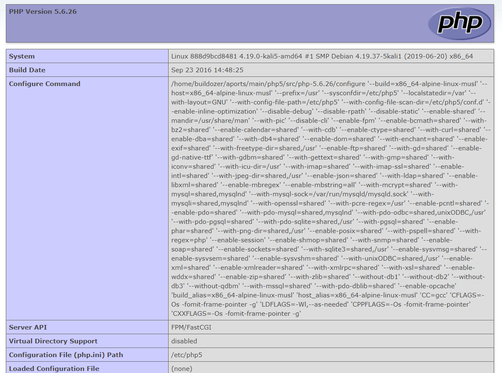
我们成功的让Discuz执行了phpinfo()
### 0x00环境搭建
Discuz源码下载链接http://discuz.ml/download
这里我使用的是docker进行复现
```bash
docker pull p8361/discuz-ssrf
docker run -it -P --name discuz p8361/discuz-ssrf /bin/bash
#这时要先退出来
#将下载回来的源码中的upload复制到docker中
docker cp ./upload/* discuz:/upload
dcoker start discuz
docker exec -it discuz /bin/bash
```
接着在docker里面进行配置
```bash
rm -r /www/*
cp -r /upload/* /www/
chown -R nginx:nginx /www
/start.sh
#MySQL: root/root
```
接着就是简单的安装，当你看到如下的时候就已经把环境配置好了
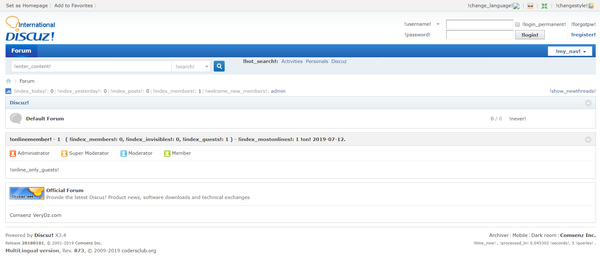
### 0x01漏洞复现
这里的漏洞源于cookie中的语言选项
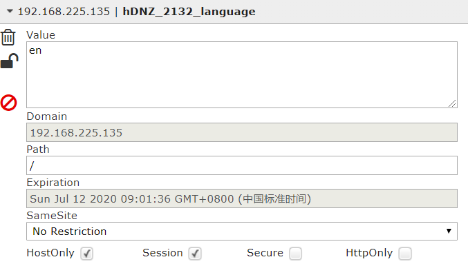<br>
将这里的`en`改为<font color="red">`en'.phpinfo().'`</font>即可触发漏洞
接下来该做什么应该不用多说了
### 0x02源码分析
通过表哥的poc，发现报错位置
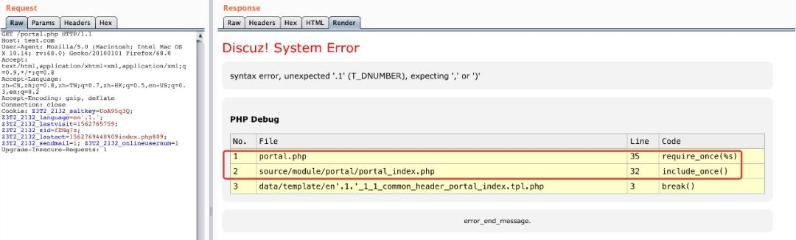
追踪源码的`source/module/portal/portal_index.php`
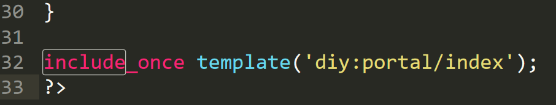
继续跟进template函数，在`/source/function/function_core.php`中找到
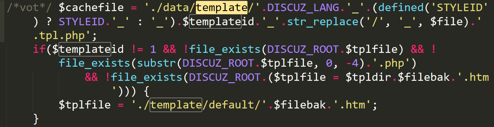
程序将缓存文件写在了`/data/template/`目录下，文件名由DISCUZ_LANG等多个变量组成，继续追踪DISCUZ_LANG，还是在`function_core.php`
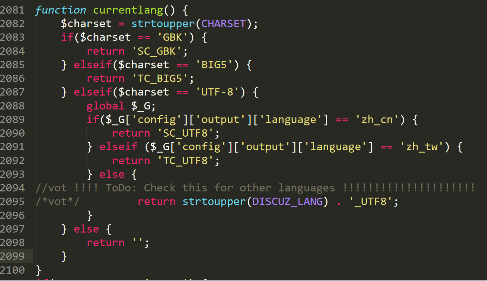
从变量`$_G['config']['output']['language']`获取，继续追踪
在`/source/class/discuz/discuz_application.php`中找到
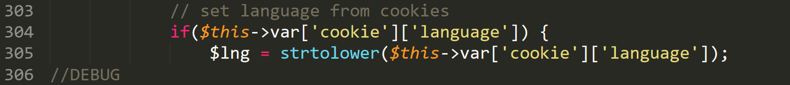
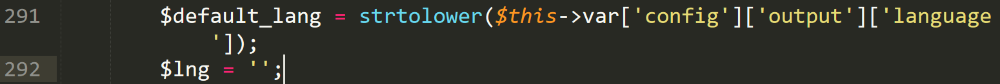
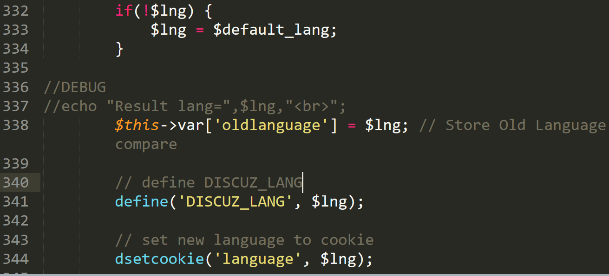
确定了`$lng`这个参数来自于cookie中，由于`$lng`并没有过滤，所以导致`tmplate`模板名可控，这样在被`include_once`时就可以执行代码

### 最后搜索一下可以利用的地方
差不多也就60多处可以利用的地方把Σ(っ °Д °;)っ
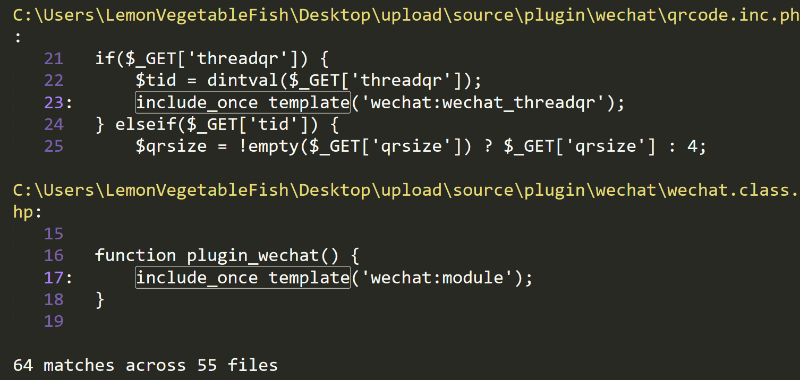

