[TOC]

Referer:
- IDEA 超实用使用技巧分享 https://juejin.im/post/5d47f4e851882534d152a206#heading-3
- 开发利器之IntelliJ IDEA学习笔记 https://segmentfault.com/a/1190000016330547#16


# IDEA 基础(一)
## 一、基础知识
1. 永久破解
- https://www.jb51.net/article/178193.htm

第一步：编辑idea.exe.vmoptions和idea64.exe.vmoptions文件，这两个文件的修改方式完全相同，都是修改文件的最后一行："-javaagent:"。确保"-javaagent:将jar文件的全路径拷贝到这里"。例如：
```
-javaagent:C:\Program Files\JetBrains\IntelliJ IDEA 2018.3.3\bin\JetbrainsIdesCrack-4.2-release-sha1-3323d5d0b82e716609808090d3dc7cb3198b8c4b.jar
```

第二步：打开IDEA工具：Help-->Register...-->选择Activation code，将以下激活码粘贴进去，重启IDEA

```
ThisCrackLicenseId-{
"licenseId":"ThisCrackLicenseId",
"licenseeName":"idea",
"assigneeName":"",
"assigneeEmail":"idea@163.com",
"licenseRestriction":"For This Crack, Only Test! Please support genuine!!!",
"checkConcurrentUse":false,
"products":[
{"code":"II","paidUpTo":"2099-12-31"},
{"code":"DM","paidUpTo":"2099-12-31"},
{"code":"AC","paidUpTo":"2099-12-31"},
{"code":"RS0","paidUpTo":"2099-12-31"},
{"code":"WS","paidUpTo":"2099-12-31"},
{"code":"DPN","paidUpTo":"2099-12-31"},
{"code":"RC","paidUpTo":"2099-12-31"},
{"code":"PS","paidUpTo":"2099-12-31"},
{"code":"DC","paidUpTo":"2099-12-31"},
{"code":"RM","paidUpTo":"2099-12-31"},
{"code":"CL","paidUpTo":"2099-12-31"},
{"code":"PC","paidUpTo":"2099-12-31"} ],
"hash":"2911276/0",
"gracePeriodDays":7,
"autoProlongated":false}
```

2. 基础配置

```
面板大小设置: Settings->Appearance->Size (推荐14)
编辑器字体大小设置: Editor->Font->推荐18
```

## 二、环境配置
### 2.1 导入jar包(反编译)
File->Project Structure->Libraries

加载进来相应的包即可，我们就可以再External Libraries中看到我们加载的class.
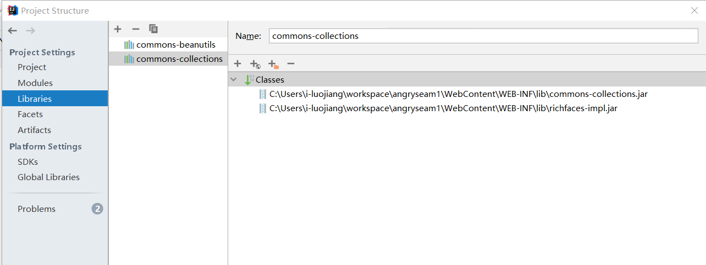

使用IDEA反编译jar包也是一样的道理，直接将jar包导入某个项目，就可以直接反编译class字节码了。

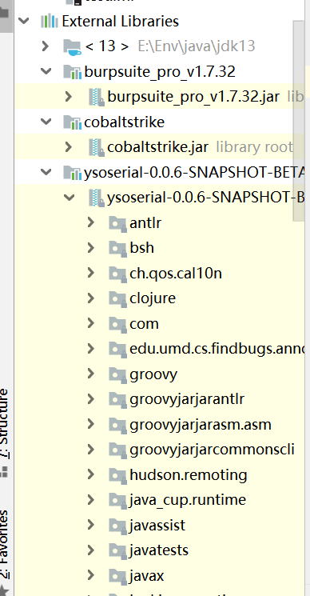

如果是Web项目的话，我们也可以找到lib文件夹，选中所有的jar包，右键add as library
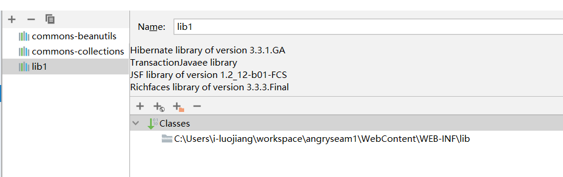

我们也可以在全局SDK中加上我们的class path, 这样之后加载的项目都可以用到这个jar包。

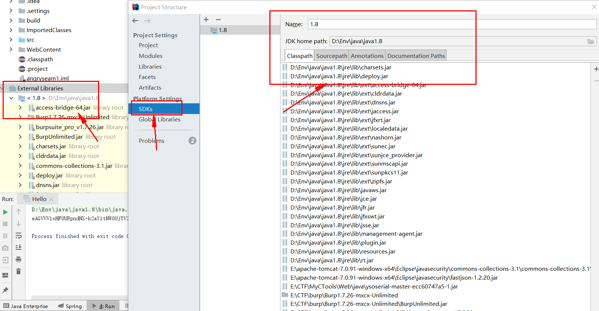


### 2.2 配置web环境

1. 配置tomcat

tomcat server->local
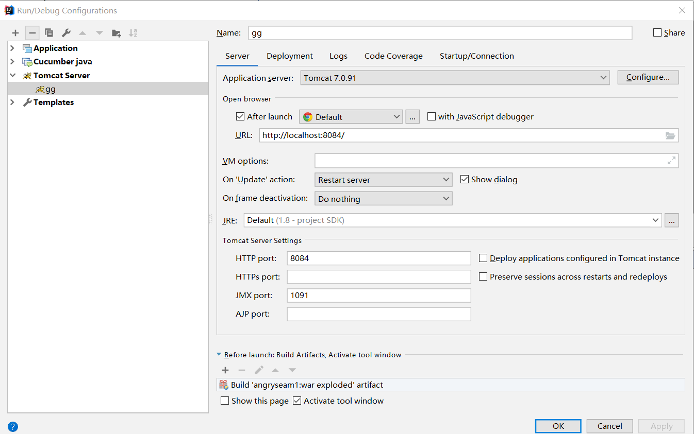

如何布置好了artifacts,可以直接在deploy里面布置即可。
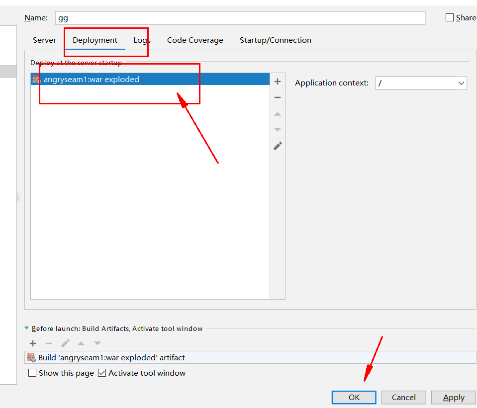

如果没有不知，点击fix修复去布置。
点击Facets->Web->选择module
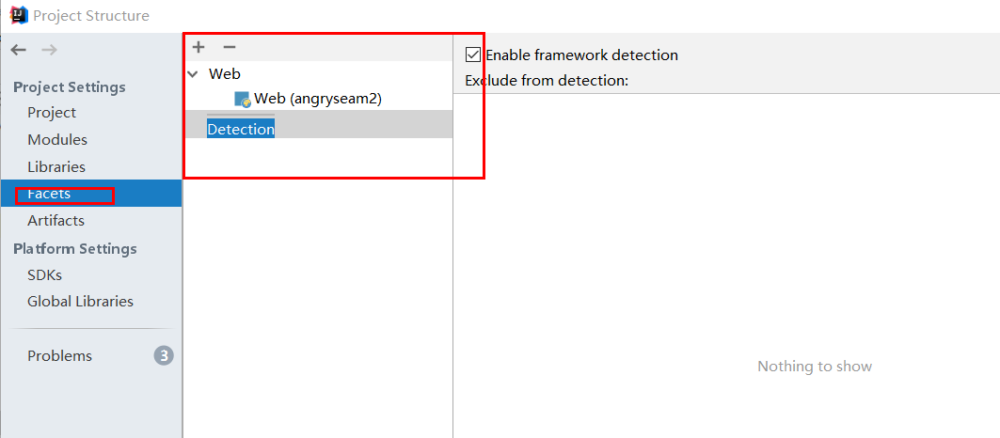
点击Artifacts->Web Application:Exploid->From Modules就算布置好了，然后去tomcat server 那儿不知artifacts即可。
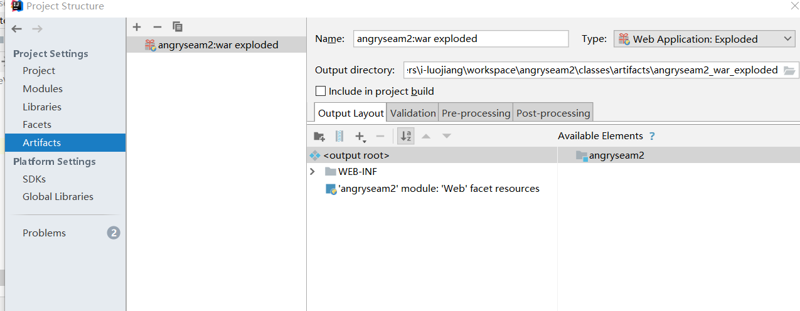

## 三、模板生成

### 3.1 文件模板
Settings -> Editor -> File and Code Template

可以设置文件头(针对任意文件)以及针对特定文件类型生成对应的文件模板， 如下是生成一个文件头的设置: 
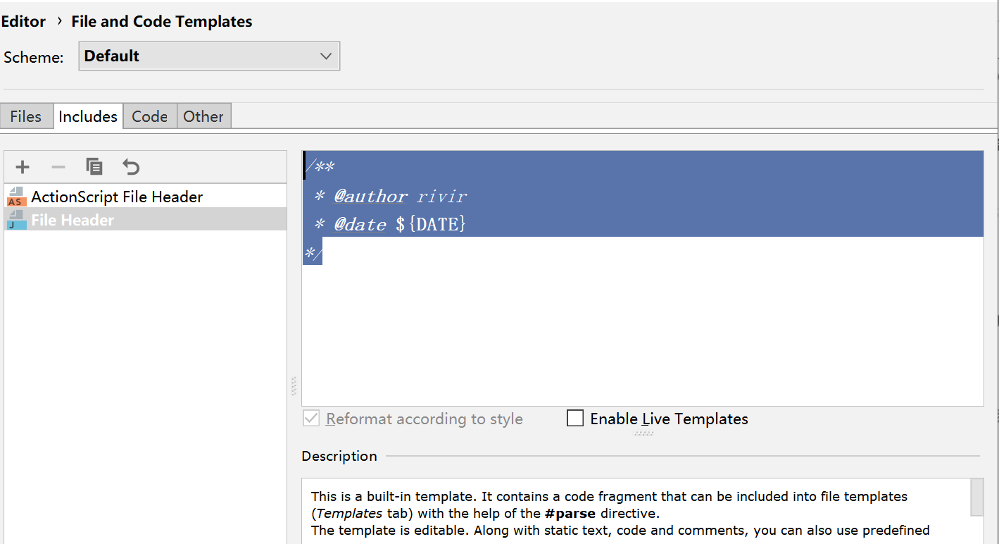

```
/**
 * @author rivir
 * @date ${DATE}
*/
```
我们新建一个java文件后的文件内容如下:
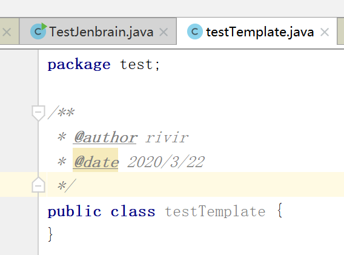

### 3.2 代码模板
代码模板类似sublime中通过触发某个关键字快速生成某个对应代码片段。

IEDA已经内置了一些函数模板和关键字模板了。当你输入sout或者psvm，就会快速自动生成System.out.println();和public static void main(String[] args) {}的代码块。
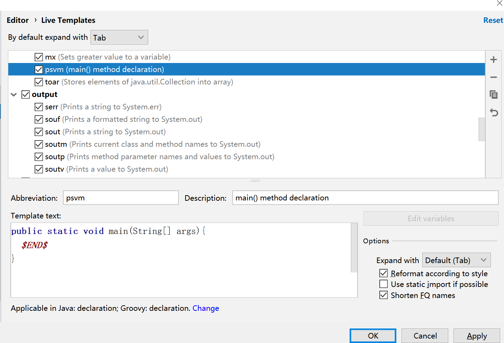
```
//psvm
public static void main(String[] args){
  $END$
}
//sout
System.out.println($END$);
//psfs
public static final String 
```

## 四、使用技巧
1. ctrl+alt+L 快速格式化代码

2. 右键->generator，快速生成类的setter,getter, 覆写equals(),hashcode(),toString()

## 五、插件安装
`File -> Setting -> Plugin`

1. Alibaba Java Coding Guidelines 阿里Java编程规约插件
2. FindBugs 代码缺陷扫描
3. Rainbow brackets 让代码中的括号更具标识性
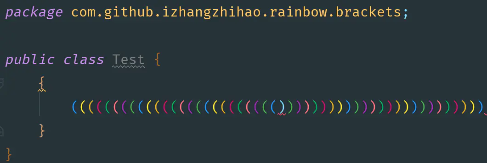