[TOC]

# Nmap - 基础介绍(一)

Referer: 
- nmap中文手册 https://nmap.org/man/zh/ 
- Nmap 参考指南 https://wizardforcel.gitbooks.io/nmap-man-page/content/14.html
- 【渗透神器系列】nmap https://thief.one/2017/05/02/1/


## 基础

1. 安装

centos
: https://nmap.org/download.html
下载yum包直接用yum安装即可。
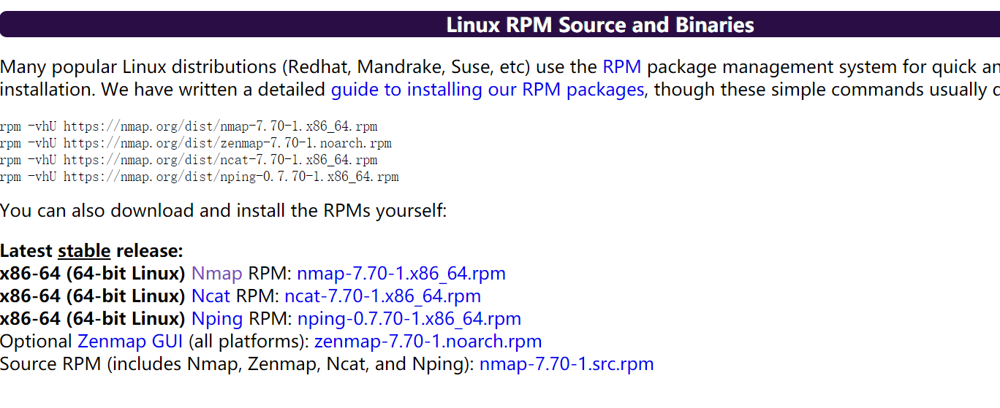

    rpm -vhU nmap-7.70-1.x86_64.rpm

ubuntu
: 直接apt安装即可，低版本nmap可能无法直接安装，nmap 没有直接提供ubuntu的deb包，需要从rpm转成deb

```
sudo apt-get install alien
wget https://nmap.org/dist/nmap-7.70-1.x86_64.rpm
sudo alien nmap-7.70-1.x86_64.rpm
sudo dpkg -i nmap-7.70-1.x86_64.deb
```


2. 目录结构

linux: 
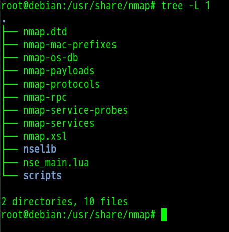

```
文件名称	文件说明
nmap.dtd	Nmap输出的XML格式内部变量的定义
nmap-mac-prefixes	是Nmap针对不同终端的MAC地址所收集的指纹（常用于内网扫描）
nmap-os-db	Nmap针对不同终端的操作系统返回的数据包特征所收集的指纹
nmap-payloads	是Nmap在扫描时将payload向扫描目标发送的数据
nmap-protocols	Nmap 用来存储目标端口对应服务描述的db文件
nmap-rpc	Nmap在扫描的时候调用RPC进行服务发现的db文件
nmap-service-probes	Nmap针对响应数据包内容进行正则匹配从而判断服务的db文件
nmap-services	Nmap存储一个TCP/UDP服务的db文件
nmap-xsl	Nmap导出xml文件的模板
nselib	Nmap的脚本引擎扩展库
nse_main.lua	在调用任何Nmap脚本都会提前自动调用的预处理Lua脚本
Scripts	Nmap的脚本扩展
```


3. 功能架构

扫描流程 V1


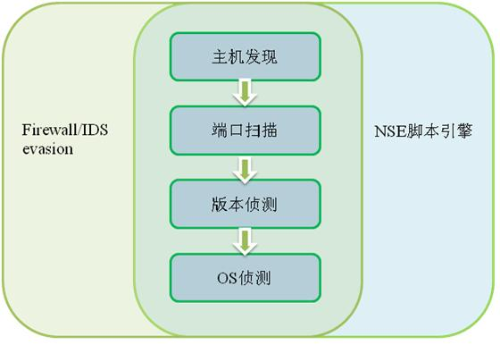

扫描流程 V2

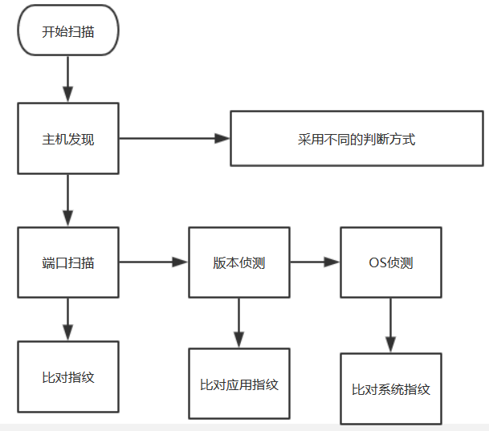

nmap的默认端口配置在`/usr/share/nmap`的nmap-services文件中,

默认扫描: 1-1024 以及在该文件中权重更大的端口


nmap 默认扫描模式是有问题的,因为默认不会扫描像6379, 11211, 20717 这些高危端口

如果需要默认扫描就需要自定义这些端口的权重和名称

或者直接: `nmap -p 1-65535 xxx`
    

4. Nmap 常用命令

信息化部门分配了两个测试ip：10.9.121.24 10.9.121.25我们对可访问的网段使用Nmap 7.60进行了端口扫描：

    nmap -v -sn -PE -n --min-hostgroup 1024 --min-parallelism 1024 -oN  10.9.0.0/16
    
发现下列C段地址存在存活主机：10.9.41.0/24，10.9.70.0/24，10.9.121.0/24

```
//扫描开放特定端口的ip段
nmap -p 1-1000 www.blogsir.com.cn

//扫描某个网段的开放22端口情况
nmap -p 22 192.168.41.*

//扫描ip.txt 中的端口，因此平时渗透的时候需要收集ip
nmap -sT -sV -O -P0 --open -n -oN result.txt -p80-89,8080-8099,8000-8009,7001-7009,9000-9099,21,443,873,2601,2604,3128,4440,6082,6379,8888,3389,9200,11211,27017,28017,389,8443,4848,8649,995,9440,9871,2222,2082,3311,18100,9956,1433,3306,1900,49705,50030,7778,5432,7080,5900,50070,5000,5560,10000 -iL ip.txt

```
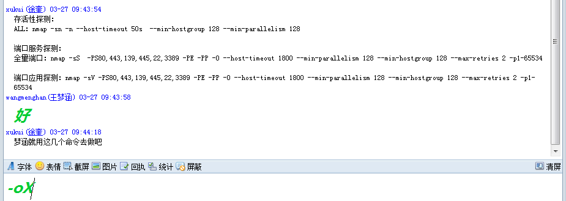

扫全网的命令:
```
nmap -sV -Pn -p7,9,13,20,21,22,23,25,26,37,42,43,47,53,63,66,67,68,69,70,79,80,81,88,89,106,107,109,110,111,113,115,119,123,135,136,137,138,139,143,144,152,161,162,179,194,199,210,216,220,247,256,257,258,259,260,261,264,265,389,427,443,444,445,464,465,500,502,512,513,514,515,517,520,524,525,543,544,546,547,548,554,563,574,585,587,591,593,599,614,626,631,635,636,640,646,647,650,662,777,808,830,832,833,847,873,901,989,990,992,993,995,1025,1026,1027,1028,1029,1080,1081,1090,1098,1099,1110,1157,1158,1159,1186,1214,1241,1270,1308,1352,1433,1434,1494,1498,1521,1525,1527,1529,1618,1720,1723,1745,1755,1808,1818,1862,1900,1993,2000,2001,2005,2049,2069,2121,2181,2273,2301,2381,2564,2717,2811,2888,3000,3005,3007,3049,3128,3264,3268,3269,3306,3389,3401,3700,3897,3986,4001,4045,4100,4200,4444,4445,4687,4848,4899,5000,5009,5051,5060,5101,5190,5357,5432,5560,5631,5632,5666,5800,5801,5802,5803,5900,5901,5902,5903,5997,5998,5999,6000-6063,6379,6446,6488,6646,7001,7070,7100,7443,7627,7677,8000,8008,8009,8021,8069,8080,8081,8083,8088,8089,8093,8182,8443,8765,8888,9001,9030,9079-9091,9100,9152,9200,9300,9443,9444,9988,9999,10000,10005,10162,11211,16020,16992,16993,17235,20002,20003,20048,20049,21201,24680,27017,28017,32768,49152,49153,49154,49155,49156,49157,50010,50020,50030,50060,50070,50075,50090,60010,63342,65301 -O --host-time 700 -oX

```


5. 端口扫描状态
许多传统的端口扫描器只列出所有端口是开放还是关闭的， Nmap 的信息粒度比它们要细得多 它把端口分成六个状态: open(开放的)， closed(关闭的)，filtered(被过滤的)， unfiltered(未被过滤的)， open|filtered(开放或者被过滤的)，或者 closed|filtered(关闭 或者未被过滤的)。

默认情况下，Nmap会扫描1000个最有可能开放的TCP端口。
Nmap通过探测将端口划分为6个状态：
```
open：端口是开放的。
closed：端口是关闭的。
filtered：端口被防火墙IDS/IPS屏蔽，无法确定其状态。
unfiltered：端口没有被屏蔽，但是否开放需要进一步确定。
open|filtered：端口是开放的或被屏蔽。
closed|filtered ：端口是关闭的或被屏蔽。
```

 

扫描192.168.41.* 网段内所有开启22端口的主机信息

指纹识别
: 
使用nmap命令的-O 选项启动操作系统测试功能。-sV 参数可以识别端口服务的指纹，但-sV 参数特别耗时，扫描本地端口-sV参数需要90s, 而不加上-sV参数仅仅需要0.2s

```
root@lj ~# nmap -O 127.0.0.1

Starting Nmap 7.40 ( https://nmap.org ) at 2017-02-03 14:47 CST
Nmap scan report for localhost (127.0.0.1)
Host is up (0.000030s latency).
Not shown: 994 closed ports
PORT     STATE SERVICE
80/tcp   open  http
3306/tcp open  mysql
5000/tcp open  upnp
5001/tcp open  commplex-link
5002/tcp open  rfe
9999/tcp open  abyss
Device type: general purpose
Running: Linux 3.X|4.X
OS CPE: cpe:/o:linux:linux_kernel:3 cpe:/o:linux:linux_kernel:4
OS details: Linux 3.8 - 4.6
Network Distance: 0 hops

OS detection performed. Please report any incorrect results at https://nmap.org/submit/ .
Nmap done: 1 IP address (1 host up) scanned in 1.72 seconds

```

> 注意，nmap默认不会扫描6379 redis服务。需要自己修改配置文件。

## 四种常见扫描方式

下面列出了最常用的四种扫描类型：

```
PING 扫描（-sP）
TCP SYN 扫描（-sS）
TCP Connect() 扫描（-sT）
UDP 扫描（-sU）
```
1. -sP : ping 扫描

```
lj@lj ~> nmap -sP 59.64.78.1

Starting Nmap 7.01 ( https://nmap.org ) at 2018-03-15 12:02 CST
Nmap scan report for 59.64.78.1
Host is up (0.0071s latency).
Nmap done: 1 IP address (1 host up) scanned in 0.01 seconds
```

默认不扫描端口，只进行nmap第一阶段:主机发现

经常用于扫描Ｃ端主机存活情况:

    nmap -sP 59.64.78.1/24
    

2.  -sS: tcp syn扫描，
又称为半开放式扫描，

特点：

-  需要root权限
-  步骤:
```
TCP SYN 扫描通过执行下面的步骤来进行工作：

源系统向目标系统发送一个同步请求，该请求中包含一个端口号。
如果添加在上一步中的所请求的端口号是开启的，那么目标系统将通过同步/应答（SYN/ACK）来响应源系统。
源系统通过重置（RST）来响应目标系统，从而断开连接。
目标系统可以通过重置/应答（RST/ACK）来响应源系统。
```


在root权限是默认sS 扫描:

```
lj@lj ~> sudo nmap -vv  59.64.78.183

Starting Nmap 7.01 ( https://nmap.org ) at 2018-03-15 12:15 CST
Initiating Ping Scan at 12:15
Scanning 59.64.78.183 [4 ports]
Completed Ping Scan at 12:15, 0.22s elapsed (1 total hosts)
Initiating SYN Stealth Scan at 12:15
Scanning test (59.64.78.183) [1000 ports]
Discovered open port 80/tcp on 59.64.78.183
Discovered open port 22/tcp on 59.64.78.183
```

第一步是`Initiating Ping Scan` 表示初始化Ping 扫描,即nmap主机发现阶段，　第二步是:`Initiating SYN Stealth Scan` 表示初始化syn 扫描
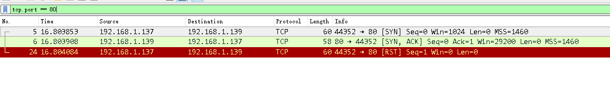

参考：　https://zhuanlan.zhihu.com/p/26330857


3. sT tcp connect扫描

尽管 TCP SYN 扫描需要 Root 权限，但 TCP Connect() 扫描并不需要。在这种扫描中会执行一个完整的“三次握手”。因为不需要 Root 权限，所以在无法获取 Root 权限的网络上，这种扫描非常有用。

特点：

1. 不需要root权限
2. 三握手


如果不指定，在普通权限下模式采用的tcp connect扫描，在root权限下默认是syn扫描，另外tcp扫描和syn扫描的扫描默认端口是不一样的，这点要区分。

```
lj@lj ~> nmap -vv  59.64.78.183

Starting Nmap 7.01 ( https://nmap.org ) at 2018-03-15 12:21 CST
Initiating Ping Scan at 12:21
Scanning 59.64.78.183 [2 ports]
Completed Ping Scan at 12:21, 0.01s elapsed (1 total hosts)
Initiating Connect Scan at 12:21
Scanning test (59.64.78.183) [1000 ports]
Discovered open port 22/tcp on 59.64.78.183
Discovered open port 80/tcp on 59.64.78.183
Discovered open port 3306/tcp on 59.64.78.183
```

端口开放: 
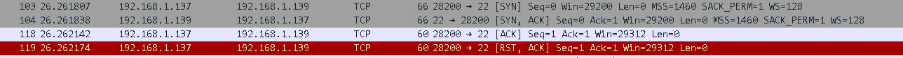
这种类型的扫描，完成了tcp 三次握手的连接, 最后又发送一个 RST 的连接重置的请求包断开了连接，一共发4个包，经过这样一个过程，nmap这边判断80端口是开启的。

端口关闭:
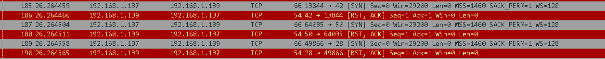
一共发2个包，如果靶机这边直接回复RST拒绝连接。nmap 这边就认为这个端口是关闭的。

**对比**

1. -sS 和 -sT的对比:
```
root@lj /m/h/F/s/p/t/libnmap# nmap -sT -T4 176.28.50.166
Starting Nmap 7.70 ( https://nmap.org ) at 2019-04-02 10:31 CST
Nmap scan report for mx1old.skatedeluxe.de (176.28.50.166)
Host is up (0.00051s latency).
All 1000 scanned ports on mx1old.skatedeluxe.de (176.28.50.166) are filtered

Nmap done: 1 IP address (1 host up) scanned in 21.29 seconds


root@lj /m/h/F/s/p/t/libnmap# nmap -sT -T4 176.28.50.166
Starting Nmap 7.70 ( https://nmap.org ) at 2019-04-02 10:31 CST
Nmap scan report for mx1old.skatedeluxe.de (176.28.50.166)
Host is up (0.00051s latency).
All 1000 scanned ports on mx1old.skatedeluxe.de (176.28.50.166) are filtered

Nmap done: 1 IP address (1 host up) scanned in 21.29 seconds
```


2. 不同参数下的时间对比:

目标|扫描参数|花费时间
-|-|-
127.0.0.1|-sT -p1-65535 -T4|2s
127.0.0.1|-sS -p1-65535 -T4|2s
127.0.0.1|-sV -sS -p1-65535 -T4|90s
127.0.0.1|-sS -T5 -P0 -O --script=banner -p T:21-25,80-89,110,143,443,513,873,1080,1433,1521,1158,3306-3308,3389,3690,5900,6379,7001,8000-8090,9000,9418,27017-27019,50060,111,11211,2049|12s
127.0.0.1|-sS -T5 -P0 -O -sV --script=banner -p T:21-25,80-89,110,143,443,513,873,1080,1433,1521,1158,3306-3308,3389,3690,5900,6379,7001,8000-8090,9000,9418,27017-27019,50060,111,11211,2049|18s
176.28.50.165|-sT -T4|21s(无端口结果)

最耗时的操作是`-sV` 参数，耗时会相当明显，而且端口越多，耗时越长，`-sS, -sT`在内外网情况下差别都不是很大, 而且很难说那种方式更加好用，看个人习惯。

3. 不同参数下的发包对比:
- 命令: `nmap -sS -p 20-90 192.168.1.139` (-sS, -sT, -sU, -sW, -sF)

扫描参数|花费时间|开放端口|发包数量|判断成功发包数量
-|-|-|-|-
-sT|0.08|22,80|148|4(syn,syn_ack,ack,rst_ack)
-sS|0.11|22,80|149|3(svn,svn_ack,rst)
-sU|72.99|无|268|
-sW|0.15|无|144|2(ACK,RST)
-sA|0.16|无|144|2(ACK,RST)
-sV|6.18|22,80,os|12-14个包

> -sU参数只扫描UDP端口，无法扫描tcp端口

## Nmap参数
### 主机发现参数

nmap 的第一阶段是主机发现，默认是ping scan来发现主机，但也可以通过`P*` 这样来指定主机发现方式

常见的集中主机发现方式：


- P0: 跳过主机发现步骤
- PS:tcp syn ping scan
- PT:tcp connect ping scan
- PA:tcp ack ping scan
- PU:udp ping scan
- PR: arp ping scan
- PE/PM : ICMP ping scan
- Pn: no DNS resolutio

### 绕防火墙参数

1. -f -mtu 分片,指定数据包的MTU
2. -S 伪装成其他的ip
3. --spoof-mac : 伪装MAC地址  
4. --ttl : 设置time-to-live时间
5.  -sA  tcp ack scan

我们在扫描方式的时候没有讲-sA,　专门把他拿到绕防火墙的方式这里来讲

使用这个命令将发送ACK包，而不是SYN包，因为如果远程计算机中有防火墙在工作的话，ACK包是不会被防火墙记录的，而且防火墙对待ACK包和对待SYN包的响应是一样的。TCP ACK扫描开始时需要root权限（Nmap启动时使用root权限启动），并且他对于对付无状态的防火墙和IDS有很好的效果。作为一个渗透测试人员，你需要检查防火墙的响应：有可能有四种类型的响应：

```
1.Open port（防火墙允许少数端口打开）

2.Closed Port（由于防火墙的缘故，大部分的端口被关闭）

3.Filtered（Nmap不确定端口是否打开或者关闭）

4.Unfiltered（Nmap能够访问这个端口，但是不清楚这个端口打开的状态）
```

1. **-f(Fragment Packets)**

这是一个非常通用的概念，并且可以被用在许多不同的情况下，例如：如果目标机器没有能力处理大量的包，那么碎片技术可以有效的绕过防火墙。这个技术的参数是-f，它将提交分成小段的IP包，这些小的包被称为碎片IP包。如果你想机一部的打散IP头的话，可以使用双-f

> 注意-f 不是-sF ,-sF时发送Fin包，但一般很难发出去。

2. **-sA(tcp ack scan)**

我们在扫描方式的时候没有讲-sA,　专门把他拿到绕防火墙的方式这里来讲

使用这个命令将发送ACK包，而不是SYN包，因为如果远程计算机中有防火墙在工作的话，ACK包是不会被防火墙记录的，而且防火墙对待ACK包和对待SYN包的响应是一样的。TCP ACK扫描开始时需要root权限（Nmap启动时使用root权限启动），并且他对于对付无状态的防火墙和IDS有很好的效果。作为一个渗透测试人员，你需要检查防火墙的响应：有可能有四种类型的响应：

```
1.Open port（防火墙允许少数端口打开）

2.Closed Port（由于防火墙的缘故，大部分的端口被关闭）

3.Filtered（Nmap不确定端口是否打开或者关闭）

4.Unfiltered（Nmap能够访问这个端口，但是不清楚这个端口打开的状态）
```
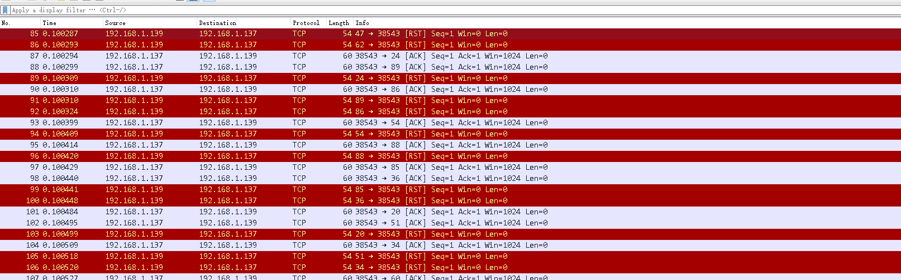

3. **-sW(tcp window scan)**

与ACK扫描非常相似，但是有一点不同，TCP window扫描可以`区分未被过滤端口的打开或者关闭`。它也需要root权限执行。让我们看下TCP window扫描的不同响应。

这类扫描不能打开目标计算机任何活动会话，所以不会被受害机记录。它的工作原理很简单，就是发送ACK包，然后在响应中接受单独的RST包。


```
lj@lj ~> sudo nmap -sW -vv 59.64.78.31 -p 445

Starting Nmap 7.01 ( https://nmap.org ) at 2018-03-15 12:57 CST
Initiating Ping Scan at 12:57
Scanning 59.64.78.31 [4 ports]
Completed Ping Scan at 12:57, 0.23s elapsed (1 total hosts)
Initiating Parallel DNS resolution of 1 host. at 12:57
Completed Parallel DNS resolution of 1 host. at 12:57, 0.01s elapsed
Initiating Window Scan at 12:57
Scanning 59.64.78.31 [1 port]
Completed Window Scan at 12:57, 0.24s elapsed (1 total ports)
Nmap scan report for 59.64.78.31
Host is up, received reset ttl 59 (0.011s latency).
Scanned at 2018-03-15 12:57:04 CST for 0s
PORT    STATE  SERVICE      REASON
445/tcp closed microsoft-ds reset ttl 253

Read data files from: /usr/bin/../share/nmap
Nmap done: 1 IP address (1 host up) scanned in 0.60 seconds
           Raw packets sent: 6 (232B) | Rcvd: 3 (120B)
lj@lj ~> sudo nmap  -vv 59.64.78.31 -p 445

Starting Nmap 7.01 ( https://nmap.org ) at 2018-03-15 12:57 CST
Initiating Ping Scan at 12:57
Scanning 59.64.78.31 [4 ports]
Completed Ping Scan at 12:57, 0.23s elapsed (1 total hosts)
Initiating Parallel DNS resolution of 1 host. at 12:57
Completed Parallel DNS resolution of 1 host. at 12:57, 0.01s elapsed
Initiating SYN Stealth Scan at 12:57
Scanning 59.64.78.31 [1 port]
Completed SYN Stealth Scan at 12:57, 0.27s elapsed (1 total ports)
Nmap scan report for 59.64.78.31
Host is up, received echo-reply ttl 59 (0.0058s latency).
Scanned at 2018-03-15 12:57:22 CST for 1s
PORT    STATE    SERVICE      REASON
445/tcp filtered microsoft-ds no-response

```


> 识别率较低，慎用。

其他参数比如 -S, --spoof-mac无法发出去包。

### nmap 其他参数
- -iL: 批量扫描文件

- -A 

进攻性（Aggressive）方式扫描, 目的是启用一个全 面的扫描选项集合，不需要用户记忆大量的 选项, 这个选项仅仅启用功能，不包含用于 可能所需要的 时间选项(如-T4)或细节选项(-v)。
    
- -O: 探测操作系统类型


- -oN/-oX/-oS/-oG: Output scan results in normal,xml,grepable　format

- -sV : 查看端口开放服务:

```
lj@lj ~> nmap 172.17.0.3  -p 11211

Starting Nmap 7.01 ( https://nmap.org ) at 2018-03-21 15:43 CST
Nmap scan report for 172.17.0.3
Host is up (0.00012s latency).
PORT      STATE SERVICE
11211/tcp open  unknown


lj@lj ~> nmap 172.17.0.3  -p 11211 -sV

Starting Nmap 7.01 ( https://nmap.org ) at 2018-03-21 15:43 CST
Nmap scan report for 172.17.0.3
Host is up (0.00013s latency).
PORT      STATE SERVICE   VERSION
11211/tcp open  memcached Memcached 1.4.15
```

原理: 正常使用-sT 扫描到开放端口后(发送4个包), -sV参数会继续建立完整的tcp握手和挥手，接收完整的数据包(ssh,http包)来进行准确判断。

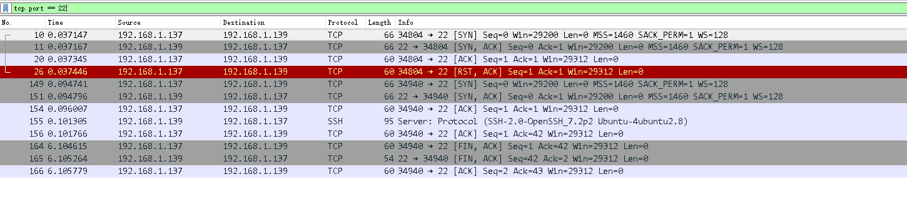
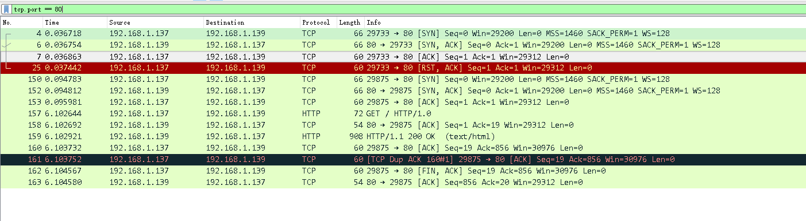
> 小心用-sV参数，如果端口稍大一些(30-40), 时间可能差10多倍。

-F  (快速 (有限的端口) 扫描)
: 在 nmap 的 nmap-services 文件中(对于-sO，是协议文件)指定您想要扫描的端口。 这比 扫描所有 65535 个端口快得多。 因为该列表包含如此多的 TCP 端口(1200 多)，这和默认 的 TCP 扫描 scan (大约 1600 个端口)速度差别不是很大。如果您用--datadir 选项指定 您自己的 小小的 nmap-services 文件 ，差别会很惊人。

-T 4
: 如果用于有足够的带宽或以太网连接，仍然建议使用-T4 选项。有些用户喜欢-T5 选项， 但这个过于强烈。有时用户考虑到避免使主机崩溃或者希望更礼貌一些会采用-T2 选项 他们并没意识到-T Polite 选项是如何的慢，这种模式的扫描比默认方式实际上要多花 10 倍的时间。默认时间选项(-T3)很少有主机崩溃和带宽问题, -T4和-T5很容易遇到达到发包重传限制，默认限制为2次。

虽然-T0 和-T1 选项可能有助于避免 IDS 告警，但在进行上千个主机或端口扫描时，会显 著增加时间。对于这种长时间的扫描，宁可设定确切的时间值，而不要去依赖封装的-T0 和-T1 选项。

--datadir
: 说明用户 Nmap 数据文件位置, Nmap 在运行时从文件中获得特殊的数据，这些文件有 nmap-service-probes， nmap-services， nmap-protocols， nmap-rpc， nmap-mac-prefixes 和 nmap-os-fingerprints。Nmap 首先 在--datadir 选项说明的目录中查找这些文件。 未 找到的文件，将在 BMAPDIR 环境变量说明的目录中查找。

-P0/-Pn -的官方解释是无ping扫描, -Pn是跳过主机发现
这是nmap --help对-Pn的解释
-Pn: Treat all hosts as online -- skip host discovery


- -sL simply list targets to scan
- -n (不用域名解析)
- -R (为所有目标解析域名)
- -e  指定网络接口
- -M 设置tcp扫描线程

--min-hostgroup
: Nmap具有并行扫描多主机端口或版本的能力，Nmap将多个目标IP地址 空间分成组，然后在同一时间对一个组进行扫描。通常，大的组更有效。缺 点是只有当整个组扫描结束后才会提供主机的扫描结果。如果组的大小定义 为50，则只有当前50个主机扫描结束后才能得到报告(详细模式中的补充信息 除外)。默认方式下，Nmap采取折衷的方法。开始扫描时的组较小， 最小为5，这样便于尽快产生结果；随后增长组的大小，最大为1024。确切的 大小依赖于所给定的选项。为保证效率，针对UDP或少量端口的TCP扫描，Nmap 使用大的组。

--max-hostgroup
: 选项用于说明使用最大的组，Nmap不 会超出这个大小。--min-hostgroup选项说明最小的组，Nmap 会保持组大于这个值。如果在指定的接口上没有足够的目标主机来满足所 指定的最小值，Nmap可能会采用比所指定的值小的组。这两个参数虽然很少使用， 但都用于保持组的大小在一个指定的范围之内。

--min-parallelism
: 这些选项控制用于主机组的探测报文数量，可用于端口扫描和主机发现。默认状态下， Nmap基于网络性能计算一个理想的并行度，这个值经常改变。如果报文被丢弃， Nmap降低速度，探测报文数量减少。随着网络性能的改善，理想的探测报文数量会缓慢增加。 这些选项确定这个变量的大小范围。默认状态下，当网络不可靠时，理想的并行度值 可能为1，在好的条件下，可能会增长至几百。最常见的应用是--min-parallelism值大于1，以加快 性能不佳的主机或网络的扫描。这个选项具有风险，如果过高则影响准确度，同时 也会降低Nmap基于网络条件动态控制并行度的能力。这个值设为10较为合适， 这个值的调整往往作为最后的手段。

--host-timeout
: 由于性能较差或不可靠的网络硬件或软件、带宽限制、严格的防火墙等原因， 一些主机需要很长的时间扫描。这些极少数的主机扫描往往占 据了大部分的扫描时间。因此，最好的办法是减少时间消耗并且忽略这些主机，使用 --host-timeout选项来说明等待的时间(毫秒)

## Nmap 常见错误
1. `nmap warning: giving up on port because retransmission cap hit (2)`

https://stackoverflow.com/questions/14736530/nmap-warning-giving-up-on-port-because-retransmission-cap-hit-2

问题在于nmap 对于-T4,-T5 的发包速率的限制上面,源码如下:
```
  } else if (*optarg == '5' || (strcasecmp(optarg, "Insane") == 0)) {
    o.timing_level = 5;
    o.setMinRttTimeout(50);
    o.setMaxRttTimeout(300);
    o.setInitialRttTimeout(250);
    o.host_timeout = 900000;
    o.setMaxTCPScanDelay(5);
    o.setMaxSCTPScanDelay(5);
    o.setMaxRetransmissions(2);
  }
```
如您所见，最大重传次数为2.当重新传输次数存在非默认上限（使用-T5，-T4设置或使用--max-retries手动设置）时，会显示您看到的警告
，那个上限被击中了。

要避免此问题，请尝试缩小时序设置。
-T4仍然非常快, -T3是默认值。
如果您确定延迟和带宽不是问题，但由于硬件故障可能会丢弃数据包，则可以手动将--max-retries设置为更高的值，并保留-T5 的参数。

## Nmap扫描优化
- nmap 时间和性能参数：https://wizardforcel.gitbooks.io/nmap-man-page/content/11.html
- 诸神之眼nmap定制化之并发处理  https://www.freebuf.com/column/166508.html

1. -T 时间模板
Nmap 提供了一些简单的方法，使用 6 个时间模板，使用时采用-T 选项及数字(0 - 5) 或名称。模板名称有 paranoid (0)、 sneaky (1)、polite (2)、normal(3)、 aggressive (4)和 insane (5)。前两种模式用 于 IDS 躲避，Polite 模式降低了扫描速度以使用更少的带宽和目标主机资源。默认模式 为 Normal,即T3, Aggressive 模式假设用户具有合适及可靠 的网络从而加速扫描。Insane 模式假设用户具有特别快的网络或者愿意为获得速度而牺 牲准确性。


探测速度对比:
```
# 163s
cmd5 = "nmap -sT -T3  -p 21-25,53,110,111,137,138,139,143,161,389,443,445,873,1080,1433,1521,3000,3128,3306,3389,3690,5000,5432,5900,5984,6379,9000,27017,50030,50060,50070,11211 172.16.176.1/24 -oN nmap5.xml"

# 160s
cmd6 = "nmap -sT -T4  -p 21-25,53,110,111,137,138,139,143,161,389,443,445,873,1080,1433,1521,3000,3128,3306,3389,3690,5000,5432,5900,5984,6379,9000,27017,50030,50060,50070,11211 172.16.176.1/24 -oN nmap6.xml"

# 94s
cmd7 = "nmap -sT -T5  -p 21-25,53,110,111,137,138,139,143,161,389,443,445,873,1080,1433,1521,3000,3128,3306,3389,3690,5000,5432,5900,5984,6379,9000,27017,50030,50060,50070,11211 172.16.176.1/24 -oN nmap7.xml"
```

2. 调整探测报文的 并行度  --min-parallelism

这些选项控制用于主机组的探测报文数量，可用于端口扫描和主机发现。默认状态下， Nmap 基于网络性能计算一个理想的并行度，这个值经常改变,这 个选项具有风险，如果过高则影响准确度，同时也会降低 Nmap 基于网络条件动态控制并 行度的能力。这个值设为 10 较为合适，这个值的调整往往作为最后的手段。(建议不要使用)

```
# 446
cmd1 = "nmap -sT -P0 -T4 --host-timeout=120s --max-hostgroup=100 --min-parallelism=10 -p 21-25,53,110,111,137,138,139,143,161,389,443,445,873,1080,1433,1521,3000,3128,3306,3389,3690,5000,5432,5900,5984,6379,9000,27017,50030,50060,50070,11211 172.16.176.1/24 -oN nmap1.xml"

# 131
cmd2 = "nmap -sT -P0 -T4 --host-timeout=120s --min-hostgroup=500 --min-parallelism=10  -p 21-25,53,110,111,137,138,139,143,161,389,443,445,873,1080,1433,1521,3000,3128,3306,3389,3690,5000,5432,5900,5984,6379,9000,27017,50030,50060,50070,11211 172.16.176.1/24 -oN nmap2.xml"
```


3.  调整并行扫描组的大 小 --min-hostgroup <milliseconds>; --max-hostgroup

Nmap 具有并行扫描多主机端口或版本的能力，Nmap 将多个目标 IP 地址空间分成组，然 后在同一时间对一个组进行扫描。通常，大的组更有效。缺点是只有当整个组扫描结束 后才会提供主机的扫描结果。如果组的大小定义为 50，则只有当前 50 个主机扫描结束后 才能得到报告, 默认方式下，Nmap 采取折衷的方法。开始扫描时的组较小，最小为 5，这样便于尽快产 生结果；随后增长组的大小，最大为 1024。

- 最慢的扫描时间：
```
# 446
cmd1 = "nmap -sT -P0 -T4 --host-timeout=120s --max-hostgroup=100 --min-parallelism=10 -p 21-25,53,110,111,137,138,139,143,161,389,443,445,873,1080,1433,1521,3000,3128,3306,3389,3690,5000,5432,5900,5984,6379,9000,27017,50030,50060,50070,11211 172.16.176.1/24 -oN nmap1.xml"
```

> 结论发现--min-hostgroup 并行扫描过多导致丢包过于严重。


- 并行发包率

实验数据： 
```
# 159s
cmd8 = "nmap -sT -T4  -p 21-25,53,110,111,137,138,139,143,161,389,443,445,873,1080,1433,1521,3000,3128,3306,3389,3690,5000,5432,5900,5984,6379,9000,27017,50030,50060,50070,11211 172.16.176.1/24 -oN nmap8.xml"

# 157s
cmd9 = "nmap -sT -T4 --min-parallelism=100 -p 21-25,53,110,111,137,138,139,143,161,389,443,445,873,1080,1433,1521,3000,3128,3306,3389,3690,5000,5432,5900,5984,6379,9000,27017,50030,50060,50070,11211 172.16.176.1/24 -oN nmap9.xml"

# 158
cmd10 = "nmap -sT -T4 --min-hostgroup=255 -p 21-25,53,110,111,137,138,139,143,161,389,443,445,873,1080,1433,1521,3000,3128,3306,3389,3690,5000,5432,5900,5984,6379,9000,27017,50030,50060,50070,11211 172.16.176.1/24 -oN nmap10.xml"
```
实验结论: 这几个参数的调整意义不大，直接利用

- nmap验证脚本的影响：
```

```

## Ndiff
利用Ndiff 的比较功能，我们可以实现内网端口的实时监控扫描：

```
ndiff [ <options> ] { <a.xml> } { <b.xml> }


  -h, --help     display this help
  -v, --verbose  also show hosts and ports that haven't changed.
  --text         display output in text format (default)
  --xml          display output in XML format

```


```
ndiff 127.0.0.1_15-16-32-40.xml now.xml
```


这是一个非常简单的脚本，它每天用默认的端口运行 nmap，然后使用 ndiff 比较结果。然后，我们可以获取这个脚本的输出结果，并让它把每天发现的新端口及时通知我们的团队。

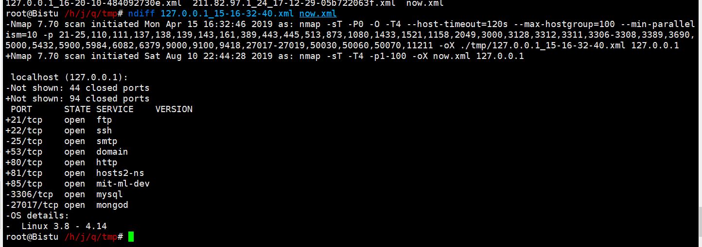

目标：

- 构建一个比默认的 nmap 更好的端口列表(例如，nmap 默认的漏掉一些端口，比如 Redis 6379/6380 和其他端口)
- 实现 nmap banner
- 保持对端口的历史跟踪
- 建立电子邮件提醒/通知系统
- 参考 diff Slack 警报

demo: a Script to NMAP a network and Post Differences to Slack

```
#!/bin/sh
TARGETS="192.168.1.0/24"
OPTIONS="-v -T4 -F -sV"
date=$(date +%Y-%m-%d-%H-%M-%S)
cd /nmap/diffs
nmap $OPTIONS $TARGETS -oA scan-$date > /dev/null
slack(){
curl -F file=@diff-$date -F initial_comment="Internal Port Change Detected" -F channels=#alerts -F token=xxxx-xxxx-xxxx https://slack.com/api/files.upload
}

if [ -e scan-prev.xml ]; then
ndiff scan-prev.xml scan-$date.xml > diff-$date
[ "$?" -eq "1" ] && sed -i -e 1,3d diff-$date && slack
fi
ln -sf scan-$date.xml scan-prev.xml
```

## Nmap的一些组合应用

### Nmap+Aquatone 
nmap+aquatone 结合可以打造出迅速扫描网段开放的web服务。
```
//先用nmap或masscan扫描web服务端口,到处xml文件
nmap -p80-90,8000-9000 59.64.78.1/24 -T4 -oX /tmp/nmap1.xml
masscan -p80-90,8000-9000 59.64.78.1/24 --rate=10000 -oX /tmp/masscan1.xml

//使用aquatone 解析xml文件生成报告
cat nmap1.xml|aquatone -nmap
```

### Nmap+Masscan
nmap+masscan结合使用可以打造出一块端口监控工具。

masscan可能会存在漏扫的问题，因此如何解决漏扫的问题呢？

```
1. 为防止漏报，减少的服务进行二次nmap扫描，判断是否漏扫
2. 针对结果进行弱口令扫描
```

方法:
```
1.把需要监控的ip放到redis中用redis的set集合。
2.调用masscan依次扫描从redis中取的要监控的ip，并保存成xml文件，
3.解析xml文件，入库redis，把ip值当key，也存set集合。
4.从redis读取ip的端口，并与第二次扫描做对比，如果有改变推送到微信。
```


端口弱口令扫描：hydran或者自己写py脚本。

